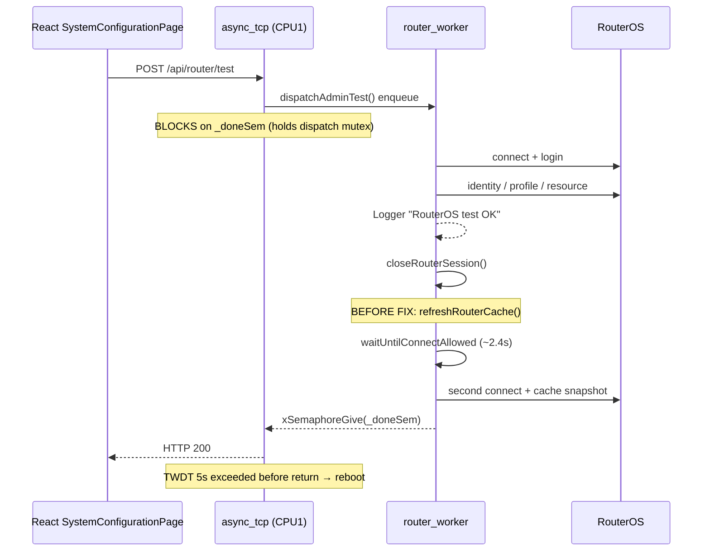

# Admin Dashboard AsyncTCP Watchdog — Forensic Report

## 1. Hardware symptom

On a provisioned ProductionReady appliance, pressing **Test Connection** in the
Admin Dashboard (System Configuration) triggered:

```
E task_wdt: Task watchdog got triggered.
Task/user that failed to reset: async_tcp (CPU 1)
Tasks currently running: CPU 0: IDLE0 / CPU 1: loopTask
```

Reboot followed. Heap/DMA/Ethernet/RouterOS commands were healthy immediately
before the reset.

## 2. Exact crash timeline

1. `[router-worker] dispatch type=admin-test` / `started type=admin-test`
2. RouterOS: identity (~1111 ms), profile (~270 ms), resource (~210 ms) — **OK**
3. `[INFO] router: RouterOS test OK — identity=MikroTik profile=default`
4. `[router-api] cooldown remaining=2437` … `37` (~100 ms slices)
5. Task WDT → `async_tcp` → reboot

## 3. Decoded backtrace

**ELF MISMATCH — HARDWARE BACKTRACE CANNOT BE AUTHORITATIVELY DECODED**

| Item | Value |
|------|-------|
| Hardware ELF SHA256 prefix | `29b1102dd` |
| Workspace `firmware.elf` SHA256 prefix (at investigation) | `7d5fd7efc…` |

`xtensa-esp32s3-elf-addr2line` was **not** treated as authoritative for the
supplied PCs. Root cause is established from source + matching serial timeline.

## 4. Task / core ownership

| Task | Core | Priority | WDT subscribed? | Responsibility |
|------|------|----------|-----------------|----------------|
| `async_tcp` | **1** (`CONFIG_ASYNC_TCP_RUNNING_CORE=1`) | AsyncTCP default | **Yes** (ESP TWDT, 5 s) | HTTP/SSE callbacks |
| `loopTask` | 1 (Arduino) | 1 | Typically yes | `loop()`, heartbeat |
| `router_worker` | unpinned (`ROUTER_WORKER_CORE_AFFINITY=-1`) | 1 | No (not TWDT target here) | RouterOS jobs |
| `IDLE0` / `IDLE1` | 0 / 1 | idle | Yes (idle WDT) | Idle |

When WDT fired, CPU1 showed `loopTask` because **`async_tcp` was blocked** on
`_doneSem`, not running — consistent with starvation of a TWDT-subscribed task
that never returns to reset the watchdog.

## 5. Admin-test sequence



Endpoint: `POST /api/router/test` (`ApiServer.cpp`) →
`RouterProvisioningWorker::dispatchAdminTest` → **blocking** `dispatch()` →
`RouterPlatform::test` → `MikroTikDriver::testSettings`.

Frontend: `testMutation` → `routerApi.test` (synchronous HTTP wait). SSE may be
connected (`sse=1`) but completion uses the HTTP response, not an SSE job event
(`jobId=0` for blocking dispatch).

## 6. Router API cooldown implementation

| Field | Value |
|-------|-------|
| Log source | `RouterApiTransportGate::logCooldownRemaining` |
| Wait API | `waitUntilConnectAllowed()` |
| Called from | `RouterOsClient::connect()` only |
| Mechanism | `for(;;)` + `vTaskDelay(100 ms slices)` — **not** a busy spin |
| Duration | Up to `ROUTER_API_MIN_CONNECT_INTERVAL_MS` (5000) and/or backoff |
| Mutex | Gate mutex held only to compute `waitMs`, **released before** delay |
| Task | Whatever calls `connect()` — here **`router_worker`** |
| Purpose | Rate-limit **new TCP connects**, not post-command pacing |

After a successful test the session was closed, then **before fix**
`RouterPlatform::test` called `refreshRouterCache()` → `collectCacheSnapshot()` →
**new** `openRouterSession`/`connect()` → cooldown for remainder of the 5 s
min-interval (~2437 ms in the log).

## 7. AsyncTCP / SSE interaction

- SSE (`EventBus` / `AsyncEventSource`) was connected (`sse=1`).
- Successful test emits `Connected` / profile events via `EventBus::emit` from
  the worker (lightweight `send`).
- **Root failure mode is not SSE payload work** — it is **`async_tcp` blocked
  inside `dispatch()`** for the entire worker job (test + former second
  connect/cooldown).
- SSE onConnect only sends small status/ping strings.

## 8. Dashboard polling audit

| Endpoint | Caller | Trigger | Interval / options |
|----------|--------|---------|-------------------|
| `/api/health` | `useAdminApiMonitor` | App shell | 5 s while enabled |
| `/api/health` | `App.tsx` / session gate | Login / reconnect | Event-driven |
| `/api/health` | Device/fleet discovery | Manual / scan | Not continuous dashboard |
| Dashboard queries | `DashboardPage` + hooks | `fallbackPollMs` | **`false` when SSE connected** |
| System Configuration GETs | `SystemConfigurationPage` | Mount / user actions | `staleTime: Infinity`, no background poll |
| `/api/status` | System Configuration | Mount | 30 s |
| `/api/router/test` | Test Connection button | User click | Once per press |

Health amplification is **not** the crash root cause. SSE-connected dashboard
disables most refetch intervals.

## 9. Root cause

**Proven:** Admin Test uses **synchronous `dispatch()` from `async_tcp`**. After
RouterOS test already succeeded and closed the session, `RouterPlatform::test`
opened a **second** RouterOS session via `refreshRouterCache()`. That hit
`waitUntilConnectAllowed` (~2.4 s) plus further API work while `async_tcp`
remained blocked past the **5 s task watchdog**.

## 10. Contributing factors

- Blocking admin RouterOS ops on `async_tcp` (architectural hazard).
- Post-success full cache refresh that reconnects immediately.
- Cooldown Serial spam every 100 ms (noise / minor scheduling cost; not the
  primary mechanism).
- `async_tcp` pinned to CPU1 with TWDT subscription.

## 11. Fix

1. **`RouterPlatform::test`:** on success, apply identity/`routerOs` from the
   test result into `RouterCacheManager` via `applyLiveSnapshot` — **do not**
   call `refreshRouterCache()` (no second connect).
2. **`logCooldownRemaining`:** rate-limit to ~1 Hz (keep string for regression
   guard).

Connect min-interval / backoff / single-session gate **preserved** for real
new connects.

## 12. Why watchdog was not disabled/increased

The WDT correctly detected `async_tcp` failing to complete work within 5 s.
Disabling it would hide the blocking-dispatch hazard.

## 13. RouterOS protection preserved

- `ROUTER_API_MIN_CONNECT_INTERVAL_MS = 5000` unchanged
- Backoff / `acquireSession` unchanged
- Session reuse / production-network paths untouched
- Explicit Synchronize / cache refresh admin actions still open live sessions
  via their own worker jobs

## 14. Performance before / after

| Metric | Before | After (expected) |
|--------|--------|------------------|
| RouterOS sessions per Admin Test | 2 | **1** |
| Post-test connect cooldown wait | ~2–5 s | **0** |
| Cooldown Serial lines | ~25 / wait | ≤ ~few / wait |
| async_tcp block duration | test + cooldown + snapshot | test + local cache write only |

## 15. Files modified

- `src/router/RouterPlatform.cpp`
- `src/RouterApiTransportGate.cpp`
- `docs/ADMIN_DASHBOARD_ASYNCTCP_WATCHDOG_FORENSIC.md` (this file)

## 16. Build result

See agent build log for `freenove_esp32_s3_wroom` after this change.

## 17. Hardware validation matrix

| # | Check | Required |
|---|--------|----------|
| 1 | Dashboard open + SSE | Pass |
| 2 | Repeated `/api/health` | Pass |
| 3 | Test Connection ×10 (user pacing) | **No WDT / reboot** |
| 4 | Test result returns normally | Pass |
| 5 | W5500 / RouterOS storm | None |
| 6 | Setup Finish / production-network | Unchanged |

**Do not claim PASS from build alone.**

## 18. Core dump secondary finding

`partitions_custom.csv` has: `nvs`, `otadata`, `app0`, `app1`, `spiffs` —
**no `coredump` partition**. Firmware/ESP-IDF may still attempt flash core dump
→ `Core dump flash config is corrupted` / `No core dump partition found`.
Diagnostic-only; not part of the watchdog fix.

## Residual risk (documented, not fixed here)

Other admin paths (`save`, `saveWireless`) still call `refreshRouterCache()`
under blocking `dispatch()`. They remain TWDT-sensitive if live snapshot work
exceeds ~5 s. Follow-up: enqueue-style admin RouterOS jobs (non-blocking
async_tcp) like Finish Setup.

## Addendum — newer incident class (`ELF 8f93b74f9`)

A later production crash after admin login was independently decoded and was
**not** this RouterWorker/RouterOS wait chain. That stack resolves to:

`FirmwareApp::refreshHealthSnapshots` -> `StorageManager::refreshRuntimeSnapshot`
-> `fallbackTotalBytes` -> `SPIFFS.exists/stat` -> `esp_flash_read`.

In that case, `loopTask` on CPU1 monopolized flash filesystem telemetry work
long enough to starve `async_tcp` (which is also pinned to CPU1), producing the
same TWDT symptom (`failed async_tcp`) with a different call chain.

This confirms endpoint-only fixes are insufficient: regression audits must
cover async callback code **and** shared-core loop/deferred work triggered by
dashboard polling.
