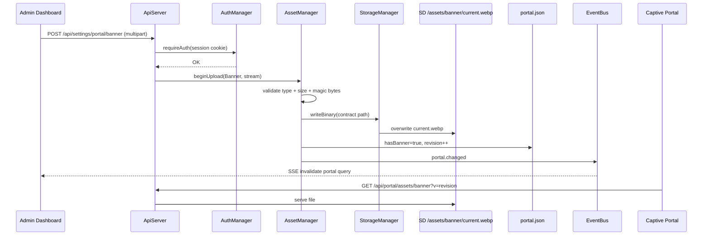
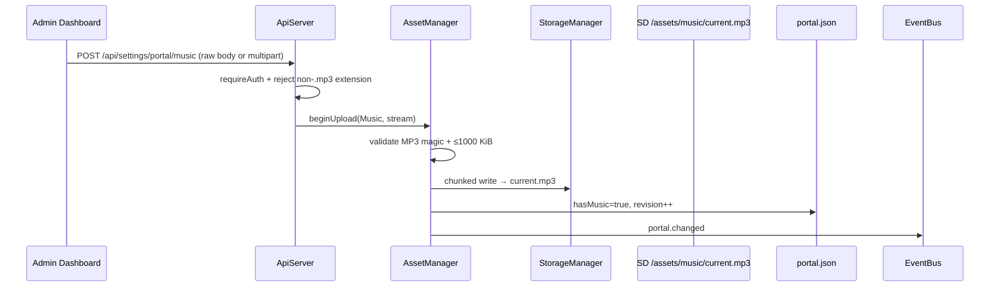

# Renz-Fi Asset Lifecycle Architecture (Frozen — Pre–Phase 3)

This document defines **how user-uploaded assets move through the system** — from the Admin Dashboard to SD storage and back to the captive portal. It complements the frozen storage contract in [STORAGE_ARCHITECTURE.md](./STORAGE_ARCHITECTURE.md).

**Status:** Frozen before AssetManager implementation. Phase 3 code must follow these flows, types, and naming rules — not invent parallel upload paths.

**Related:**
- Storage paths & ownership → `STORAGE_ARCHITECTURE.md`, `StoragePaths.h`
- Portal vs media split → `PORTAL_CONFIG_ARCHITECTURE.md`
- Frozen C++ types → `AssetTypes.h`, `PortalConfigSchema.h`
- Current runtime (banner + music only) → `PortalConfigManager`, `ApiServer` portal routes
- Admin UI → `src/services/portal.ts`, `src/pages/CaptivePortalPage.tsx`

---

## Layer model

Every asset follows the same layered pipeline. No layer skips the one below it.

```
┌─────────────────────────────────────────────────────────────┐
│  Admin Dashboard (React PWA — SPIFFS /admin)                │
│  Select file → POST multipart or raw body                   │
└───────────────────────────┬─────────────────────────────────┘
                            │
                            ▼
┌─────────────────────────────────────────────────────────────┐
│  ApiServer                                                  │
│  Route match → requireAuth (session cookie) → size gate     │
│  Stream body → delegate to AssetManager (Phase 3)           │
└───────────────────────────┬─────────────────────────────────┘
                            │
                            ▼
┌─────────────────────────────────────────────────────────────┐
│  AssetManager (Phase 3 — sole writer under /assets/)        │
│  Validate type / magic bytes / dimensions / duration        │
│  Optional transcode → canonical filename                    │
│  Write via StorageManager                                   │
│  Update portal.json metadata                                │
│  emit EventBus notification                                 │
└───────────────────────────┬─────────────────────────────────┘
                            │
                            ▼
┌─────────────────────────────────────────────────────────────┐
│  StorageManager                                             │
│  SD primary, SPIFFS fallback when SD degraded               │
│  writeBinary / chunked write / verify on disk               │
└───────────────────────────┬─────────────────────────────────┘
                            │
                            ▼
┌─────────────────────────────────────────────────────────────┐
│  SD card — canonical path (e.g. /assets/banner/current.webp)│
└───────────────────────────┬─────────────────────────────────┘
                            │
                            ▼
┌─────────────────────────────────────────────────────────────┐
│  portal.json — revision bump + has* flags                   │
└───────────────────────────┬─────────────────────────────────┘
                            │
                            ▼
┌─────────────────────────────────────────────────────────────┐
│  EventBus — SSE /api/events → portal.changed                │
└───────────────────────────┬─────────────────────────────────┘
                            │
                            ▼
┌─────────────────────────────────────────────────────────────┐
│  Consumers refresh                                          │
│  • Admin Dashboard (React Query invalidates ["portal"])     │
│  • Captive portal PWA (?v=revision cache bust)              │
│  • renzfi-app.js branding listener (portal.changed)         │
└─────────────────────────────────────────────────────────────┘
```

**Ownership rule:** Only **AssetManager** writes media files under `/assets/`. **PortalConfigManager** stays permanently for portal configuration (title, theme, behaviour) and stops touching files in Phase 3B. See [PORTAL_CONFIG_ARCHITECTURE.md](./PORTAL_CONFIG_ARCHITECTURE.md).

---

## Frozen allowed file types

Upload validation happens in **AssetManager** (and at the ApiServer boundary for early rejection). Extensions are case-insensitive.

| Asset | Upload allowed | Stored as (canonical) | Notes |
|-------|----------------|----------------------|-------|
| Banner | `.webp`, `.png`, `.jpg`, `.jpeg` | `current.webp` | Raster only |
| Logo | `.webp`, `.png`, `.jpg`, `.jpeg` | `current.webp` | `.svg` reserved — see below |
| Background | `.webp`, `.png`, `.jpg`, `.jpeg` | `current.webp` | Same as banner |
| Music | `.mp3` | `current.mp3` | No other audio formats |
| Advertisement | `.webp`, `.png`, `.jpg`, `.jpeg` | `adN.webp` (N = 1…max) | Fixed slots, not free naming |
| Video (future) | `.mp4` | `adN.mp4` or `current.mp4` | H.264 baseline; slot TBD |
| Icons (future) | `.webp`, `.png` | `current.webp` or named slot | Admin / portal chrome |
| Fonts (future) | `.woff2`, `.woff` | `current.woff2` | Portal theming |

### SVG policy (logo — optional future)

SVG is **not** in the Phase 3 v1 allow-list. The captive portal renderer today expects raster images. If SVG support is added later:

1. Extend allow-list for logo only.
2. Store as `current.svg` **or** rasterize to `current.webp` at upload time.
3. Update `portal.json` with `logoFormat` field.

Until then, SVG uploads are rejected with `INVALID_UPLOAD`.

### Magic-byte validation (required in AssetManager)

Extension checks alone are insufficient. AssetManager must verify file headers:

| Type | Check |
|------|-------|
| WebP | RIFF….WEBP |
| PNG | `\x89PNG` |
| JPEG | `\xFF\xD8\xFF` |
| MP3 | ID3 tag or `\xFF\xFB` / `\xFF\xF3` frame sync |
| MP4 (future) | `ftyp` box at offset 4 |

Mismatch between extension and magic bytes → reject upload.

---

## Frozen storage format policy

**Principle:** The portal always loads **fixed paths with fixed extensions**. Upload filenames are discarded.

```
Owner uploads:     summer_banner_final_v2.png
                           │
                           ▼
AssetManager:      validate PNG magic bytes
                           │
                           ▼
Transcode (Phase 3): PNG → WebP  (or accept native WebP skip transcode)
                           │
                           ▼
Store:             /assets/banner/current.webp   (overwrite)
```

### Raster images (banner, logo, background, ads)

| Policy item | Rule |
|-------------|------|
| Canonical on-disk format | **WebP** (`current.webp`, `adN.webp`) |
| PNG/JPG upload | Accepted at API; AssetManager **must transcode to WebP** before commit |
| WebP upload | Store directly (optional re-encode for size cap) |
| No versioning | Overwrite previous `current.webp` in place |
| No original retained | Do not keep `upload.png` on SD |

If transcoding is not yet implemented, Phase 3 **must still reject** PNG/JPG with a clear error rather than storing under a non-contract name. Native WebP upload works on day one.

### Music

| Policy item | Rule |
|-------------|------|
| Canonical format | **MP3** (`current.mp3`) |
| Transcode | None — store bytes as received after validation |
| Max size | 1000 KiB (`RenzFiConfig::PORTAL_MUSIC_MAX_BYTES`) |

### Videos (future)

| Policy item | Rule |
|-------------|------|
| Canonical format | **MP4** (H.264 + AAC) |
| Max size | TBD (recommend ≤ 5 MiB per slot for SD wear) |
| Transcode | None on-device initially — reject non-conforming uploads |

---

## Size limits (frozen)

| Asset | Max upload size | Rationale |
|-------|-----------------|-----------|
| Banner | 200 KiB | Portal header; matches current ApiServer gate |
| Logo | 100 KiB | Small chrome asset |
| Background | 512 KiB | Full-screen optional |
| Music | 1000 KiB | Matches `PORTAL_MUSIC_MAX_BYTES` |
| Ad (each slot) | 200 KiB | Same as banner |
| Video (future) | 5 MiB (proposed) | SD / memory budget |

AssetManager enforces limits during streaming upload (abort early, same pattern as current `PortalConfigManager::beginAssetUpload`).

---

## Asset metadata model (frozen)

Every asset type shares one metadata structure. The Admin Dashboard can show file size, upload date, MIME type, replace/delete actions, and integrity status **without per-type UI logic**.

### C++ contract (`AssetTypes.h`)

```cpp
struct AssetInfo {
  AssetType type;
  String filename;            // canonical leaf: "current.webp", "ad2.webp"
  String mimeType;            // stored format: "image/webp", "audio/mpeg"
  size_t size;                // bytes on disk
  uint32_t lastModified;      // Unix epoch seconds at commit
  String checksum;            // "md5:" + 32-char lowercase hex
  AssetStorageLocation storageLocation;  // sd | spiffs | bundled
  String path;                // full path on storage tier
  uint8_t slot;               // 0 = N/A; 1…N for ads / videos
};
```

### Field rules

| Field | Rule |
|-------|------|
| `type` | `AssetType` enum — banner, music, logo, background, ad, video, … |
| `filename` | Always the **canonical** stored name (`current.webp`, `current.mp3`, `adN.webp`) — never the upload filename |
| `mimeType` | MIME of the **stored** file (after transcode), not the upload |
| `size` | Verified byte count after write completes |
| `lastModified` | Set at commit time (`time()` if available, else `millis()/1000` + boot offset) |
| `checksum` | MD5 of stored bytes, prefixed `md5:` — same digest style as OTA firmware uploads |
| `storageLocation` | `sd` when on SD card; `spiffs` when SD degraded; `bundled` for firmware defaults (read-only, not in portal.json) |
| `path` | Full path on the active tier, e.g. `/assets/banner/current.webp` |
| `slot` | Only for `Ad` and `Video` types; `0` for single-slot assets |

### Examples

**Banner**

| Field | Value |
|-------|-------|
| type | `banner` |
| filename | `current.webp` |
| mimeType | `image/webp` |
| size | `250880` (245 KiB) |
| lastModified | `1719686400` |
| checksum | `md5:a1b2c3d4…` |
| storageLocation | `sd` |
| path | `/assets/banner/current.webp` |

**Music**

| Field | Value |
|-------|-------|
| type | `music` |
| filename | `current.mp3` |
| mimeType | `audio/mpeg` |
| size | `1258291` (~1.2 MiB) |
| lastModified | `1719686500` |
| checksum | `md5:…` |
| storageLocation | `sd` |
| path | `/assets/music/current.mp3` |

**Ad slot 2**

| Field | Value |
|-------|-------|
| type | `ad` |
| filename | `ad2.webp` |
| slot | `2` |
| path | `/assets/ads/ad2.webp` |

### Integrity

On boot and before serve, AssetManager may recompute MD5 and compare to `checksum`. Mismatch sets `integrityOk: false` in API responses and logs `INTEGRITY_FAILED` — does not delete the file automatically.

---

## Operation results (frozen)

AssetManager methods **must not** return bare `bool`. Every upload, delete, and reconcile returns `AssetOperationResult`.

### C++ contract (`AssetTypes.h`)

```cpp
struct AssetOperationResult {
  bool success;
  AssetType assetType;
  String storedPath;
  size_t bytesWritten;
  uint32_t revisionUpdated;
  String warning;              // non-fatal notes
  AssetErrorCode errorCode;
  String errorMessage;
  AssetInfo asset;             // filled on success
};
```

Factory helpers: `AssetOperationResult::ok(...)` and `AssetOperationResult::fail(...)`.

### ApiServer mapping

ApiServer translates `AssetOperationResult` → HTTP response:

| Result | HTTP | Body |
|--------|------|------|
| `success == true` | 200 | `{ ok, message, revision, asset: AssetInfo }` |
| `errorCode == InvalidUpload` | 400 | `{ ok: false, error, code }` |
| `errorCode == StorageError` | 500 | `{ ok: false, error, code }` |
| `warning` non-empty | 200 | include `warning` field; upload still succeeded |

Example success payload:

```json
{
  "ok": true,
  "message": "Banner uploaded",
  "revision": 1234567890,
  "asset": {
    "type": "banner",
    "filename": "current.webp",
    "mimeType": "image/webp",
    "size": 250880,
    "lastModified": 1719686400,
    "checksum": "md5:a1b2c3d4e5f6789012345678901234ab",
    "storageLocation": "sd",
    "path": "/assets/banner/current.webp"
  }
}
```

Example failure payload:

```json
{
  "ok": false,
  "error": "Only MP3 files are allowed",
  "code": "INVALID_UPLOAD"
}
```

### Admin Dashboard (TypeScript mirror)

```typescript
export type AssetInfo = {
  type: string;
  filename: string;
  mimeType: string;
  size: number;
  lastModified: number;
  checksum: string;
  storageLocation: "sd" | "spiffs" | "bundled";
  path: string;
  slot?: number;
  integrityOk?: boolean;
};

export type AssetOperationResult = {
  ok: boolean;
  message?: string;
  revision?: number;
  asset?: AssetInfo;
  warning?: string;
  error?: string;
  code?: string;
};
```

One UI component (`AssetCard`) can render any asset from `AssetInfo` — size, date, type, replace, delete, integrity badge.

---

## portal.json contract (metadata)

`portal.json` is **shared** by two managers:

| Manager | Owns in JSON |
|---------|----------------|
| **PortalConfigManager** | `portal`, `theme`, `behaviour` (Phase 3B) |
| **AssetManager** | `branding`, `audio`, `ads`, `videos` |

Each media leaf is a full **`AssetInfo`** object. Full schema: [PORTAL_CONFIG_ARCHITECTURE.md](./PORTAL_CONFIG_ARCHITECTURE.md).

### Current fields (runtime today — legacy)

```json
{
  "revision": 1234567890,
  "hasBanner": true,
  "hasMusic": true,
  "bannerPath": "/www/portal-banner.webp",
  "musicPath": "/www/portal-bg-music.mp3"
}
```

### Target media sections (Phase 3B)

```json
{
  "revision": 1234567890,

  "branding": {
    "banner": {
      "type": "banner",
      "filename": "current.webp",
      "mimeType": "image/webp",
      "size": 250880,
      "lastModified": 1719686400,
      "checksum": "md5:a1b2c3d4e5f6789012345678901234ab",
      "storageLocation": "sd",
      "path": "/assets/banner/current.webp"
    },
    "logo": {},
    "background": {}
  },

  "audio": {
    "music": {
      "type": "music",
      "filename": "current.mp3",
      "mimeType": "audio/mpeg",
      "size": 1258291,
      "lastModified": 1719686500,
      "checksum": "md5:…",
      "storageLocation": "sd",
      "path": "/assets/music/current.mp3"
    },
    "coin": {}
  },

  "ads": {
    "ad1": {},
    "ad2": {}
  },

  "videos": {
    "video1": {}
  }
}
```

### Deprecated mirrors (transition only)

AssetManager still writes these until all clients migrate:

| Legacy | Source |
|--------|--------|
| `hasBanner` | `branding.banner` present |
| `hasMusic` | `audio.music` present |
| `bannerPath` | `branding.banner.path` |
| `musicPath` | `audio.music.path` |

Rules:

- **`revision`** — bumped by either manager on successful save; used in `?v=` cache bust.
- **Sectioned metadata** — authoritative for AssetManager; `AssetInfo` at each leaf.
- **Legacy mirrors** — kept for PortalConfigManager until Phase 3B refactors it to query AssetManager.
- AssetManager merge-reads before write so PortalConfigManager config keys are preserved.

Readers use `revision` and serve URLs for the captive portal; admin UI reads sectioned `AssetInfo` for media details.

---

## EventBus notifications

| Event | Payload | When | Consumers |
|-------|---------|------|-----------|
| `portal.changed` | `{"revision":1234567890}` | Any portal asset upload/delete | Admin SSE (`useDashboardEvents` → `["portal"]`), `renzfi-app.js` branding reload |

**Frozen rule:** Keep `portal.changed` for backward compatibility. Do not require clients to listen for per-asset event names in Phase 3.

Optional future granular events (not required for Phase 3):

| Event | Payload example |
|-------|-----------------|
| `assets.changed` | `{"kind":"banner","revision":123}` |

If added, AssetManager must **also** emit `portal.changed`.

---

## Per-asset lifecycles

### Banner



**Serve URL (frozen):** `GET /api/portal/assets/banner?v={revision}` — public, no auth (captive portal clients).

**Delete flow:** `DELETE /api/settings/portal/banner` → AssetManager removes file → `hasBanner=false` → `portal.changed`.

---

### Logo

Same pipeline as banner with these differences:

| Step | Value |
|------|-------|
| Upload route (proposed) | `POST /api/settings/portal/logo` |
| Storage path | `/assets/logo/current.webp` |
| Max size | 100 KiB |
| Serve route (proposed) | `GET /api/portal/assets/logo?v={revision}` |
| portal.json | `hasLogo`, `logoPath` |

Logo is **not implemented today**. Phase 3 adds AssetManager + routes; no separate folder or naming scheme.

---

### Music



**Serve URL (frozen):** `GET /api/portal/assets/music?v={revision}` — `Content-Type: audio/mpeg`.

**Delete:** `DELETE /api/settings/portal/music`.

---

### Background

Same as banner:

| Step | Value |
|------|-------|
| Upload route (proposed) | `POST /api/settings/portal/background` |
| Storage path | `/assets/background/current.webp` |
| Max size | 512 KiB |
| Serve route (proposed) | `GET /api/portal/assets/background?v={revision}` |
| portal.json | `hasBackground`, `backgroundPath` |

Background is optional portal chrome (behind login form). Fallback to bundled SPIFFS default if absent.

---

### Advertisement (multi-slot)

Ads use **numbered slots**, not free filenames.

```
Upload ad slot 2 (PNG)
        │
        ▼
Validate → transcode → /assets/ads/ad2.webp
        │
        ▼
portal.json: adCount = max(slots with files), hasAds = adCount > 0
        │
        ▼
portal.changed
        │
        ▼
Portal carousel loads GET /api/portal/assets/ads/2?v={revision}
```

| Step | Value |
|------|-------|
| Upload route (proposed) | `POST /api/settings/portal/ads/{slot}` where slot = 1…N |
| Storage paths | `/assets/ads/ad1.webp`, `ad2.webp`, `ad3.webp`, … |
| Max slots (proposed) | 5 |
| Delete route (proposed) | `DELETE /api/settings/portal/ads/{slot}` |
| Serve route (proposed) | `GET /api/portal/assets/ads/{slot}?v={revision}` |

Upload **replaces** the slot in place. Empty slot = file removed + carousel skips it.

---

### Video (future)

Reserved for Phase 4+; contract defined now to avoid redesign.

| Step | Value |
|------|-------|
| Storage directory | `/assets/videos/` |
| Naming | `ad1.mp4`, `ad2.mp4`, … (aligned with ad slots) or single `current.mp4` |
| Upload allowed | `.mp4` only |
| Max size | 5 MiB (proposed) |
| Serve | `GET /api/portal/assets/videos/{slot}?v={revision}` |

On ESP32-S3, video serving is byte-range optional; Phase 4 scoping decision required before implementation.

---

## Read / serve fallback chain

Implemented once in **`AssetResolver`** (internal to AssetManager). All consumers call `AssetManager::resolveBanner()` etc. — never duplicate this logic.

```text
resolveBanner()
  1. Metadata path (if file exists)
  2. SD contract path   /assets/banner/current.webp
  3. Legacy SD path     /www/portal-banner.webp     (banner/music only)
  4. SPIFFS custom      /portal/custom/banner.webp  (banner/music only)
  5. Bundled default    /portal/Default-Banner.png  (banner/music only)
```

Returns `ResolvedAsset` with `path`, `mimeType`, `tier` (`contract_sd`, `legacy_sd`, `spiffs_custom`, `bundled`).

Phase 3B: ApiServer GET handlers use `resolve*()` then `req->send()`. **PortalConfigManager must not implement fallback** or reference `StoragePaths`.

---

## Write safety (atomic commit pattern)

AssetManager must not leave partial files at canonical paths.

**Recommended pattern (matches current PortalConfigManager streaming):**

1. Stream to target path with truncate (delete old file first).
2. On each chunk, write via open FILE_WRITE handle.
3. On final chunk: close, **verify size ≥ minBytes**, then update meta.
4. On failure: delete partial file, abort, return `STORAGE_ERROR` — do **not** bump `revision` or emit event.

Optional hardening (Phase 3+):

- Stage to `/temp/.upload-{kind}.part` then rename to canonical path.
- Use `/temp` owner (`StorageManagerTemp`) for staging only.

---

## API surface (frozen routes)

### Implemented today (banner + music)

| Method | Route | Auth | Handler today |
|--------|-------|------|---------------|
| GET | `/api/settings/portal` | Session | PortalConfigManager |
| POST | `/api/settings/portal/banner` | Session | PortalConfigManager |
| DELETE | `/api/settings/portal/banner` | Session | PortalConfigManager |
| POST | `/api/settings/portal/music` | Session | PortalConfigManager |
| DELETE | `/api/settings/portal/music` | Session | PortalConfigManager |
| GET | `/api/portal/assets/banner` | Public | PortalConfigManager |
| GET | `/api/portal/assets/music` | Public | PortalConfigManager |

Auth = `requireAuth(req)` — session cookie `renz_session` validated by AuthManager.

### Proposed Phase 3 additions (same auth pattern)

| Method | Route | Asset |
|--------|-------|-------|
| POST | `/api/settings/portal/logo` | Logo |
| DELETE | `/api/settings/portal/logo` | Logo |
| POST | `/api/settings/portal/background` | Background |
| DELETE | `/api/settings/portal/background` | Background |
| POST | `/api/settings/portal/ads/{slot}` | Ad slot N |
| DELETE | `/api/settings/portal/ads/{slot}` | Ad slot N |
| GET | `/api/portal/assets/logo` | Serve logo |
| GET | `/api/portal/assets/background` | Serve background |
| GET | `/api/portal/assets/ads/{slot}` | Serve ad |

ApiServer remains a **thin router** — no asset validation logic beyond auth and request size routing.

---

## Transition (Phase 3B)

| Concern | Today | Phase 3B target |
|---------|-------|-----------------|
| Media files | PortalConfigManager | **AssetManager** |
| Portal config | PortalConfigManager | **PortalConfigManager** (unchanged role) |
| Banner SD path | `/www/portal-banner.webp` | `/assets/banner/current.webp` |
| Music SD path | `/www/portal-bg-music.mp3` | `/assets/music/current.mp3` |
| Media metadata | `hasBanner`, `bannerPath` | `branding.*`, `audio.music` (`AssetInfo`) |
| Config metadata | (minimal) | `portal`, `theme`, `behaviour` |
| Events | `portal.changed` | unchanged |
| ApiServer uploads | → PortalConfigManager | → AssetManager |
| ApiServer config | → PortalConfigManager | → PortalConfigManager |

**PortalConfigManager is not removed.** It stops touching files and owns configuration only. See [PORTAL_CONFIG_ARCHITECTURE.md](./PORTAL_CONFIG_ARCHITECTURE.md).

---

## Admin Dashboard responsibilities

The React admin UI (`portalApi` in `src/services/portal.ts`) must:

1. Upload via fixed API routes — never construct SD paths.
2. Rely on `portal.changed` SSE (or refetch after POST response) for refresh.
3. Use `?v={revision}` URLs from settings response for previews.
4. Validate client-side file type before POST (UX only — server validation is authoritative).
5. For ads (future): upload to explicit slot UI, not arbitrary filenames.

Client-side conversion (e.g. canvas → WebP in browser) is **optional optimization**; AssetManager remains responsible for contract compliance on disk.

---

## Error codes (frozen)

ApiServer / AssetManager return consistent error shapes:

| Code | HTTP | Meaning |
|------|------|---------|
| `UNAUTHORIZED` | 401 | Missing or invalid session |
| `INVALID_UPLOAD` | 400 | Wrong type, size, magic bytes, or empty body |
| `STORAGE_ERROR` | 500 | SD write failed, verify failed |
| `NOT_READY` | 500 | AssetManager / storage unavailable |
| `SLOT_INVALID` | 400 | Ad slot out of range (future) |

Failed uploads never bump `portal.json.revision` and never emit `portal.changed`.

---

## Phase 3 implementation checklist

- [ ] Create `AssetManager` — sole writer under `/assets/`; all methods return `AssetOperationResult`
- [ ] Use `AssetInfo` for every asset type; serialize to `portal.json` → `assets` map
- [ ] Compute MD5 checksum at commit; store in `AssetInfo.checksum`
- [ ] Move upload/serve logic from `PortalConfigManager` with legacy path fallback
- [ ] Enforce allowed types + magic bytes + size limits from this document
- [ ] WebP transcode path for PNG/JPG (or reject until transcode ready)
- [ ] Extend `portal.json` schema additively (`assets` map + legacy `has*`)
- [ ] ApiServer maps `AssetOperationResult` → JSON responses (include `asset` on success)
- [ ] Keep `portal.changed` event and existing API URLs
- [ ] Add logo, background, ads routes per table above
- [ ] One-time legacy → contract file copy on upgrade
- [ ] Admin UI: shared `AssetCard` driven by `AssetInfo` TypeScript type

---

## Related files

| File | Role |
|------|------|
| `AssetTypes.h` / `AssetTypes.cpp` | Frozen `AssetInfo`, `AssetOperationResult`, enums |
| `StoragePaths.h` | Canonical paths, `AssetNames::*` |
| `STORAGE_ARCHITECTURE.md` | Directory layout, ownership |
| `PortalConfigManager.*` | Current banner/music implementation |
| `ApiServer.cpp` | Upload routes, auth gate, serve routes |
| `EventBus.*` | SSE broadcast |
| `src/services/portal.ts` | Admin client API |
| `src/hooks/useDashboardEvents.ts` | `portal.changed` → query invalidation |
