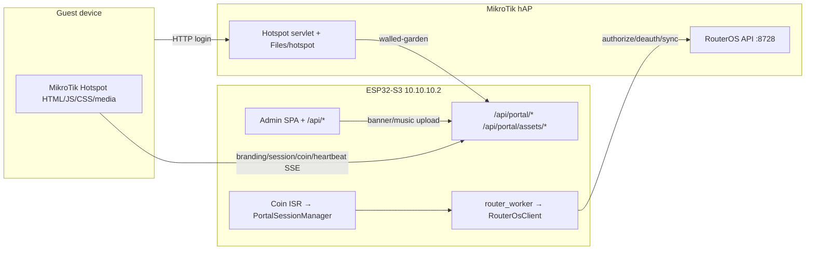

# FINAL RELEASE FORENSIC VALIDATION

**Mode:** NO CODE CHANGES  
**Date:** 2026-08-07  
**Verdict:** **RELEASE CANDIDATE** (not PRODUCTION READY until post-patch hardware checklist and portal SSoT cleanup decision)

---

## 1. Single Source of Truth

### Answers

| # | Question | Answer (evidence) |
|---|----------|-------------------|
| 1 | Uploaded to MikroTik? | **`deployment/mikrotik-hotspot/`** contents (Files → `hotspot/`). `upload-hotspot-files.rsc` only configures `html-directory=hotspot` + walled-garden; it does **not** FTP files. Upload is manual/FTP of the build output. |
| 2 | Build scripts? | **`portal/`** → `npm run build:mikrotik-portal` → `deployment/mikrotik-hotspot/` (`scripts/build-mikrotik-portal.mjs`). Also `portal/` → `stage-esp32-data.mjs` → ESP32 SPIFFS recovery. |
| 3 | Edited by Admin Dashboard? | **Neither folder.** Admin Captive Portal page uploads banner/music to ESP32 storage via `/api/settings/portal/*` and serves via `/api/portal/assets/*`. Portal JS loads branding from ESP32 APIs. |
| 4 | `upload-hotspot-files.rsc`? | References appliance IP / Hotspot profile / walled-garden only. Assumes files already in MikroTik `hotspot/`. Comments point at `build:mikrotik-portal`. |
| 5 | Byte-identical folders? | **No.** Three trees differ. |
| 6 | Diffs | See tables below. |

### Comparison table (shared names)

| File | `portal/` | `deployment/mikrotik-hotspot/` | `Captive Portal/` |
|------|----------:|-------------------------------:|------------------:|
| `login.html` | 8161 · hash `07D6AD…` | **same as portal** | 6671 · **different** |
| `renzfi-app.js` | 39102 · placeholder `__RENZFI…__` | 39090 · substituted `http://10.10.10.2` (**only line differs**) | 26187 · **obsolete** |
| `renzfi-style.css` | 22522 · match mikrotik | same | 19663 · **different** |
| `md5.js` | 7218 · match | same | same hash |
| `admin.html` | 496 · placeholder | 460 · substituted URL | **missing** |
| `Default-Banner.png` | 7266 | 7266 | **566116** (stale huge asset) |
| `bg_music.mp3` | 936562 | 936562 | 936562 |
| `coin.mp3` / `success.mp3` | present | present | **missing** |
| `favicon.ico` | 671 | 671 | 903 · different |

### Present only in `Captive Portal/` (not in production build output)

`alogin.html`, `logout.html`, `status.html`, `error.html`, `redirect.html`, `rlogin.html`, `radvert.html`, `api.json`, `errors.txt`, `piso_portal_logo.png`, `css/`, `img/`, `xml/` — legacy MikroTik sample shell. **Not** emitted by `build-mikrotik-portal.mjs`. Production Hotspot uses Renz-Fi `login.html` + RouterOS defaults for other servlet pages unless manually uploaded from this tree historically.

### Present only in `deployment/mikrotik-hotspot/`

Hand-written: `README.md`, `upload-hotspot-files.rsc`, `MIGRATION_*.md`. Junk: `New Text Document.txt`. Extra: `index.html`, extensionless `admin` (clean-URL experiments).

### Recommended Single Source of Truth

| Role | Path |
|------|------|
| **Canonical edit source** | **`portal/`** |
| **Production MikroTik upload artifact** | **`deployment/mikrotik-hotspot/`** (generated; gitignored HTML/JS/CSS/media) |
| **ESP32 SPIFFS recovery/setup** | Staged from **`portal/`** (required subset only) |
| **Deprecated — do not edit** | **`Captive Portal/`** (README already says so) |

**Do not delete `Captive Portal/` until** a release checklist confirms no field unit still depends on its shell templates (`alogin`/`logout`/…). Safe next step: mark for removal in a cleanup PR after inventory.

---

## 2. Communication validation

### Captive Portal → ESP32

| Path | Evidence | Status |
|------|----------|--------|
| Banner / music | `GET /api/portal/branding`, `GET /api/portal/assets/banner|music`; Admin `POST /api/settings/portal/*` | **OK** — dynamic, not files in hotspot folder |
| Images/CSS/JS static | Served from MikroTik `hotspot/` (`login.html`, `renzfi-*.css/js`, defaults) | **OK** |
| Portal API | `portal/renzfi-app.js` → `APPLIANCE_BASE_URL + /api/portal/*` | **OK** |
| Coin API | `start-coin-session`, `done-paying`, credits via session | **OK** |
| Session / heartbeat | `GET/POST session`, `POST /heartbeat` | **OK** |
| Voucher API (ESP32 `/api/vouchers`) | Admin generate/list/storage only (`VoucherManager` → JSON file; **no RouterOS push in source**) | Admin path **OK**; not guest REST |
| Voucher (guest) | MikroTik Hotspot form `action="$(link-login-only)"` in `login.html` | **OK** for Hotspot-native users; **not wired** to ESP32 `VoucherManager` in firmware source |

### Captive Portal → MikroTik

| Asset | In `deployment/mikrotik-hotspot/` | Notes |
|-------|----------------------------------|-------|
| `login.html` | Yes (from `portal/`) | Production UI |
| `renzfi-app.js` / CSS / `md5.js` / media | Yes | Build output |
| `alogin/logout/status/error/redirect` | **No** | Legacy in `Captive Portal/` only; Hotspot uses RouterOS defaults unless operator uploaded them |
| `api.json` | No | Legacy sample |

### ESP32 → MikroTik

| Operation | Path | Status |
|-----------|------|--------|
| RouterOS API | `RouterOsClient` via `router_worker` | **OK** |
| Sync | `collectCacheSnapshot` + WAN observe | **OK** |
| Wireless / profiles / hotspot | Sync + wireless save + reconcile | **OK** |
| DHCP / routes / WAN | `observeAndRepairWan` | **OK** |
| Coin/session grant | `tryEnqueueActivateHotspotUser` → `createHotspotUser` / login active | **OK** |

### MikroTik → ESP32

| Path | Status |
|------|--------|
| Direct RouterOS→ESP32 push | **None** (no MikroTik script calling ESP32) |
| Guest browser as proxy | Heartbeat/session/branding/SSE to ESP32 via walled-garden | **OK** |
| Dashboard / router cache | Admin pulls ESP32 APIs; Sync pulls RouterOS | **OK** |

---

## 3. Customer flow (source-backed)

1. Guest hits Hotspot → MikroTik serves `login.html` + JS/CSS.  
2. Portal opens coin window → `POST /api/portal/start-coin-session`.  
3. Coin pulse → GPIO ISR → `CoinManager::loop` settle → `PortalSessionManager::onCoinInserted`.  
4. Guest Done Paying → `donePaying` (idempotent if activating/active) → sale record → `onSessionActivated`.  
5. Activation **serialized** on `router_worker` (`tryEnqueueActivateHotspotUser`); if busy, re-queue with budget (`kHotspotRetryBudgetMs`).  
6. MikroTik Hotspot user/login → Internet.  
7. Portal heartbeat + Admin SSE/status refresh; logs via Logger/sales.

### Race handling (evidence)

| Risk | Mitigation |
|------|------------|
| Dual RouterOS from HTTP | Forbidden — worker only |
| Double done-paying | Idempotent states in `donePaying` |
| Worker busy at activate | Deferred `ActivateSession` work + abandon after budget |
| Coin during Sync | Queue depth 1; activation retries |

**No open source-level race proven** that would grant Internet without a session or drop credits silently without `activationError`/Resume path. Continuous field soak still required for RC→Production.

---

## 4. Performance audit

### RouterOS CPU

| Context | Expected | Notes |
|---------|----------|-------|
| Idle | ~0 ESP-driven cmds/min | No continuous poll |
| Sync | High transient (many prints + pacing) | hAP lite can spike; **legitimate short spike**, not continuous 100% |
| Coin/voucher grant | Short API burst | Serialized |
| Login/logout/expire | Short | deauth/pause paths |

Near-100% **during Sync** on hAP lite is plausible and temporary; not a defect by itself. Smallest future optimization if needed: Sync split (FULL vs FAST) — **not required for RC**.

### ESP32

| Area | Assessment |
|------|------------|
| Heap / PSRAM | Telemetry corrected; general heap healthy |
| DMA | Transient low watermark during Sync; free recovers — acceptable |
| Watchdog | AsyncTCP core pin + no RouterOS from HTTP |
| Worker / queue | Depth 1; job timeout 20s |
| HTTP / SSE | Dashboard poll + portal heartbeat; no RouterOS |

**Sustainable for continuous customer operation** at source level, subject to hardware soak.

---

## 5. Stability + cleanup report (do not auto-delete)

| Item | Classification |
|------|----------------|
| `Captive Portal/` | **Deprecated duplicate** — cleanup candidate after confirming no field shell-template dependency |
| `deployment/.../New Text Document.txt` | Junk |
| Huge `Captive Portal/Default-Banner.png` (566 KB) | Obsolete vs 7 KB `portal/` banner |
| Stale docs citing SPIFFS `bg_music` as primary | Stale relative to SPIFFS audio removal |
| `Captive Portal` shell HTML | Unused by current build pipeline |
| ESP32 SPIFFS `portal/` required HTML/JS | **Still required** for Setup Finish / recovery — not obsolete |
| Admin `/api/vouchers` | Live for Admin; not dead |
| Dual `admin` / `admin.html` / `index.html` on Hotspot | Experimental clean-URL artifacts — document or consolidate later |

---

## Final deliverables summary

1. **SSoT:** Edit **`portal/`** → build **`deployment/mikrotik-hotspot/`** for MikroTik; Admin media on ESP32 APIs; **`Captive Portal/`** deprecated.  
2. **Communication:** Validated as above; guest voucher is Hotspot-native; coin/session via ESP32; Sync via worker.  
3. **Performance:** Idle clean; Sync may spike RouterOS CPU briefly — acceptable.  
4. **Stability:** Worker serialization + idempotent done-paying + activation retry — sound.  
5. **Verdict:**

### **RELEASE CANDIDATE**

Not **PRODUCTION READY** until:

- Hardware re-validation of post-forensic WAN/Provision/bridge patches  
- Explicit decision on `Captive Portal/` retention vs deletion  
- Soak: coin + voucher + idle CPU + DMA after Sync  

Not **NOT READY**: core paths are source-complete and system is reported operational.
