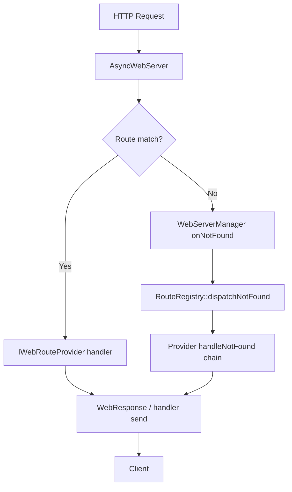

# Renz-Fi HTTP Route Contract (Frozen)

This document is the **permanent HTTP contract** for the Renz-Fi ESP32 appliance web platform. It sits alongside the other frozen architecture documents:

- [STORAGE_ARCHITECTURE.md](./STORAGE_ARCHITECTURE.md)
- [ASSET_LIFECYCLE.md](./ASSET_LIFECYCLE.md)
- [PORTAL_CONFIG_ARCHITECTURE.md](./PORTAL_CONFIG_ARCHITECTURE.md)

**Authoritative runtime:** `WebServerManager` → `RouteRegistry` → `IWebRouteProvider`  
**Default port:** `80` (`RenzFiConfig::HTTP_PORT`)  
**MIME resolution:** `MimeResolver` (`src/web/MimeResolver.h`)  
**Cache headers:** `CacheManager` (`src/web/CacheManager.h`)  
**Status:** Frozen. These routes are **stable public interfaces**. Do not change URLs unless absolutely necessary.

> **Production hosting correction:** the customer-facing captive portal (`/`, `/portal`, `/portal/*`) is deployed to **MikroTik Hotspot storage** in production — see `deployment/mikrotik-hotspot/README.md` and `scripts/build-mikrotik-portal.mjs`. The URLs and `PortalServer` implementation below are unchanged and remain registered on the ESP32 for local development, factory setup, management-AP access, and field recovery only. `/admin`, `/api/*`, and all other routes are unaffected and continue to be served by the ESP32 exactly as documented.

---

## 1. Route ownership table

| Route | Owner | Purpose | Authentication | Consumer | Cache policy | Content type |
|-------|-------|---------|----------------|----------|--------------|--------------|
| `GET /` | **PortalServer** | Captive portal entry — **development/recovery fallback only in production** (see note below) | No | Guest browser (dev/recovery) | No Cache | `text/html` |
| `GET /portal` | **PortalServer** | Captive portal alias — dev/recovery fallback only | No | Guest browser (dev/recovery) | No Cache | `text/html` |
| `GET /portal/*` | **PortalServer** | Portal static subtree (HTML, JS, CSS, sounds) — dev/recovery fallback only | No | Guest browser (dev/recovery) | Short Cache | Resolved MIME |
| `GET /admin` | **AdminServer** | React admin dashboard SPA shell | No† | Administrator | No Cache | `text/html` |
| `GET /admin/*` | **AdminServer** | Admin deep links (React Router fallback) | No† | Administrator | No Cache | `text/html` |
| `GET /login` | **AdminServer** | Admin login entry (legacy alias). On the Management AP, redirects to `/admin/setup` instead of serving the SPA | No | Administrator | No Cache | `text/html` |
| `GET /dashboard` | **AdminServer** | Admin dashboard alias (legacy). On the Management AP, redirects to `/admin/setup` instead of serving the SPA | No† | Administrator | No Cache | `text/html` |
| `GET /manifest.webmanifest` | **AdminServer** | Admin PWA manifest | No | Administrator browser | No Cache | `application/manifest+json` |
| `GET /sw.js` | **AdminServer** | Admin service worker | No | Administrator browser | No Cache | `application/javascript` |
| `GET /favicon.svg` | **AdminServer** | Admin favicon | No | Browser | No Cache | `image/svg+xml` |
| `GET /favicon.ico` | **AdminServer** | Admin favicon | No | Browser | No Cache | `image/x-icon` |
| `/api/*` | **ApiServer** | REST API (admin + portal session) | Depends | Admin dashboard, portal JS, mobile app | No Cache | `application/json` |
| `GET /api/events` | **EventBusRouteProvider** | Server-sent events stream | No | Admin dashboard | No Cache | `text/event-stream` |
| `GET /api/portal/assets/banner` | **AssetServer** | Resolved portal banner image | No | Portal JS, guest browser | Long Cache‡ | Resolved MIME |
| `GET /api/portal/assets/music` | **AssetServer** | Resolved portal music file | No | Portal JS, guest browser | Long Cache‡ | Resolved MIME |
| `GET /assets/*` | **StaticFileServer** | Admin React build artifacts (bundled chunks) | No | Admin dashboard | Immutable | Resolved MIME |
| `GET /static/*` | **StaticFileServer** | Firmware-shipped static resources | No | Portal, dashboard | Short Cache | Resolved MIME |
| `GET /downloads/*` | **DownloadServer** | Owner downloads (exports, backups) | Admin | Administrator | No Cache | `application/json` / octet-stream |
| `GET /api/health` | **ApiServer** | Lightweight system health (canonical today) | No | Diagnostics, monitoring, admin | No Cache | `application/json` |
| `GET /health` | *Reserved — WebServerManager* | Top-level health alias | No | Diagnostics, monitoring | No Cache | `application/json` |
| `GET /healthz` | **SetupServer** | Compact heartbeat JSON — works on **both** the Management AP and Ethernet planes | No | Installer, mobile app, diagnostics | No Cache | `application/json` |
| `GET /api/setup/status` | **SetupServer** | Setup wizard status (Management AP only): device ID, firmware, installation state, storage, Ethernet, wizard step | No | Setup wizard, mobile app | No Cache | `application/json` |
| `POST /api/setup/owner` | **SetupServer** | Create owner account during first-run setup (Management AP only) | No | Setup wizard | No Cache | `application/json` |
| `GET /api/setup/router-status` | **SetupServer** | Router connection check (Management AP only): Ethernet link, DHCP, IP, gateway, DNS | No | Setup wizard | No Cache | `application/json` |
| `GET /api/setup/router-config` | **SetupServer** | Saved MikroTik metadata: `host`, `username`, `apiPort`, `connectionVerified`, `hasSavedPassword` — never password (Management AP only) | No | Setup wizard, mobile app | No Cache | `application/json` |
| `POST /api/setup/router/test` | **SetupServer** | Test RouterOS API login without persisting; blank `password` uses saved encrypted credential when `hasSavedPassword` is true (Management AP only) | No | Setup wizard, mobile app | No Cache | `application/json` |
| `POST /api/setup/router/save` | **SetupServer** | Revalidate and persist MikroTik connection; blank `password` preserves existing encrypted password; sets `router_configured` (Management AP only) | No | Setup wizard, mobile app | No Cache | `application/json` |
| `GET /api/setup/router-plan` | **SetupServer** | Read-only router provisioning plan preview (requires `router_configured`) | No | Setup wizard | No Cache | `application/json` |
| `POST /api/setup/router-plan` | **SetupServer** | **405 METHOD_NOT_ALLOWED** — preview is GET-only; never invokes provisioning | No | — | No Cache | `application/json` |
| `POST /api/setup/router-apply` | **SetupServer** | Apply guest bridge + DHCP foundation only (no Hotspot); advances to `provisioned` | No | Setup wizard | No Cache | `application/json` |

† HTML shell is delivered without a session cookie. **All dashboard functionality** requires **Admin** authentication via `/api/*`.  
‡ Portal media uses `?v={revision}` query strings from branding JSON for cache busting; AssetServer serves resolved bytes with asset MIME type.

### Namespace clarification (frozen)

| URL pattern | What it serves | Owner |
|-------------|----------------|-------|
| `/assets/*` | **Bundled** admin frontend files (Vite/Webpack output in SPIFFS) | StaticFileServer |
| `/api/portal/assets/*` | **Dynamic** owner-uploaded portal media (banner, music) | AssetServer |

These namespaces must never be merged or aliased.

---

## 2. Top-level route specifications

### `/`

| Field | Value |
|-------|-------|
| **Owner** | PortalServer |
| **Purpose** | Captive portal entry — **development/local-recovery fallback only in production** |
| **Authentication** | No |
| **Consumer** | Guest browser (dev/recovery); production customers are served by MikroTik |
| **Cache policy** | No Cache |
| **Content type** | `text/html; charset=utf-8` |
| **Notes** | Resolves via `PortalServer::servePortalEntry` from SPIFFS `/portal/login.html`. Production traffic is served by MikroTik Hotspot storage (`deployment/mikrotik-hotspot/`); this route is not the production customer path |
| **Future compatibility** | Stable URL, retained for dev/recovery. Not the production customer entry point |

---

### `/portal`

| Field | Value |
|-------|-------|
| **Owner** | PortalServer |
| **Purpose** | Captive portal alias — **development/local-recovery fallback only in production** |
| **Authentication** | No |
| **Consumer** | Guest browser (dev/recovery) |
| **Cache policy** | No Cache (shell); Short Cache (`/portal/*` subtree) |
| **Content type** | `text/html; charset=utf-8` |
| **Notes** | Equivalent entry point to `/` for dev/recovery. Production hotspot redirects go to MikroTik's own `/hotspot/login.html`, not this route |
| **Future compatibility** | Stable, retained for dev/recovery |

---

### `/portal/*`

| Field | Value |
|-------|-------|
| **Owner** | PortalServer |
| **Purpose** | Portal JavaScript, CSS, sounds, and static portal files — **development/local-recovery fallback only in production** |
| **Authentication** | No |
| **Consumer** | Guest browser, portal JS (dev/recovery) |
| **Cache policy** | Short Cache (`max-age=86400`) |
| **Content type** | Resolved MIME (`text/css`, `application/javascript`, `audio/mpeg`, …) |
| **Notes** | Served from SPIFFS `/portal/` for dev/recovery. Production customer traffic is served from the equivalent generated bundle hosted on MikroTik Hotspot storage (`deployment/mikrotik-hotspot/`), built from the same `portal/` source by `scripts/build-mikrotik-portal.mjs` |
| **Future compatibility** | Stable paths on the ESP32; production storage backend is MikroTik, not this appliance |

---

### `/admin`

| Field | Value |
|-------|-------|
| **Owner** | AdminServer |
| **Purpose** | React admin dashboard SPA shell |
| **Authentication** | No (HTML shell); **Admin** required for API data |
| **Consumer** | Administrator |
| **Cache policy** | No Cache |
| **Content type** | `text/html; charset=utf-8` |
| **Notes** | `/admin/*` deep links fall back to `/index.html` via `AdminServer::handleNotFound` |
| **Future compatibility** | Stable |

---

### `/login`

| Field | Value |
|-------|-------|
| **Owner** | AdminServer |
| **Purpose** | Admin login page (legacy SPA entry) |
| **Authentication** | No |
| **Consumer** | Administrator |
| **Cache policy** | No Cache |
| **Content type** | `text/html; charset=utf-8` |
| **Notes** | Session created via `POST /api/auth/login`. On the Management AP (`192.168.4.1`), this route redirects (302) to `/admin/setup` instead of serving the SPA — see [NETWORK_PLANE_ARCHITECTURE.md](./NETWORK_PLANE_ARCHITECTURE.md) |
| **Future compatibility** | Stable legacy alias |

---

### `/api/*`

| Field | Value |
|-------|-------|
| **Owner** | ApiServer (+ AssetServer for `GET /api/portal/assets/*`) |
| **Purpose** | REST API for admin operations and captive portal session control |
| **Authentication** | Depends on endpoint (see §3) |
| **Consumer** | Admin dashboard, ESP32-internal callers, owner mobile app, portal JS |
| **Cache policy** | No Cache |
| **Content type** | `application/json` (envelope: `{ success, data, message }` or `{ success, error, code }`) |
| **Notes** | ApiServer never serves HTML. CORS preflight on `OPTIONS /api/` |
| **Future compatibility** | Stable prefix; new endpoints extend existing groups |

---

### `/api/portal/assets/*`

| Field | Value |
|-------|-------|
| **Owner** | AssetServer |
| **Purpose** | Dynamic user-uploaded portal media |
| **Authentication** | No |
| **Consumer** | Portal JS, guest browser |
| **Cache policy** | Long Cache with revision query (`?v=`) from `/api/portal/branding` |
| **Content type** | Resolved MIME via AssetResolver (`image/webp`, `image/jpeg`, `audio/mpeg`, …) |
| **Notes** | Fallback chain: SD contract → legacy `/www` → SPIFFS → bundled default. AssetManager owns metadata; AssetServer owns HTTP |
| **Future compatibility** | Stable URLs |

---

### `/assets/*`

| Field | Value |
|-------|-------|
| **Owner** | StaticFileServer |
| **Purpose** | Bundled admin React frontend resources (not owner uploads) |
| **Authentication** | No |
| **Consumer** | Admin dashboard browser |
| **Cache policy** | Immutable (`public, max-age=31536000, immutable`) |
| **Content type** | Resolved MIME (`application/javascript`, `text/css`, …) |
| **Notes** | SPIFFS `/assets/` mirror of production build output |
| **Future compatibility** | Stable; content-hashed filenames from build tooling |

---

### `/static/*`

| Field | Value |
|-------|-------|
| **Owner** | StaticFileServer |
| **Purpose** | Firmware-shipped static resources |
| **Authentication** | No |
| **Consumer** | Portal, dashboard |
| **Cache policy** | Short Cache |
| **Content type** | Resolved MIME |
| **Notes** | Foundation registered; assets not migrated in Phase 4A |
| **Future compatibility** | Reserved prefix for firmware-bundled non-portal files |

---

### `/downloads/*`

| Field | Value |
|-------|-------|
| **Owner** | DownloadServer |
| **Purpose** | Administrator file downloads (backups, exports, reports) |
| **Authentication** | Admin |
| **Consumer** | Administrator |
| **Cache policy** | No Cache |
| **Content type** | `application/json` or `application/octet-stream` |
| **Notes** | Foundation registered; individual routes TBD. Some exports today via `/api/logs/export`, `/api/sales/export` |
| **Future compatibility** | Prefix reserved; migrate inline download APIs here over time |

---

### `/api/health` (canonical health today)

| Field | Value |
|-------|-------|
| **Owner** | ApiServer |
| **Purpose** | Lightweight health probe |
| **Authentication** | No |
| **Consumer** | Diagnostics, monitoring, admin degraded-mode page |
| **Cache policy** | No Cache |
| **Content type** | `application/json` |
| **Notes** | Returns storage ok, session flags. Linked from SPIFFS fallback page |
| **Future compatibility** | Stable; `/health` may alias this in future |

---

### `/health` (reserved)

| Field | Value |
|-------|-------|
| **Owner** | WebServerManager (reserved) |
| **Purpose** | Top-level health alias for load balancers / external monitors |
| **Authentication** | No |
| **Consumer** | Diagnostics, monitoring |
| **Cache policy** | No Cache |
| **Content type** | `application/json` |
| **Notes** | **Not implemented.** Use `GET /api/health` today |
| **Future compatibility** | Reserved; must not break `/api/health` when added |

---

## 3. Authentication matrix

| Class | Description | Routes |
|-------|-------------|--------|
| **No authentication** | No session cookie required | `/`, `/portal/*`, `/login`, `/assets/*`, `/static/*`, `GET /api/health`, `GET /api/events`, all `/api/portal/*` except none require admin, `GET /api/portal/assets/*`, PWA icons, `OPTIONS /api/` |
| **Admin authentication** | Valid admin session cookie via `AuthManager`; blocked if password change required (403) | All other `/api/*` endpoints including `/api/status`, settings, sales, promos, vouchers, users, coin, router, OTA, logs, uploads |
| **Session authentication** | Valid admin session; allowed during forced password change | `POST /api/auth/change-password` |
| **Portal session** | MAC/IP identity in JSON body or query; no admin cookie | `GET /api/portal/session`, `POST /api/portal/start-coin-session`, pause/resume/terminate/heartbeat, etc. Managed by PortalSessionManager |
| **Future token** | Reserved for API key or Bearer token auth (e.g. mobile app hardening) | Not implemented |

### Auth endpoints

| Method | Route | Auth required | Purpose |
|--------|-------|---------------|---------|
| POST | `/api/auth/login` | No | Create admin session |
| POST | `/api/auth/logout` | No | Clear session |
| POST | `/api/auth/change-password` | Session | Change password |

---

## 4. Cache policy table

Standard policies (`CacheManager`):

| Policy | `Cache-Control` header | When to use |
|--------|------------------------|-------------|
| **No Cache** | `no-store` | All JSON APIs, SPA HTML shells, errors, SSE, downloads |
| **Short Cache** | `max-age=86400` | Portal static subtree `/portal/*`, firmware `/static/*` |
| **Long Cache** | `public, max-age=31536000` | Available; portal media uses revision query for busting |
| **Immutable** | `public, max-age=31536000, immutable` | Admin React bundles `/assets/*` |

| Route group | Policy |
|-------------|--------|
| `/api/*` | No Cache |
| `/`, `/portal` (shell) | No Cache |
| `/portal/*` (static files) | Short Cache |
| `/admin`, `/admin/*`, `/login`, `/dashboard` | No Cache |
| `/assets/*` | Immutable |
| `/static/*` | Short Cache |
| `/api/portal/assets/*` | Long Cache‡ (client uses `?v=revision`) |
| `/downloads/*` | No Cache |
| `/api/events` | No Cache |

---

## 5. MIME ownership table

All HTTP content types are resolved by **`MimeResolver`** unless AssetResolver provides an explicit MIME on a resolved asset.

| Extension / use | MIME type | Typical routes |
|-----------------|-----------|----------------|
| `.html` | `text/html; charset=utf-8` | `/`, `/portal`, `/admin` |
| `.css` | `text/css; charset=utf-8` | `/portal/*`, `/assets/*` |
| `.js` | `application/javascript; charset=utf-8` | `/portal/*`, `/assets/*`, `/sw.js` |
| `.json` | `application/json` | `/api/*` |
| `.webmanifest` | `application/manifest+json; charset=utf-8` | `/manifest.webmanifest` |
| `.webp` | `image/webp` | `/api/portal/assets/banner` |
| `.png` | `image/png` | `/assets/*` |
| `.jpg` / `.jpeg` | `image/jpeg` | assets |
| `.svg` | `image/svg+xml` | `/favicon.svg` |
| `.ico` | `image/x-icon` | `/favicon.ico` |
| `.mp3` | `audio/mpeg` | `/api/portal/assets/music`, `/portal/*` sounds |
| `.mp4` | `video/mp4` | future video assets |
| `.woff` / `.woff2` / `.ttf` | font MIME | future |
| `.bin` / unknown | `application/octet-stream` | firmware downloads |
| SSE stream | `text/event-stream` | `/api/events` |

**Rule:** handlers must not hardcode MIME strings when `MimeResolver` or `ResolvedAsset.mimeType` applies.

---

## 6. URL stability policy

1. **Public firmware contract** — every route in this document is a stable interface for external clients: captive portal HTML/JS, `renzfi-app.js`, admin React app, owner Android app, and monitoring scripts.
2. **Backward compatibility preferred** — preserve existing URLs across firmware versions whenever possible.
3. **Breaking changes** — require major version bump, migration notes, and simultaneous updates to all consumers listed in §1.
4. **Deprecation** — old URLs remain functional for at least one major release after replacement is introduced.
5. **New routes** — extend existing prefixes (`/api/settings/...`, `/api/portal/...`) before inventing new top-level paths.
6. **Reserved routes** — `/health`, `/metrics`, `/docs`, etc. must be documented here before implementation.
7. **Production portal hosting** — the customer captive portal is generated from `portal/` and deployed to MikroTik Hotspot storage; `/`, `/portal`, `/portal/*` on the ESP32 remain registered for dev/recovery only. This changes **where production files are stored**, not **which URLs the ESP32 exposes**.

---

## 7. HTTP request flow



**Registration pipeline (boot):**

```
FirmwareApp::startNetworkServices()
    → WebServerManager::initialize()
    → WebServerManager::configure()
    → ApiServer::begin()          // domain deps only
    → WebServerManager::registerRoutes()
        → RouteRegistry::registerAll()
            → each IWebRouteProvider::registerRoutes(WebServerManager&)
    → WebServerManager::start()
```

**Provider registration order (first match wins):**  
StaticFileServer → AssetServer → EventBusRouteProvider → ApiServer → PortalServer → AdminServer → DownloadServer

**onNotFound priority order:** AdminServer (10) → ApiServer (20) → DownloadServer (30) → StaticFileServer (40)

---

## 8. Dependency rules

| Subsystem | Rule |
|-----------|------|
| **PortalServer** | Never calls StorageManager directly. Portal media URLs come from PortalConfigManager → AssetManager queries. Static bytes served via StaticFileServer helpers or SPIFFS paths |
| **AdminServer** | Never serves dynamic owner assets directly. Admin UI loads bundled `/assets/*`; portal branding/media uses `/api/portal/assets/*` via AssetServer |
| **AssetServer** | Never knows RouterOS. Uses AssetManager + AssetResolver only |
| **ApiServer** | Never serves HTML or static files. JSON, SSE coordination, and upload streams only |
| **StaticFileServer** | Never reads AssetManager metadata. Serves SPIFFS/static paths only |
| **AssetManager** | Never owns HTTP routes |
| **PortalConfigManager** | Never serves files or owns HTTP routes |
| **StorageManager** | Never knows HTTP |
| **WebServerManager** | Coordinates lifecycle and RouteRegistry; does not implement business logic |

---

## 9. Complete `/api/*` route inventory

Unless noted: **Admin** auth, **No Cache**, **`application/json`**.

### Public (no admin auth)

| Method | Route | Owner | Consumer | Notes |
|--------|-------|-------|----------|-------|
| OPTIONS | `/api/` | ApiServer | Browser | CORS preflight |
| GET | `/api/health` | ApiServer | Monitoring | Canonical health |
| POST | `/api/auth/login` | ApiServer | Admin | |
| POST | `/api/auth/logout` | ApiServer | Admin | |
| GET | `/api/portal/branding` | ApiServer | Portal JS | |
| GET | `/api/portal/session` | ApiServer | Portal JS | Query `mac`, `ip` |
| GET | `/api/portal/rates` | ApiServer | Portal JS | |
| POST | `/api/portal/start-coin-session` | ApiServer | Portal JS | Portal session |
| POST | `/api/portal/done-paying` | ApiServer | Portal JS | Portal session |
| POST | `/api/portal/pause` | ApiServer | Portal JS | Portal session |
| POST | `/api/portal/resume` | ApiServer | Portal JS | Portal session |
| POST | `/api/portal/cancel-modal` | ApiServer | Portal JS | Portal session |
| POST | `/api/portal/reset` | ApiServer | Portal JS | Portal session |
| POST | `/api/portal/terminate` | ApiServer | Portal JS | Portal session |
| POST | `/api/portal/heartbeat` | ApiServer | Portal JS | Portal session |
| GET | `/api/portal/assets/banner` | AssetServer | Portal JS | Resolved MIME |
| GET | `/api/portal/assets/music` | AssetServer | Portal JS | Resolved MIME |
| GET | `/api/events` | EventBusRouteProvider | Admin | SSE |

### Session auth

| Method | Route | Notes |
|--------|-------|-------|
| POST | `/api/auth/change-password` | Allowed during forced password change |

### Admin auth — system & storage

| Method | Route | Purpose |
|--------|-------|---------|
| GET | `/api/status` | Dashboard summary |
| GET | `/api/storage/status` | SD/SPIFFS health |
| POST | `/api/storage/retry-sd` | Remount SD |
| GET | `/api/system/health` | Detailed health JSON |
| GET | `/api/system/coin` | Coin subsystem status |
| GET/PUT | `/api/system/rgb` | RGB settings |
| GET | `/api/rgb/status` | RGB status |
| POST | `/api/rgb/mode` | RGB mode |
| POST | `/api/rgb/color` | RGB color |
| POST | `/api/rgb/brightness` | RGB brightness |
| POST | `/api/system/reboot` | Reboot device |
| POST | `/api/system/factory-reset` | Factory reset |
| GET/POST | `/api/system/firmware` | OTA info / upload |
| GET | `/api/system/network` | Ethernet status |
| GET | `/api/system/wifi` | Backward-compat alias |
| GET/POST/PUT | `/api/system/wifi/config` | Read-only stub |

### Admin auth — business data

| Method | Route | Purpose |
|--------|-------|---------|
| GET/POST | `/api/promos` | List / create promos |
| PUT/DELETE | `/api/promos/{id}` | Update / delete (onNotFound) |
| GET/POST | `/api/vouchers` | List / create vouchers |
| GET/DELETE | `/api/vouchers/{code}` | Lookup / delete (onNotFound) |
| GET | `/api/users` | Active users |
| POST | `/api/users/disconnect` | Disconnect user |
| POST | `/api/users/pause` | Pause user session |
| POST | `/api/users/resume` | Resume user session |
| GET | `/api/sales/today` | Sales today |
| GET | `/api/sales/weekly` | Sales weekly |
| GET | `/api/sales/monthly` | Sales monthly |
| GET | `/api/sales/history` | Sales history |
| GET | `/api/sales/export` | CSV export download |
| GET | `/api/sales/chart/{period}` | Chart data (onNotFound) |

### Admin auth — settings & portal admin

| Method | Route | Purpose |
|--------|-------|---------|
| GET | `/api/settings` | All settings |
| POST/PUT | `/api/settings` | Save settings |
| GET/PUT | `/api/settings/admin` | Admin account settings |
| GET | `/api/settings/portal` | Portal config JSON |
| POST | `/api/settings/portal/banner` | Upload banner |
| POST | `/api/settings/portal/music` | Upload music |
| DELETE | `/api/settings/portal/banner` | Remove banner |
| DELETE | `/api/settings/portal/music` | Remove music |
| GET | `/api/settings/backup` | Download backup |
| POST | `/api/settings/restore` | Restore backup upload |

### Admin auth — logs, coin, router

| Method | Route | Purpose |
|--------|-------|---------|
| GET/DELETE | `/api/logs` | Read / clear logs |
| GET | `/api/logs/export` | Export logs |
| GET/POST/PUT | `/api/coin/settings` | Coin settings |
| GET | `/api/coin/diagnostics` | Coin diagnostics |
| POST | `/api/coin/test` | Test pulse |
| POST | `/api/coin/reset` | Reset coin counters |
| GET/POST/PUT | `/api/router/settings` | MikroTik settings |
| GET/POST | `/api/access-points` | External AP registry list / create (owner-only, exact match) |
| GET/PUT/DELETE | `/api/access-points/{id}` | External AP registry item (owner-only) |
| POST | `/api/access-points/{id}/check` | Queue generic reachability job (owner-only, HTTP 202, single-flight) |
| GET | `/api/access-points/jobs/{jobId}` | RAM-only access-point check job snapshot (owner-only) |
| GET | `/api/router/profiles` | Hotspot profiles |
| POST | `/api/router/test` | Test router connection |

---

## 10. Future reserved routes

**Do not implement without updating this document first.**

| Route | Intended owner | Purpose | Status |
|-------|----------------|---------|--------|
| `GET /health` | WebServerManager | Top-level health alias | Reserved |
| `GET /metrics` | WebServerManager | Telemetry / metrics export | Reserved |
| `GET /docs` | WebServerManager or StaticFileServer | Operator / API documentation | Reserved |
| `GET /system` | ApiServer or WebServerManager | System info page | Reserved |
| `GET /diagnostics` | ApiServer | Extended diagnostics UI | Reserved |
| `GET /logs` | DownloadServer | Log download UI | Reserved |
| `GET /reports` | DownloadServer | Sales / report downloads | Reserved |
| `GET /downloads/*` | DownloadServer | Canonical download prefix | Foundation only |

---

## 11. Route provider registry (frozen)

| Provider | `providerName()` | Registers |
|----------|------------------|-----------|
| StaticFileServer | `StaticFileServer` | `/assets/*`, `/static/*`, SPA static resolution |
| AssetServer | `AssetServer` | `/api/portal/assets/banner`, `/api/portal/assets/music` |
| EventBusRouteProvider | `EventBus` | `/api/events` |
| ApiServer | `ApiServer` | `/api/*` (except asset GET above) |
| PortalServer | `PortalServer` | `/`, `/portal`, `/portal/*` (dev/recovery fallback; production is MikroTik) |
| AdminServer | `AdminServer` | `/admin`, `/login`, `/dashboard`, PWA assets |
| DownloadServer | `DownloadServer` | `/downloads/*` (reserved) |

---

## 12. Setup plane DNS and Management AP lifecycle (frozen)

During first-run setup (`factory`, `owner_created`, `router_configured`, and any
state before `provisioned`/`ready`):

| Concern | Behavior |
|---------|----------|
| Management AP | Stays active at `192.168.4.1` (`Renz-Fi Setup`) |
| Setup wizard | `GET /admin/setup` and all `/api/setup/*` routes remain reachable on the AP |
| Captive DNS | AP-local only — every client DNS query answered with `192.168.4.1`; never forwarded to Ethernet/MikroTik |
| AP DHCP DNS option | Offers `192.168.4.1` so clients do not use upstream DNS |
| ESP32 Ethernet DNS | lwIP DNS servers cleared; outbound hostname resolution blocked during setup |
| NTP | Deferred until installation reaches `provisioned` or `ready` |
| Router validation | Direct RouterOS API TCP to configured IP:8728 — no DNS dependency |

When installation becomes `provisioned` or `ready`:

- Management AP and captive DNS stop cleanly
- Ethernet and production HTTP routes (`/admin`, `/api/*`, portal APIs) continue
- lwIP DNS restored from DHCP/static config; NTP starts

Setup-plane HTTP routes in section 1 are unchanged; only the underlying network
isolation and post-provisioning AP shutdown are documented here. See
[NETWORK_PLANE_ARCHITECTURE.md](./NETWORK_PLANE_ARCHITECTURE.md) for serial
diagnostics and lifecycle logs.

---

## Quick reference

```
Guest portal (prod)    →  MikroTik Hotspot storage (deployment/mikrotik-hotspot/)
Guest portal (dev/rec) →  GET /  /portal/*      (ESP32 fallback only)
Appliance API (all)    →  GET/POST /api/portal/*  (called by portal from either origin)
Dynamic media          →  GET /api/portal/assets/banner|music
Admin UI shell         →  GET /admin/*  /login
Admin bundles          →  GET /assets/*
Admin API              →  /api/*  (session cookie)
Health (today)         →  GET /api/health
Live updates           →  GET /api/events
```

**Frozen:** Treat amendments with the same rigor as `StoragePaths` changes.

**Validation gate:** [PHASE_4C_SYSTEM_VALIDATION.md](./PHASE_4C_SYSTEM_VALIDATION.md) must pass before Phase 5 (Router Adapter).

**Related:** [PHASE_4B_PORTAL_MIGRATION.md](./PHASE_4B_PORTAL_MIGRATION.md) — infrastructure migration must preserve every URL above.
