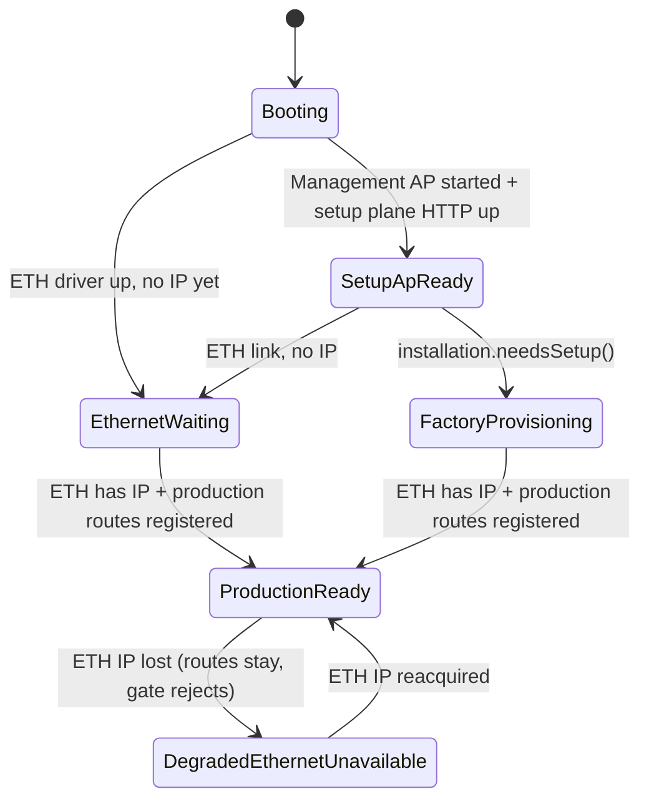

# Network Plane Architecture (Setup vs Production HTTP)

## Problem

Serving the full production web stack (React admin SPA from SPIFFS, portal APIs,
EventBus SSE, large static trees) on **both** the Management AP (`192.168.4.1`)
and W5500 Ethernet (`10.10.10.x`) through a single ungated `AsyncWebServer`
caused `async_tcp` task watchdog resets under ETH+AP coexistence.

## Decision: one server, strict interface gating

Two separate `AsyncWebServer` instances on port 80 cannot bind independently to
AP vs Ethernet on ESP32 — the stack uses one listener on `INADDR_ANY`. The fix
uses **one** `AsyncWebServer` started once at boot, with **two logical HTTP
planes** enforced by `HttpPlaneGate` on every handler.

| Plane | Local IP | When active |
|-------|----------|-------------|
| **Setup** | `192.168.4.1` | Management AP running (factory / provisioning / maintenance) |
| **Production** | active ETH DHCP/static IP | After W5500 reports a valid IP (routes registered once, server never restarted) |

Plane detection uses `request->client()->localIP()` as the primary signal
(`192.168.4.1` = setup, current Ethernet IP = production).

## Lifecycle state machine

During first-run setup (`factory`, `owner_created`, `router_configured`, and any
pre-`provisioned`/`ready` state), the Management AP stays up at `192.168.4.1`
with **AP-local captive DNS only**. DNS queries from AP clients are answered
on-device with `192.168.4.1`; they are never forwarded to Ethernet or MikroTik
DNS. The ESP32 clears lwIP DNS servers on Ethernet during setup and defers NTP
until installation reaches `provisioned` or `ready`.

When installation becomes `provisioned` or `ready`, the firmware stops the
Management AP and its captive DNS server cleanly. Ethernet and production HTTP
services continue unchanged.

Serial diagnostics (every 10 s heartbeat):

```
[net] heartbeat lifecycle=... eth_link=... eth_ip=... mgmt_ap=... setup=... production=... install=...
[setup-dns] ap_req=N ap_local=N eth_attempts=0 blocked=yes
```

Setup lifecycle serial markers:

```
[setup-dns] Ethernet lwIP DNS cleared — no outbound DNS during setup lifecycle
[mgmt-ap-dns] captive DNS started (AP-local only, wildcard -> 192.168.4.1)
[sales] NTP deferred until setup complete (provisioned/ready)
[mgmt-ap] setup complete (provisioned/ready) — stopping Management AP and captive DNS
[mgmt-ap-dns] captive DNS stopped
[setup-dns] Ethernet lwIP DNS restored from active interface config
[sales] NTP time sync started (Asia/Manila)
```



Serial heartbeat (every 10 s):

```
[net] heartbeat lifecycle=... eth_link=... eth_ip=... mgmt_ap=... setup=... production=... install=...
```

---

## Setup plane (Management AP — permanent)

Registered at boot when the Management AP starts. **Only lightweight handlers**
— no React SPA, no SPIFFS bundles, no auth, no provisioning engine, no full
system APIs on `192.168.4.1`.

**Registered providers:** `SetupServer`, `CaptivePortalDetectionServer` only.

| Method | Path | Notes |
|--------|------|-------|
| GET | `/` | 302 → `/admin/setup` |
| GET | `/admin` | 302 → `/admin/setup` (`WebServerManager`) |
| GET | `/login`, `/dashboard` | 302 → `/admin/setup` |
| GET | `/admin/setup` | inline PROGMEM setup page (no SPIFFS/React) |
| GET | `/healthz` | compact JSON — works on **both** planes |
| GET | `/api/setup/status` | Wizard status JSON (device ID, firmware, installation state, storage, Ethernet, wizard step) |
| POST | `/api/setup/owner` | Create owner account (display name, username, password) |
| GET | `/api/setup/router-status` | Ethernet/DHCP/router detection status (link, IP, gateway, DNS) — no RouterOS probing |
| GET | `/api/setup/router-config` | Saved router connection metadata (`hasSavedPassword`; no password) |
| POST | `/api/setup/router/test` | Validate MikroTik RouterOS API credentials (no persist; blank password uses saved credential) |
| POST | `/api/setup/router/save` | Revalidate + persist router connection; blank password preserves encrypted password; advance to `router_configured` |
| GET | `/api/setup/router-plan` | Read-only provisioning plan preview (requires `router_configured`) |
| POST | `/api/setup/router-plan` | **405 METHOD_NOT_ALLOWED** — preview is GET-only |
| POST | `/api/setup/router-apply` | Apply guest bridge + DHCP foundation only (Hotspot deferred); advance to `provisioned` |
| GET | `/favicon.ico` | Setup plane: 204 No Content; production: admin favicon |
| GET | captive probe paths | 302 → `http://192.168.4.1/admin/setup` |

**Not available on setup plane (403 `SETUP_PLANE_RESTRICTED`):**

- `/api/health`, `/api/auth/*`, `/api/system/*`, `/api/provisioning/*`
- `/assets/*`, `/static/*`, service worker, SSE, portal APIs, SD-backed pages
- Full admin dashboard, MikroTik/router operations, reports

Unknown setup-plane routes return:

```json
HTTP 403
{"success":false,"error":"This route is available only through the Ethernet dashboard","code":"SETUP_PLANE_RESTRICTED"}
```

The setup wizard uses `GET /api/setup/status`, `POST /api/setup/owner`,
`GET /api/setup/router-status`, `GET /api/setup/router-config`,
`POST /api/setup/router/test`, `POST /api/setup/router/save`, and
`GET /healthz`. Installation lifecycle state is authoritative in
`/config/installation.json`; owner metadata in `/config/provisioning.json`;
router credentials in `/config/router-connection.json` (device-bound protection,
never returned over HTTP).

`GET /healthz` is gated with `HttpPlaneGate::ensureAppliancePlane()` (Setup **or**
Production). Response: `{"ok":true,"plane":"setup"|"production","uptimeMs":N}`.

---

## Production plane (Ethernet — permanent)

Registered **once** when `EthernetManager::isServiceReady()` becomes true.
The `AsyncWebServer` is **never restarted** after `GOT_IP`.

- `StaticFileServer`, `AdminServer`, `AssetServer`, `PortalServer`, `DownloadServer`
- `EventBusRouteProvider` (`/api/events` SSE)
- `ApiServer::registerProductionRoutes()` (all `/api/*` including `/api/health`, auth, provisioning, portal, router, etc.)

Every production handler calls `HttpPlaneGate::ensureProductionPlane(req)` before
any SPIFFS, SD, router, or service work.

Full admin dashboard: `http://<ESP32_ETHERNET_IP>/admin`

---

## Build and flash

```powershell
cd ESP32_S3_Firmware
pio run -e freenove_esp32_s3_wroom
pio run -e freenove_esp32_s3_wroom -t upload
```

Optional verbose HTTP logging for field diagnosis:

```powershell
pio run -e renzfi_setup_plane -t upload
```

(`renzfi_setup_plane` is the same production firmware with `RENZFI_DEBUG_HTTP=1`.)

---

## Physical test matrix

| # | Test | Expected |
|---|------|----------|
| A | Join `Renz-Fi Setup`; open `/admin/setup` and `/healthz` repeatedly 10 min | No reboot; inline setup page only; `/api/health` returns 403 on AP |
| B | Ethernet connected; repeat Test A while DHCP runs | AP stable; production routes register after `GOT_IP`; Ethernet `/admin` serves SPA |
| C | Open `http://<ETH_IP>/admin`; refresh 20× | Full admin SPA; no watchdog |
| D | Guest portal calls `http://<ETH_IP>/api/portal/*` | API succeeds |
| E | Entire session | No `task_wdt async_tcp`, no server restart |
