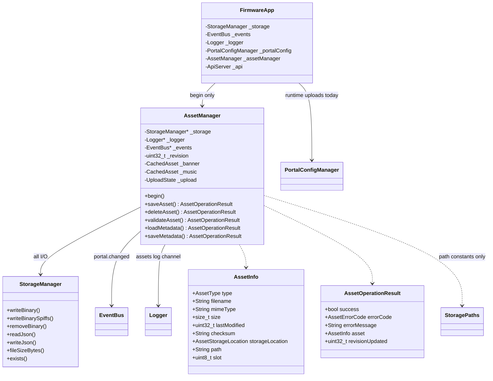
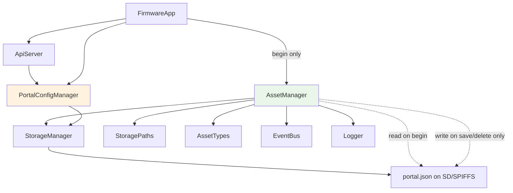

# Phase 3A — AssetManager Core Implementation Report

**Date:** 2026-06-29  
**Status:** Engine implemented, not integrated (runtime behavior unchanged)

---

## 1. New files

| File | Purpose |
|------|---------|
| `src/AssetManager.h` | Public API, in-memory asset cache, upload state |
| `src/AssetManager.cpp` | Validation, storage commit, metadata, events |
| `docs/PHASE_3A_IMPLEMENTATION_REPORT.md` | This document |

**Pre-existing (Phase 3 prep, unchanged in 3A):**

| File | Purpose |
|------|---------|
| `src/AssetTypes.h` / `AssetTypes.cpp` | Frozen `AssetInfo`, `AssetOperationResult`, enums |

---

## 2. Modified files

| File | Change |
|------|--------|
| `FirmwareApp.h` | `#include "AssetManager.h"`, member `AssetManager _assetManager` |
| `FirmwareApp.cpp` | `_assetManager.begin(&_storage, &_logger, &_events)` after `PortalConfigManager` |

**Not modified:** ApiServer, PortalConfigManager, StorageManager, admin UI, captive portal, boot order (single `begin()` line added in Phase 4 block).

---

## 3. Class diagram



---

## 4. Public API

| Method | Returns | Description |
|--------|---------|-------------|
| `begin(storage, logger, events)` | void | Load metadata from `portal.json`; no writes, no events |
| `ready()` | bool | Manager initialized and storage reachable |
| `portalRevision()` | uint32_t | Current cached revision |
| `saveAsset(type, data, len, filename, slot)` | `AssetOperationResult` | Buffer upload → validate → write → metadata → event |
| `beginSaveAsset(type, expectedTotal, filename, slot)` | `AssetOperationResult` | Start RAM-buffered stream |
| `appendSaveChunk(data, len, index, final)` | `AssetOperationResult` | Append stream chunk |
| `finishSaveAsset()` | `AssetOperationResult` | Validate + commit stream |
| `abortSaveAsset()` | void | Cancel active stream |
| `deleteAsset(type, slot)` | `AssetOperationResult` | Remove files + metadata + event |
| `getAssetInfo(type, out, slot)` | `AssetOperationResult` | Read from in-memory cache |
| `listAssets(out)` | `AssetOperationResult` | All cached `AssetInfo` entries |
| `assetExists(type, slot)` | bool | Cache or on-disk probe |
| `validateAsset(...)` | `AssetOperationResult` | Validation only, no write |
| `loadMetadata()` | `AssetOperationResult` | Read `portal.json` → cache |
| `saveMetadata()` | `AssetOperationResult` | Write cache → `portal.json` |
| `refreshPortalRevision()` | uint32_t | `millis()` bump |
| `verifyIntegrity(type, slot)` | `AssetOperationResult` | Size + checksum metadata check |
| `calculateChecksum(data, len)` | String | Static MD5 → `md5:hex` |

Supported types: `Banner`, `Music`, `Logo`, `Background`, `Ad`, `Video`.  
Icon/Font reserved in `AssetType` enum — not implemented in 3A.

---

## 5. Dependency diagram



AssetManager is **not** referenced by ApiServer or PortalConfigManager in Phase 3A.

---

## 6. Metadata flow

```
Boot
  AssetManager::begin()
    loadMetadata()
      StorageManager::readJson(/config/portal.json)
      syncCacheFromDoc()
        Parse "assets" map → CachedAsset entries
        Read legacy revision

Save / Delete (not called in 3A production path)
  commitAsset() / deleteAsset()
    Update CachedAsset
    refreshPortalRevision()
    saveMetadata()
      readJson (merge)
      updateLegacyFlags(hasBanner, hasMusic, …, *Path)
      write "assets" map (AssetInfo fields)
      StorageManager::writeJson(portal.json, forcePortalWrite=true)
    notifyPortalChanged() → portal.changed SSE
```

**Legacy fields preserved:** `revision`, `hasBanner`, `hasMusic`, `hasLogo`, `hasBackground`, `hasAds`, `adCount`, `bannerPath`, `musicPath`, `logoPath`, `backgroundPath`.

**New field:** `assets` object with per-key `AssetInfo` JSON (see ASSET_LIFECYCLE.md).

---

## 7. Event flow

```
Successful saveAsset / deleteAsset / finishSaveAsset
  → notifyPortalChanged()
  → EventBus::emit("portal.changed", {"revision":N})

Failed validation / storage error
  → NO event

Boot / loadMetadata
  → NO event
```

Same event name as `PortalConfigManager` for Phase 3B compatibility.

---

## 8. Storage flow

```
resolveStorageTargets(type, slot)
  → StoragePaths contract SD path
  → SPIFFS fallback path (banner/music only)

removeAssetFiles(sd, spiffs)
  → StorageManager::removeBinary()

writeAssetBytes(sd, spiffs, data, len)
  if SD healthy:
    StorageManager::writeBinary(sdPath)
    removeBinary(null, spiffsPath)  // clear stale fallback
    location = Sd
  else if spiffsPath defined:
    StorageManager::writeBinarySpiffs(spiffsPath)
    location = Spiffs, warning set
  else:
    fail (logo/background/ad/video require SD)

Canonical filenames only (never upload names):
  current.webp, current.mp3, adN.webp, adN.mp4
```

AssetManager **never** calls `SD.open()` or `SD.mkdir()` directly.

---

## 9. Validation flow

```
validateAsset(type, data, len, filename, slot)
  1. ready / supported type / slot range
  2. non-empty data, len ≤ maxBytesFor(type)
  3. extensionAllowed(type, filename)
  4. requiresTranscode? → TranscodeFailed (PNG/JPG)
  5. magicBytesMatch(type, data, filename)
  6. raster types must upload .webp (stored format)
  7. music → .mp3 magic; video → .mp4 ftyp
```

| Type | Max size |
|------|----------|
| Banner | 200 KiB |
| Logo | 100 KiB |
| Background | 512 KiB |
| Music | 1000 KiB |
| Ad | 200 KiB |
| Video | 5 MiB |

---

## 10. Error handling strategy

All operations return `AssetOperationResult` — never `bool`.

| Code | When |
|------|------|
| `NotReady` | Storage/AssetManager unavailable |
| `InvalidType` | Unknown type or bad extension |
| `InvalidUpload` | Empty body, magic mismatch |
| `SizeExceeded` | Over limit |
| `TranscodeFailed` | PNG/JPG upload (transcode not implemented) |
| `SlotInvalid` | Ad/video slot out of 1…5 |
| `StorageError` | writeBinary / writeJson failed |
| `NotFound` | delete/get on missing asset |
| `IntegrityFailed` | Size mismatch vs metadata |

On commit failure after file write, file is removed and metadata is not saved.

---

## 11. Backward compatibility verification

| Check | Result |
|-------|--------|
| ApiServer routes unchanged | ✅ |
| PortalConfigManager unchanged | ✅ |
| Boot order (ETH → SPIFFS → SD → managers) | ✅ (+1 begin line) |
| `portal.json` on boot | Read-only by AssetManager; **no write** |
| Legacy `hasBanner` / `hasMusic` | Still written by PortalConfigManager; AssetManager only writes if save/delete called |
| Upload paths `/www/…` | Unchanged — PortalConfigManager still active |
| EventBus | AssetManager emits only on its own commits (none in 3A prod) |
| StoragePaths / AssetTypes | Unmodified |

**Note:** If both managers wrote metadata concurrently, last writer would win. Phase 3B must route all uploads through AssetManager only.

---

## 12. Unit-test checklist (manual / host tests)

- [ ] `validateAsset(Banner, webp bytes, .webp)` → success
- [ ] `validateAsset(Banner, png bytes, .png)` → `TranscodeFailed`
- [ ] `validateAsset(Music, mp3 bytes, .mp3)` → success
- [ ] `validateAsset(Music, .wav)` → `InvalidType`
- [ ] Oversized banner (>200 KiB) → `SizeExceeded`
- [ ] `saveAsset` WebP banner → file at `/assets/banner/current.webp`, MD5 in metadata
- [ ] `deleteAsset(Banner)` → file gone, `hasBanner=false`, event emitted
- [ ] Ad slot 3 → `/assets/ads/ad3.webp`, key `ad3` in JSON
- [ ] SD degraded: banner/music → SPIFFS fallback + warning
- [ ] SD degraded: logo → `StorageError`
- [ ] `loadMetadata` after PortalConfigManager save → legacy fields intact, `assets` may be absent
- [ ] `finishSaveAsset` stream equals buffer `saveAsset`
- [ ] Failed validation does not emit `portal.changed`

---

## 13. Future integration points (Phase 3B only)

| Task | Owner |
|------|-------|
| ApiServer POST/DELETE portal routes → AssetManager | ApiServer |
| Remove write path from PortalConfigManager (keep serve shim + legacy fallback) | PortalConfigManager |
| One-time migration `/www/` → `/assets/` | AssetManager boot hook or admin action |
| Admin `portalApi` response includes `assets` map | React PWA |
| Shared `AssetCard` UI from `AssetInfo` | React PWA |
| PNG/JPG → WebP transcode | AssetManager |
| Full MD5 re-read integrity (StorageManager `readBinary`?) | AssetManager + StorageManager |
| Serve GET `/api/portal/assets/*` from contract paths | ApiServer + AssetManager |
| Wire `_assetManager` into ApiServer constructor | FirmwareApp |

---

## Compile verification

Run on dev machine:

```bash
pio run -d ESP32_S3_Firmware
```

PlatformIO was not available in the agent shell; verify locally before flash.
