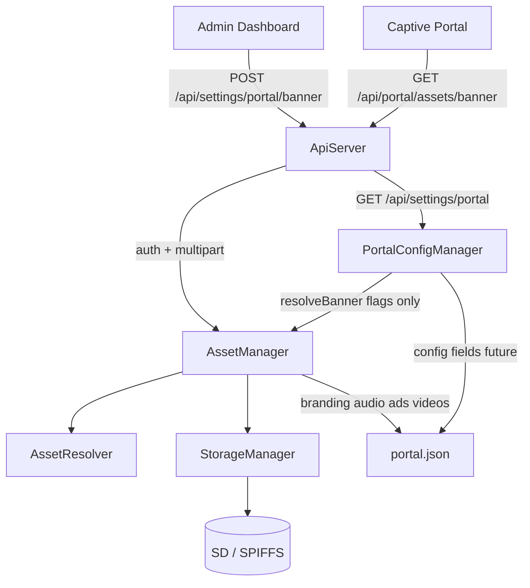

# Phase 3B — AssetManager Integration Report

**Date:** 2026-06-29  
**Status:** Complete — media operations flow through AssetManager; user-visible behavior preserved.

---

## 1. Files modified

| File | Change |
|------|--------|
| `ApiServer.h` / `ApiServer.cpp` | AssetManager wiring; uploads/serves via AssetManager + AssetResolver; upload response includes `AssetInfo` |
| `PortalConfigManager.h` / `.cpp` | Config-only; media flags/URLs via `AssetManager::resolve*()`; all file I/O removed |
| `AssetManager.cpp` | `removeAllTiersForType()` clears contract + legacy `/www` + SPIFFS custom on save/delete |
| `BackupManager.h` / `.cpp` | Factory reset deletes media via AssetManager |
| `FirmwareApp.cpp` | Boot order: AssetManager → PortalConfigManager; ApiServer receives AssetManager |

**Not modified:** StorageManager, CoinManager, PortalSessionManager, MikroTik, W5500, boot phases, Admin UI, captive portal HTML, REST route URLs.

---

## 2. Runtime behavior changes

| Area | Before | After | User-visible |
|------|--------|-------|--------------|
| Upload banner/music | PortalConfigManager → `/www/` | AssetManager → `/assets/` (+ metadata) | Same API; new uploads use contract path |
| Serve banner/music | PCM hardcoded fallback | AssetResolver chain | Same URLs; same fallback order |
| Existing `/www/` files | Active | Still served (legacy tier) | **Unchanged** |
| Upload response | Settings JSON only | Settings + `asset`, `revision`, `storedPath`, … | **Additive** — frontend unchanged |
| Factory reset | PCM deleteBanner/Music | AssetManager deleteAsset | Same outcome |
| portal.json media | Legacy flags | + `branding`/`audio` sections on new uploads | Legacy mirrors retained |

No migrations. No automatic file moves.

---

## 3. Integration diagram



---

## 4. Upload flow

```text
POST /api/settings/portal/banner (auth required)
  → ApiServer portalHandleChunk
  → AssetManager::beginSaveAsset(Banner)
  → AssetManager::appendSaveChunk (stream)
  → AssetManager::finishSaveAsset
       validate → removeAllTiersForType → writeBinary
       → saveMetadata (branding.banner + legacy mirrors)
       → portal.changed
  → PortalConfigManager::loadMeta()
  → Response: fillSettingsJson + asset/revision/storedPath/bytesWritten
```

Music: identical with `AssetType::Music` and `audio.music`.

---

## 5. AssetResolver flow (serve)

```text
GET /api/portal/assets/banner
  → AssetManager::resolveBanner()
  → AssetResolver:
       1 metadata path (if file exists)
       2 contract SD /assets/banner/current.webp
       3 legacy SD /www/portal-banner.webp
       4 SPIFFS /portal/custom/banner.webp
       5 bundled /portal/Default-Banner.png
  → ApiServer::serveResolvedAsset (SD or SPIFFS send)
```

---

## 6. Event flow

| Operation | `portal.changed` |
|-----------|------------------|
| Successful upload/delete | Yes (AssetManager) |
| Validation failure | No |
| GET serve / loadMeta | No |
| Config-only PCM save (future) | PCM (future) |

---

## 7. Legacy compatibility verification

| Check | Status |
|-------|--------|
| `/www/portal-banner.webp` served without re-upload | ✅ Legacy tier |
| `/www/portal-bg-music.mp3` served without re-upload | ✅ Legacy tier |
| SPIFFS custom + bundled defaults | ✅ AssetResolver |
| `hasBanner` / `bannerUrl` API shape | ✅ PCM fillSettingsJson |
| No file migration on boot | ✅ |
| Factory reset clears legacy + contract paths | ✅ removeAllTiersForType |

---

## 8. API compatibility verification

| Endpoint | URL | Auth | Status |
|----------|-----|------|--------|
| GET portal settings | `/api/settings/portal` | Session | ✅ |
| POST banner | `/api/settings/portal/banner` | Session | ✅ |
| DELETE banner | `/api/settings/portal/banner` | Session | ✅ |
| POST music | `/api/settings/portal/music` | Session | ✅ |
| DELETE music | `/api/settings/portal/music` | Session | ✅ |
| GET banner asset | `/api/portal/assets/banner` | Public | ✅ |
| GET music asset | `/api/portal/assets/music` | Public | ✅ |
| GET branding | `/api/portal/branding` | Public | ✅ |

Upload success response now also includes (additive):

```json
{
  "revision": 123,
  "storedPath": "/assets/banner/current.webp",
  "bytesWritten": 250880,
  "asset": { "type": "banner", "mimeType": "image/webp", ... },
  "bannerUrl": "...",
  "has_banner": true
}
```

---

## 9. Hardware testing checklist

- [ ] Boot — serial shows AssetManager + API started
- [ ] Existing deployment with `/www/` banner — portal shows custom banner without re-upload
- [ ] Upload new banner from Admin — portal updates after save
- [ ] Upload music MP3 — plays on captive portal
- [ ] Delete banner — reverts to bundled default
- [ ] Delete music — reverts to bundled default
- [ ] SD removed (SPIFFS fallback) — upload banner/music with warning in response
- [ ] SSE `portal.changed` fires on upload (admin portal query refreshes)
- [ ] Factory reset — assets cleared, defaults restored
- [ ] Backup restore — metadata reloads

---

## 10. Remaining work (Phase 3C)

- [ ] PortalConfigManager: `portal`, `theme`, `behaviour` config fields + save API
- [ ] Logo, background, ads upload routes → AssetManager
- [ ] Admin UI `AssetCard` using `asset` in upload response
- [ ] PNG/JPG → WebP transcode (or document webp-only for admin)
- [ ] Remove deprecated `bannerPath` / `hasBanner` mirrors when all clients use `branding.*`
- [ ] Optional: `AssetManager::serve()` helper to consolidate ApiServer send logic

---

## Build

PlatformIO **SUCCESS** after Phase 3B integration.
