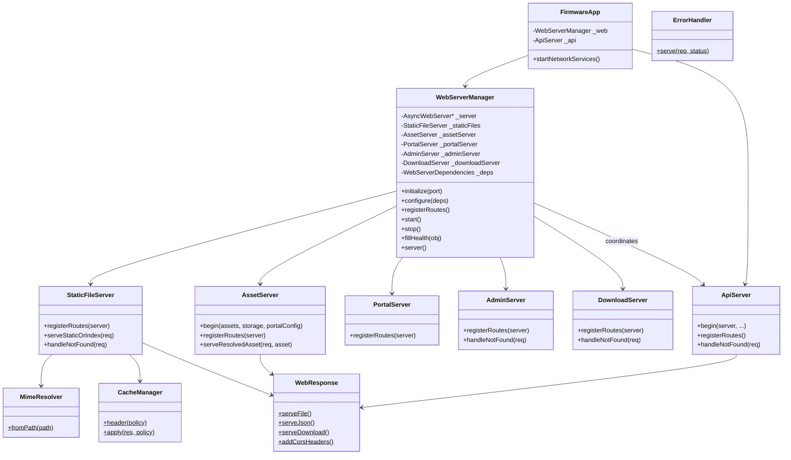
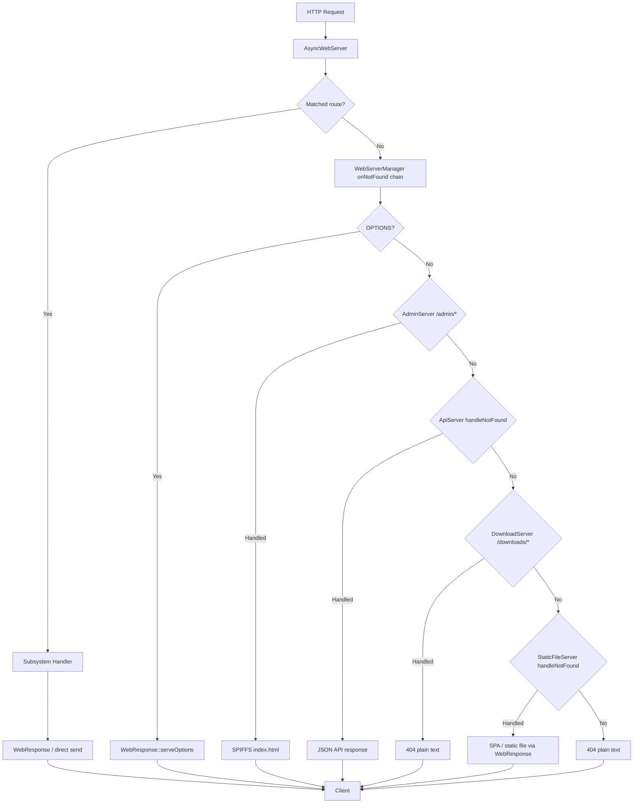
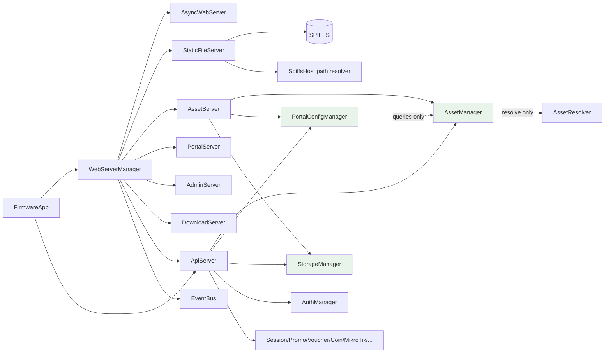

# Phase 4A – Web Server Foundation

**Firmware:** `0.5.0-w5500`  
**Status:** Complete — PlatformIO build **SUCCESS**  
**Scope:** Internal web architecture only. No captive portal migration. No user-visible behavior change.

---

## 1. Files Created

| File | Purpose |
|------|---------|
| `src/web/WebServerManager.h` | Composition root for HTTP stack |
| `src/web/WebServerManager.cpp` | Server lifecycle, route orchestration, onNotFound chain |
| `src/web/MimeResolver.h` | Central MIME detection |
| `src/web/MimeResolver.cpp` | Extension → MIME mapping |
| `src/web/CacheManager.h` | Cache policy enum + header application |
| `src/web/CacheManager.cpp` | NoCache / ShortCache / LongCache / Immutable |
| `src/web/WebResponse.h` | Shared HTTP response helpers |
| `src/web/WebResponse.cpp` | serveFile, serveJson, serveDownload, CORS, etc. |
| `src/web/ErrorHandler.h` | Minimal HTML error pages |
| `src/web/ErrorHandler.cpp` | 400, 401, 403, 404, 500 |
| `src/web/StaticFileServer.h` | SPIFFS static + SPA fallback |
| `src/web/StaticFileServer.cpp` | `/assets/*`, `/static/*` foundation, sendStaticOrIndex |
| `src/web/AssetServer.h` | Resolved asset HTTP serving |
| `src/web/AssetServer.cpp` | GET `/api/portal/assets/banner`, `/music` |
| `src/web/PortalServer.h` | Portal route group (foundation) |
| `src/web/PortalServer.cpp` | `/`, `/portal`, legacy RenzFiPortalRoutes |
| `src/web/AdminServer.h` | Admin SPA route group (foundation) |
| `src/web/AdminServer.cpp` | `/admin`, `/login`, `/dashboard`, PWA icons |
| `src/web/DownloadServer.h` | Download route group (reserved) |
| `src/web/DownloadServer.cpp` | `/downloads/*` foundation stub |

---

## 2. Files Modified

| File | Change |
|------|--------|
| `src/FirmwareApp.h` | Replaced direct `AsyncWebServer*` with `WebServerManager _web` |
| `src/FirmwareApp.cpp` | `startNetworkServices()` delegates to WebServerManager |
| `src/ApiServer.h` | Public `registerRoutes()`, `handleNotFound()`; removed static/asset serve methods |
| `src/ApiServer.cpp` | REST-only routes; CORS via WebResponse; parameterized API not-found extracted |

**Not modified (per spec):** CoinManager, PortalSessionManager, MikroTik, StorageManager responsibilities, AssetManager, PortalConfigManager, W5500, boot order, deferred queue, REST URLs, JSON schemas.

---

## 3. WebServerManager Class Diagram



---

## 4. HTTP Request Flow



Every matched route follows: **Request → WebServerManager route table → Subsystem → Response helper → Client**.

---

## 5. Route Registration Architecture

Each subsystem owns a `registerRoutes(AsyncWebServer &server)` method. `WebServerManager::registerRoutes()` calls them in fixed order (first match wins in ESPAsyncWebServer):

| Order | Subsystem | Prefix / routes |
|-------|-----------|-----------------|
| 1 | StaticFileServer | `/assets/*`, `/static/*` (foundation) |
| 2 | AssetServer | `/api/portal/assets/banner`, `/api/portal/assets/music` |
| 3 | EventBus | `/api/events` (SSE) |
| 4 | ApiServer | `/api/*` REST endpoints |
| 5 | PortalServer | `/`, `/portal`, `/portal/*` (legacy backup handlers) |
| 6 | AdminServer | `/admin`, `/login`, `/dashboard`, PWA assets |
| 7 | DownloadServer | Reserved (no active routes yet) |
| 8 | WebServerManager | Global `onNotFound` dispatcher |

ApiServer no longer registers static routes or captive portal shells.

---

## 6. MIME Resolver Architecture

`MimeResolver::fromPath(path)` strips optional `.gz` suffix, extracts extension, returns MIME string.

Supported types: html, css, js, json, webmanifest, png, webp, jpg/jpeg, svg, mp3, mp4, ico, woff, woff2, ttf, txt, bin, zip, pdf, gzip.

StaticFileServer uses MimeResolver instead of `StorageManager::contentType()`. StorageManager is unchanged (still used for SD file I/O elsewhere).

AssetServer continues to use `ResolvedAsset.mimeType` from AssetResolver when serving portal media.

---

## 7. Cache Policy Architecture

| Policy | Cache-Control header | Usage |
|--------|------------------------|-------|
| NoCache | `no-store` | API JSON, SPA fallback, errors |
| ShortCache | `max-age=86400` | `/static/*` foundation, legacy `/portal/` backup |
| LongCache | `public, max-age=31536000` | Available for future use |
| Immutable | `public, max-age=31536000, immutable` | `/assets/*` React bundles |

`CacheManager::apply(res, policy)` sets headers on responses. StaticFileServer and `serveStatic` use these policies instead of inline header strings.

---

## 8. Error Handling Architecture

| Layer | Behavior |
|-------|----------|
| ApiServer | JSON envelope `{ success, error, code }` via existing `sendError()` |
| AssetServer | JSON errors via `WebResponse::serveErrorJson()` (same schema) |
| StaticFileServer | Plain-text 404 for missing static assets |
| ErrorHandler | Minimal HTML pages for 400/401/403/404/500 (available for non-API use) |
| onNotFound fallback | Plain-text 404 |

No UI redesign. Admin dashboard and portal unchanged.

---

## 9. Dependency Diagram



**Design rules enforced:**
- ApiServer does not serve static SPIFFS assets directly
- PortalConfigManager does not serve files
- AssetManager does not own HTTP routes
- StorageManager does not know HTTP
- WebServerManager coordinates; subsystems execute

---

## 10. Startup Sequence

```
FirmwareApp::begin()
  RecoveryManager
  ETH.begin()
  SPIFFS.begin()
  StorageManager + domain managers (AssetManager before PortalConfigManager)
  startNetworkServices()  [when ETH service ready]
    salesTimeBegin()
    WebServerManager::initialize(HTTP_PORT)   // heap AsyncWebServer
    WebServerManager::configure(deps)
    ApiServer::begin(server, ...)             // wire deps only
    WebServerManager::registerRoutes()        // subsystems + EventBus + onNotFound
    WebServerManager::start()                 // server->begin()
```

Boot order and deferred heap allocation for AsyncWebServer are preserved.

---

## 11. Backward Compatibility Verification

| Area | Verification |
|------|--------------|
| REST URLs | All `/api/*` endpoints unchanged; same handlers in ApiServer |
| Portal asset URLs | `/api/portal/assets/banner`, `/music` — moved to AssetServer, same paths and resolution |
| Admin UI | `/admin`, `/admin/*`, `/login`, `/dashboard` — AdminServer + StaticFileServer, same SPA behavior |
| Captive portal | `/`, `/portal`, `/portal/*` — PortalServer + legacy RenzFiPortalRoutes preserved |
| React bundles | `/assets/*` — StaticFileServer immutable cache |
| Uploads | Banner/music POST/DELETE remain in ApiServer via AssetManager |
| SSE | EventBus registered before ApiServer routes |
| JSON schemas | ApiServer sendOk/sendError unchanged |
| Build | `platformio run` **SUCCESS** |

---

## 12. Remaining Work for Phase 4B

See **[PHASE_4B_PORTAL_MIGRATION.md](./PHASE_4B_PORTAL_MIGRATION.md)** for the expanded scope:

**Phase 4B – ESP32 Portal Migration & Portal Hosting**

1. **Migrate captive portal hosting** — `login.html`, portal JS/CSS served by `PortalServer` on ESP32
2. **Router independence** — MikroTik: DHCP, NAT, gateway, captive redirect, authorization only
3. **Portal assets** — `AssetServer` + `AssetResolver` + SD contract, preserve `/www` fallback
4. **Infrastructure-only migration** — no visual or behavioral changes for users
5. **Retire `RenzFiPortalRoutes.h` duplicates** once `PortalServer` is authoritative
6. **DownloadServer** — wire backup/export downloads currently inline in ApiServer

---

## Appendix A – RouteRegistry Refinement (post-4A)

Decouples `WebServerManager` from individual subsystems:

| Component | Role |
|-----------|------|
| `IWebRouteProvider` | `registerRoutes(WebServerManager&)`, optional `handleNotFound()` |
| `RouteRegistry` | Ordered provider list; `registerAll()`, `dispatchNotFound()` |
| `WebServerManager::registerProvider()` | Add providers without modifying WSM |
| `WebServerManager::routeServer()` | AsyncWebServer access for providers only (not exposed on FirmwareApp) |

**Default provider order:** StaticFileServer → AssetServer → EventBus → ApiServer → PortalServer → AdminServer → DownloadServer

**Not-found priority:** AdminServer (10) → ApiServer (20) → DownloadServer (30) → StaticFileServer (40)

**New files:** `IWebRouteProvider.h`, `RouteRegistry.h/cpp`, `EventBusRouteProvider.h/cpp`

`ApiServer::begin()` no longer accepts `AsyncWebServer*`; the server pointer is bound during `registerRoutes(WebServerManager&)`.

---

## Appendix B – HTTP URL Contract (frozen)

Permanent route ownership, auth, cache, and consumer matrix: **[HTTP_ROUTE_CONTRACT.md](./HTTP_ROUTE_CONTRACT.md)**.

Treat URL changes with the same rigor as `StoragePaths` changes. Phase 4B portal migration must not alter any frozen URL.

---

## Summary

Phase 4A introduces a centralized **WebServerManager** composition root with shared **MimeResolver**, **CacheManager**, **WebResponse**, and **ErrorHandler** infrastructure. Static serving, portal asset GET endpoints, and SPA shell routes are grouped into dedicated subsystems while **ApiServer** retains all REST, auth, upload, and portal session APIs. External behavior, URLs, and boot order are unchanged. The firmware compiles successfully and is ready for Phase 4B captive portal migration.
