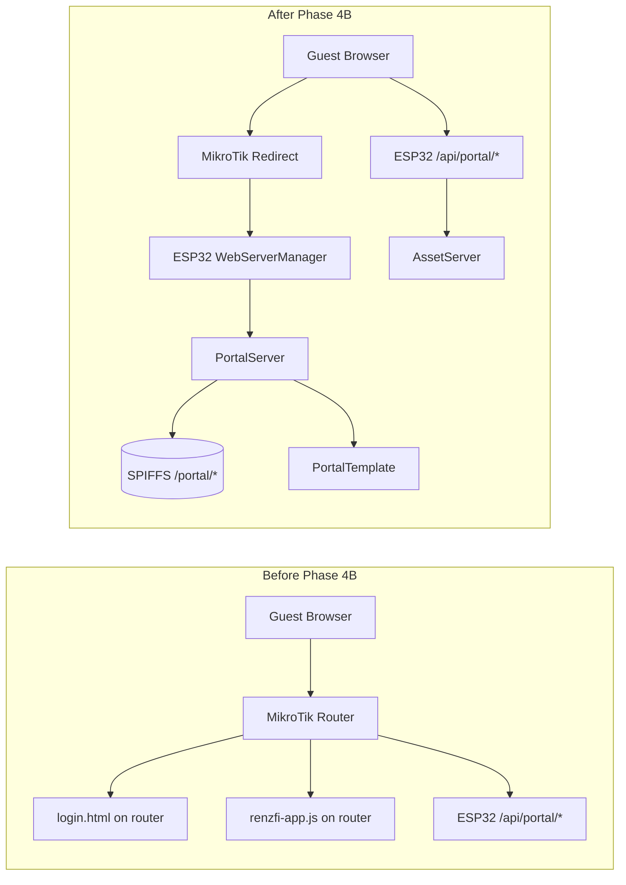
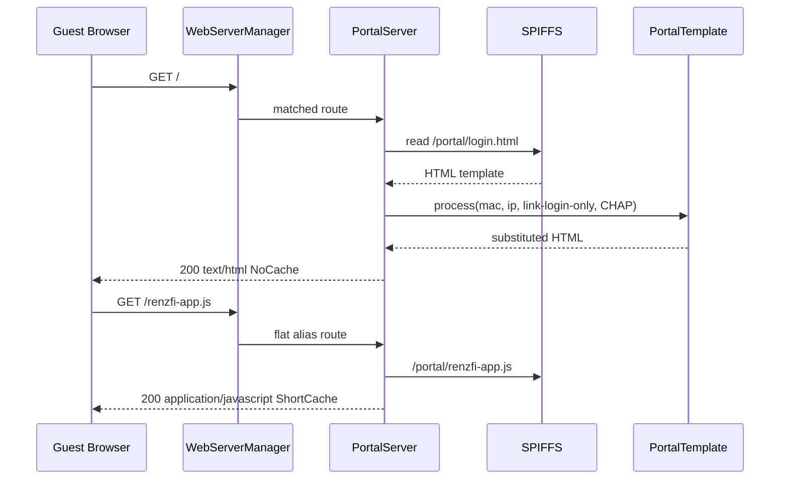
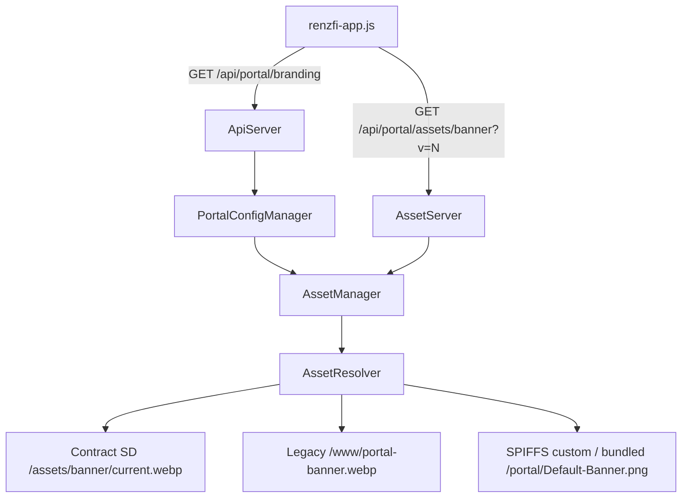
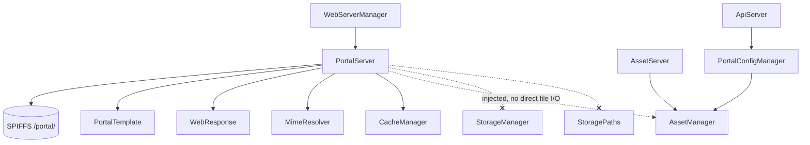

# Phase 4B – ESP32 Portal Migration & Portal Hosting

**Firmware:** `0.5.0-w5500`  
**Status:** Complete — PlatformIO build **SUCCESS**  
**Scope:** Infrastructure migration only. Portal HTML/JS/CSS files unchanged. Hosting moved to ESP32 `PortalServer`.

**HTTP contract:** [HTTP_ROUTE_CONTRACT.md](./HTTP_ROUTE_CONTRACT.md) — all URLs preserved.

---

## 1. Files Created

| File | Purpose |
|------|---------|
| `src/web/PortalSpiffsLayout.h` | Web-layer SPIFFS path constants (not StoragePaths) |
| `src/web/PortalTemplate.h` | MikroTik variable substitution at serve time |
| `src/web/PortalTemplate.cpp` | `$(mac)`, `$(ip)`, `$(link-login-only)`, CHAP blocks |
| `data/portal/login.html` | Copy of repo portal (unchanged content) |
| `data/portal/renzfi-app.js` | Copy of repo portal JS |
| `data/portal/renzfi-style.css` | Copy of repo portal CSS |
| `data/portal/md5.js` | Standard MikroTik CHAP MD5 helper |
| `data/portal/Default-Banner.png` | Bundled default banner |
| `data/portal/favicon.ico` | Portal favicon |
| `data/README.md` | SPIFFS upload instructions |

---

## 2. Files Modified

| File | Change |
|------|--------|
| `src/web/PortalServer.h` | Full portal host; `begin(AssetManager*)`; onNotFound |
| `src/web/PortalServer.cpp` | Routes, template entry, flat aliases, cache/MIME via WebResponse |
| `src/web/WebServerManager.cpp` | `portalServer.begin(deps.assets)` |
| `src/web/AdminServer.cpp` | Inlined admin SPA fallback; removed RenzFiPortalRoutes |
| `src/web/StaticFileServer.cpp` | Removed portal handling (PortalServer owns `/portal/*`) |
| `src/SpiffsHost.cpp` | Portal paths excluded from admin SPA resolver |
| `src/RenzFiPortalRoutes.h` | **Deleted** — duplicate portal handlers removed |

**Not modified:** ApiServer REST, AssetManager, StorageManager, PortalConfigManager, AssetServer, MikroTikManager, W5500, login.html / renzfi-app.js / renzfi-style.css source content.

---

## 3. Portal Migration Diagram



---

## 4. Portal Request Flow



---

## 5. Asset Request Flow

Dynamic portal media remains on **AssetServer** (unchanged URLs):



PortalServer does **not** read SD paths or AssetResolver directly. Banner/music in the page come from branding JSON → `/api/portal/assets/*`.

---

## 6. Dependency Diagram



---

## 7. Legacy Compatibility Report

| Item | Status |
|------|--------|
| `/api/portal/*` URLs | Unchanged |
| `/api/portal/assets/banner`, `/music` | Unchanged (AssetServer) |
| AssetResolver fallback chain | Unchanged |
| Legacy SD `/www/*` | Unchanged |
| Admin dashboard `/admin`, `/assets/*` | Unchanged (AdminServer + StaticFileServer) |
| MikroTik hotspot integration | Unchanged (RouterOS user provisioning) |
| Portal source files (HTML/JS/CSS) | Unchanged — copied verbatim to SPIFFS |
| MikroTik upload compatibility | Preserved — template vars substituted at serve time |
| Router config change | **Deferred** — router redirect URL update is next phase |

---

## 8. Route Ownership Verification

| Route | Owner (post-4B) | Verified |
|-------|-----------------|----------|
| `GET /` | PortalServer | ✅ |
| `GET /portal` | PortalServer | ✅ |
| `GET /portal/*` | PortalServer | ✅ |
| `GET /renzfi-app.js`, `/renzfi-style.css`, … | PortalServer (flat aliases) | ✅ |
| `GET /admin/*` | AdminServer | ✅ |
| `/api/*` | ApiServer | ✅ |
| `GET /api/portal/assets/*` | AssetServer | ✅ |
| `GET /assets/*` | StaticFileServer (admin bundles) | ✅ |
| RenzFiPortalRoutes duplicates | Removed | ✅ |

---

## 9. Portal Asset Verification

| Asset | Serve path | Mechanism |
|-------|------------|-----------|
| Banner (custom) | `/api/portal/assets/banner` | AssetServer + AssetResolver |
| Music (custom) | `/api/portal/assets/music` | AssetServer + AssetResolver |
| Default banner in HTML | `Default-Banner.png` | PortalServer → SPIFFS `/portal/` |
| Default music fallback in JS | `bg_music.mp3` or API URL | Branding API + AssetServer |
| Portal static files | `/portal/*` on SPIFFS | PortalServer |

**Note:** Add `bg_music.mp3` to `data/portal/` before `uploadfs` for bundled default music. Without it, custom music via API still works; default local file 404s until added.

---

## 10. Cache Verification

| Content | Policy | Implementation |
|---------|--------|----------------|
| Portal HTML (`/`, `/portal`) | No Cache | `CachePolicy::NoCache` on template response |
| Portal JS/CSS | Short Cache | `cachePolicyForPath()` + `/portal/` serveStatic |
| Portal images/audio (static) | Short Cache | PortalServer `servePortalFile` |
| Dynamic banner/music API | Long + `?v=revision` | AssetServer (unchanged) |
| Admin `/assets/*` | Immutable | StaticFileServer (unchanged) |

---

## 11. MIME Verification

All portal responses use **`MimeResolver::fromPath()`** via `WebResponse::serveFile()`. No hardcoded MIME strings in PortalServer.

---

## 12. Acceptance Checklist

| Criterion | Status |
|-----------|--------|
| Portal served by ESP32 (PortalServer) | ✅ Code complete |
| Router no longer required to host portal files | ✅ Ready when router redirect points to ESP32 |
| UI visually identical | ✅ Same HTML/CSS/JS files |
| Behavior functionally identical | ✅ Same APIs + template substitution for MikroTik vars |
| REST APIs unchanged | ✅ |
| Admin dashboard unchanged | ✅ |
| Mobile app unchanged | ✅ |
| AssetManager unchanged | ✅ |
| StorageManager unchanged | ✅ |
| W5500 unchanged | ✅ |
| Legacy `/www` assets work | ✅ AssetResolver unchanged |
| PlatformIO build SUCCESS | ✅ |
| Field test on live hotspot | ⏳ Requires `uploadfs` + router redirect config |

---

## 13. Remaining Work Before Router Adapter Layer

1. **Router redirect configuration** — point MikroTik hotspot external/login URL to `http://10.40.0.2/` (or appliance IP)
2. **Remove portal files from MikroTik** — router serves redirect/auth only
3. **Add `bg_music.mp3`** to SPIFFS image if bundled default music is required offline
4. **uploadfs deployment** — `pio run -t uploadfs` with admin React build + portal data
5. **Field validation** — voucher CHAP, coin flow, session, redirect per testing matrix
6. **Router Adapter Layer** (Phase 5 — blocked until [Phase 4C validation](./PHASE_4C_SYSTEM_VALIDATION.md) passes)

---

## SPIFFS Layout (Phase 4B)

```
/portal/
    login.html
    renzfi-app.js
    renzfi-style.css
    md5.js
    Default-Banner.png
    favicon.ico
    bg_music.mp3          (optional — add before uploadfs)

/static/                  (foundation — empty)
/defaults/                (reserved)

/index.html               (admin SPA — separate upload)
/assets/                  (admin React bundles)
```

---

## Summary

Phase 4B makes **PortalServer** the single owner of captive portal HTTP delivery. MikroTik template variables are applied at **serve time** via `PortalTemplate` without modifying stored portal files. Dynamic media continues through **AssetServer** and **AssetResolver**. Duplicate handlers in **RenzFiPortalRoutes** are removed. The appliance is ready for router redirect configuration while preserving full backward compatibility with existing APIs, admin UI, and asset fallback chains.
