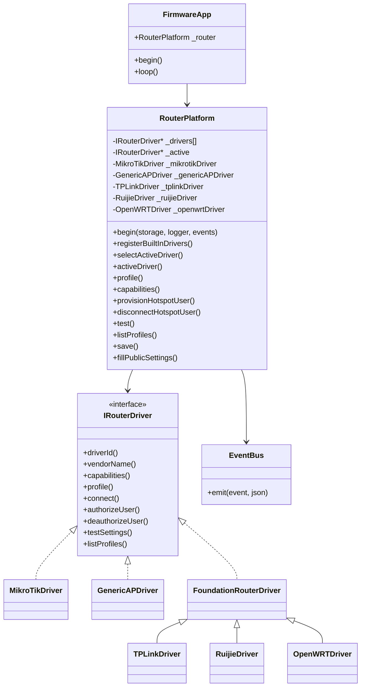
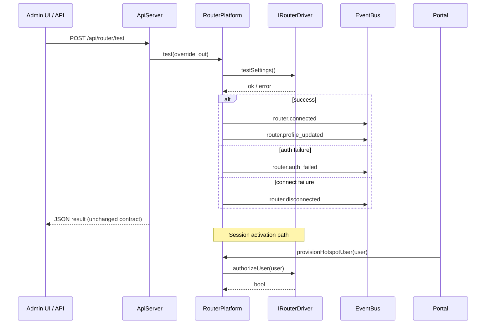

# Phase 5 – Router Platform & Driver Architecture

**Status:** Complete  
**Firmware build:** SUCCESS (`freenove_esp32_s3_wroom`)  
**Version context:** `0.5.0-w5500`

---

## Summary

Phase 5 introduces a **Router Platform** layer between `FirmwareApp` and vendor-specific router communication. All MikroTik RouterOS logic was migrated from the deleted `MikroTikManager` into `MikroTikDriver`. Upper layers (`ApiServer`, `PortalSessionManager`) now depend on `RouterPlatform` only — they never reference a vendor.

No HTTP routes, portal UI, storage layout, asset pipeline, or boot sequence were changed. Existing MikroTik installations continue to work with default `driverType: mikrotik` (implicit when the field is absent).

---

## 1. Files Created

| Path | Purpose |
|------|---------|
| `src/router/IRouterDriver.h` | Vendor driver contract |
| `src/router/RouterCapabilities.h` | Capability flag model |
| `src/router/RouterProfile.h` | Standard router description schema |
| `src/router/RouterEvents.h` | SSE event name constants |
| `src/router/RouterPlatform.h` | Platform composition root + `ProfileManager` |
| `src/router/RouterPlatform.cpp` | Registration, selection, facade, EventBus integration |
| `src/router/drivers/MikroTikDriver.h` | MikroTik driver header |
| `src/router/drivers/MikroTikDriver.cpp` | Full RouterOS API implementation (migrated) |
| `src/router/drivers/GenericAPDriver.h` | Passive gateway driver header |
| `src/router/drivers/GenericAPDriver.cpp` | Limited-capability no-API driver |
| `src/router/drivers/FoundationRouterDriver.h` | Shared stub base for future drivers |
| `src/router/drivers/FoundationRouterDriver.cpp` | Stub connect/auth/statistics behavior |
| `src/router/drivers/TPLinkDriver.h/.cpp` | TP-Link foundation (protocol not implemented) |
| `src/router/drivers/RuijieDriver.h/.cpp` | Ruijie foundation (protocol not implemented) |
| `src/router/drivers/OpenWRTDriver.h/.cpp` | OpenWRT foundation (protocol not implemented) |

---

## 2. Files Modified

| Path | Change |
|------|--------|
| `src/FirmwareApp.h` | `MikroTikManager _mikrotik` → `RouterPlatform _router` |
| `src/FirmwareApp.cpp` | Lifecycle wires `RouterPlatform`; passes `&_router` to dependents |
| `src/ApiServer.h` | Dependency type `RouterPlatform*` (same REST behavior) |
| `src/ApiServer.cpp` | Internal pointer rename `_mikrotik` → `_router` |
| `src/PortalSessionManager.h` | Dependency type `RouterPlatform*` |
| `src/PortalSessionManager.cpp` | Provisioning/deauth via `RouterPlatform` |

---

## 3. Files Removed

| Path | Reason |
|------|--------|
| `src/MikroTikManager.h` | Replaced by `RouterPlatform` + `MikroTikDriver` |
| `src/MikroTikManager.cpp` | Logic migrated to `MikroTikDriver.cpp` |

---

## 4. RouterPlatform Class Diagram



---

## 5. Driver Hierarchy

```
IRouterDriver
├── MikroTikDriver          (fully functional — RouterOS binary API)
├── GenericAPDriver         (passive gateway — ESP-only session control)
└── FoundationRouterDriver  (shared stub base)
    ├── TPLinkDriver        (foundation only)
    ├── RuijieDriver        (foundation only)
    └── OpenWRTDriver       (foundation only)
```

| Driver ID | Vendor | Status |
|-----------|--------|--------|
| `mikrotik` | MikroTik | Production — hotspot user CRUD, profiles, test, statistics |
| `generic_ap` | Generic AP | Production — no router API; authorize/deauthorize are appliance-side no-ops |
| `tplink` | TP-Link | Foundation — registers, returns "not implemented" |
| `ruijie` | Ruijie | Foundation — registers, returns "not implemented" |
| `openwrt` | OpenWRT | Foundation — registers, returns "not implemented" |

Driver selection reads `driverType` from the existing router settings file (`StoragePaths::RouterFile`). When absent, defaults to `mikrotik` for backward compatibility.

---

## 6. Capability Model

Every driver reports a `RouterCapabilities` struct:

| Field | Meaning |
|-------|---------|
| `supportsVoucherControl` | Can programmatically grant/revoke voucher access |
| `supportsBandwidthLimit` | Can apply bandwidth profiles/limits |
| `supportsHotspot` | Can manage hotspot users/sessions on router |
| `supportsApi` | Has a programmable management API |
| `supportsIdentity` | Can read router identity |
| `supportsHealth` | Can run connectivity/health checks |
| `supportsStatistics` | Can report router-side session/statistics |
| `supportsRemoteConfig` | Can push configuration to router |

**MikroTikDriver:** all `true` except `supportsRemoteConfig`.  
**GenericAPDriver:** only `supportsHealth`.  
**Foundation drivers:** all `false`.

Callers must query `RouterPlatform::capabilities()` — never assume vendor features.

---

## 7. RouterProfile Schema

Standard description returned by `RouterPlatform::profile()` and included in SSE payloads:

```json
{
  "vendor": "MikroTik",
  "model": "",
  "firmware": "",
  "identity": "MyRouter",
  "ipAddress": "10.40.0.1",
  "username": "admin",
  "driverId": "mikrotik",
  "connectionType": "routeros-api",
  "apiVersion": "RouterOS API",
  "status": "disconnected",
  "capabilities": {
    "supportsVoucherControl": true,
    "supportsBandwidthLimit": true,
    "supportsHotspot": true,
    "supportsApi": true,
    "supportsIdentity": true,
    "supportsHealth": true,
    "supportsStatistics": true,
    "supportsRemoteConfig": false
  }
}
```

Settings persistence remains in the existing router JSON file. MikroTik saves now also write `"driverType": "mikrotik"`; existing files without this field continue to select MikroTik.

---

## 8. Router Event Flow

Events are emitted on `EventBus` (SSE `/api/events`):

| Event | When |
|-------|------|
| `router.connected` | Successful router test / connection |
| `router.disconnected` | Test/connect failure (no auth) |
| `router.auth_failed` | Connection reached but auth-related failure |
| `router.unavailable` | Unknown `driverType` — fallback to MikroTik |
| `router.capabilities_changed` | Active driver switched |
| `router.profile_updated` | Driver selected, settings saved, or test succeeded |



Portal session activation path is unchanged externally: `PortalSessionManager` → `RouterPlatform::provisionHotspotUser()` → active driver `authorizeUser()`.

---

## 9. Dependency Diagram

```
FirmwareApp
    └── RouterPlatform          ← only layer that knows drivers
            └── IRouterDriver
                    ├── MikroTikDriver → RouterOsClient → Router
                    ├── GenericAPDriver
                    ├── TPLinkDriver
                    ├── RuijieDriver
                    └── OpenWRTDriver

ApiServer ──────────► RouterPlatform   (never IRouterDriver)
PortalSessionManager ► RouterPlatform   (never IRouterDriver)

PortalServer ──────── (no router dependency)
AdminServer ───────── (no router dependency)
AssetManager ──────── (no router dependency)
PortalConfigManager ─ (no router dependency)
WebServerManager ──── (no router dependency)
StorageManager ────── (no router dependency)
```

---

## 10. Backward Compatibility Verification

| Area | Status |
|------|--------|
| HTTP route contract | Unchanged — same `/api/router/*` handlers |
| REST response shapes | Unchanged — `test`, `profiles`, settings fields identical |
| Router settings file | Compatible — missing `driverType` defaults to MikroTik |
| Portal session flow | Unchanged — same `provisionHotspotUser` / `disconnectHotspotUser` calls |
| MikroTik hotspot commands | Identical RouterOS paths (`/ip/hotspot/user/*`, `/ip/hotspot/active/*`) |
| Boot sequence / W5500 | Unchanged |
| Portal UI / captive portal | Unchanged |
| Storage / assets / web platform | Untouched |

**Build verification:** PlatformIO `freenove_esp32_s3_wroom` — **SUCCESS**.

**Field validation:** Recommended before production deploy — run Phase 4C checklist plus router test + coin/voucher activation on live MikroTik.

---

## 11. Migration Report (MikroTik Logic)

| Former `MikroTikManager` responsibility | New location |
|---------------------------------------|--------------|
| Settings load/save/fillPublic | `MikroTikDriver::loadSettings/saveSettings/fillPublicSettings` |
| RouterOS connect/login/disconnect | `MikroTikDriver::openRouterSession/closeRouterSession/connect/disconnect` |
| Profile listing | `MikroTikDriver::listProfiles` |
| Router test + identity | `MikroTikDriver::testSettings` |
| Hotspot user create/update | `MikroTikDriver::createHotspotUser` → `authorizeUser` |
| Hotspot disconnect | `MikroTikDriver::deauthorizeUser` |
| Profile assignment | `MikroTikDriver::assignProfile` |
| RouterOS client + timeouts | `MikroTikDriver` owns `RouterOsClient` |
| Orchestration / driver selection | `RouterPlatform` |
| Event emission | `RouterPlatform` via `EventBus` |
| Upper-layer API | `RouterPlatform` facade (same method names as old manager) |

`RouterOsClient` was not modified — it remains the MikroTik transport layer used exclusively by `MikroTikDriver`.

---

## 12. Future Driver Integration Guide

To add a new router vendor without modifying existing architecture:

1. **Create a driver class** implementing `IRouterDriver` in `src/router/drivers/`.
2. **Report accurate capabilities** in `capabilities()` — do not over-declare.
3. **Implement** `authorizeUser` / `deauthorizeUser` for session control, or return no-op success for passive gateways.
4. **Persist vendor-specific settings** via `saveSettings` / `loadSettings` using the shared router JSON file; always set `driverType` to your driver ID.
5. **Register** the driver in `RouterPlatform::registerBuiltInDrivers()` (or call `registerDriver()` for dynamically loaded drivers in a future phase).
6. **Document** the `driverType` value for admin configuration.

Example driver ID convention: lowercase snake_case (`my_vendor`).

No changes required in `ApiServer`, `PortalServer`, `PortalSessionManager` logic, or HTTP handlers — admin selects driver via settings when UI support is added in a later phase.

---

## 13. Remaining Work for Phase 6

Suggested next-phase items (out of scope for Phase 5):

- **Admin UI** — driver type selector, capability-aware settings panels
- **Plug-and-play wizard** — guided router setup
- **Automatic router discovery** — mDNS / probe heuristics
- **OpenWRT / TP-Link / Ruijie protocols** — replace foundation stubs with real implementations
- **Periodic health polling** — `RouterPlatform::loop()` background health + `router.unavailable` alerts
- **Router statistics API** — expose `fillStatistics()` via REST when UI ready
- **Remote config push** — WiFi SSID/password sync for supported drivers
- **Multi-router orchestration** — not planned near-term
- **Field validation** — execute Phase 4C + router platform checklist on hardware

---

## Acceptance Criteria

| Criterion | Met |
|-----------|-----|
| RouterPlatform exists | ✓ |
| IRouterDriver exists | ✓ |
| MikroTikDriver functional | ✓ |
| GenericAPDriver exists | ✓ |
| TPLinkDriver foundation | ✓ |
| RuijieDriver foundation | ✓ |
| OpenWRTDriver foundation | ✓ |
| Existing MikroTik functionality preserved | ✓ (code migrated, same RouterOS commands) |
| Firmware behavior unchanged (user-visible) | ✓ |
| Future routers addable without architecture changes | ✓ |

---

## Frozen Contracts — Verified Untouched

- StorageManager, AssetManager, PortalConfigManager
- PortalServer, AdminServer, ApiServer route handlers (internal pointer only)
- WebServerManager, AssetResolver
- HTTP Route Contract
- Boot sequence, W5500 networking
- Portal file content and URLs

---

## Phase 5.1 Addendum — Driver Manifest & Discovery API

**Build:** SUCCESS (post-refinement)

### Driver Manifest (`RouterDriverManifest`)

Each driver now publishes declarative metadata beyond raw capability flags:

| Field | Purpose |
|-------|---------|
| `driverId` / `vendor` / `model` | Identity for admin UI |
| `supportedFirmware` / `minimumVersion` | Block unsupported firmware early |
| `capabilities` | Runtime feature flags |
| `supportedFeatures` | Human-readable feature list |
| `stability` | `stable` or `experimental` |
| `documentationUrl` | Optional vendor docs link |
| `driverVersion` | Driver implementation version |

Helpers:

- `isSupported(firmware, version)` — pre-flight compatibility check
- `unsupportedReason(firmware, version)` — user-facing message for setup wizard

Example (MikroTik): RouterOS ≥ 6.0, stable, driver `1.0.0`.  
Example (TP-Link foundation): experimental, `0.1.0-foundation`, no protocol yet.

### RouterPlatform discovery API

| Method | Purpose |
|--------|---------|
| `availableDrivers(JsonArray &out)` | All registered manifests + `active` flag |
| `activeDriver()` | Current `IRouterDriver*` (unchanged) |
| `driverManifest()` | Active driver manifest |
| `driverManifest(driverId)` | Manifest for any registered driver |
| `switchDriver(driverId)` | Persist `driverType` + reselect |
| `detectDrivers(JsonDocument &out)` | Per-driver detection metadata (wizard foundation) |
| `isFirmwareSupported(firmware, version, reasonOut)` | Active-driver compatibility gate |

`detectDrivers()` is intentionally shallow today (configured vs not detected). Live probing (RouterOS port 8728, Omada API, etc.) belongs in Phase 6 setup wizard.

### New files

- `src/router/RouterDriverManifest.h/.cpp`
- `src/router/IRouterDriver.cpp` (default `detect()`)

### Files updated

- `IRouterDriver.h` — `manifest()`, `detect()`
- All drivers — manifest definitions
- `RouterPlatform.h/.cpp` — discovery/switch API
- `FoundationRouterDriver` — manifest-driven stub base

---

## Phase 5.2 Addendum — Installation State

**Build:** SUCCESS

Lightweight setup progress tracking persisted across reboots.

### State machine

```
Factory → RouterSelected → RouterConnected → PortalConfigured
       → CoinConfigured → ValidationPassed → Ready
```

### Persistence

`/config/installation.json`:

```json
{
  "state": "portal_configured",
  "updatedAt": 123456,
  "completedSteps": ["router", "portal"],
  "firmwareVersion": "0.5.0-w5500",
  "installationVersion": 1
}
```

- `completedSteps` — wizard section keys (`router`, `portal`, `coin`, `validation`)
- `firmwareVersion` — firmware that last wrote the file (upgrade migration hook)
- `installationVersion` — schema version (`INSTALLATION_SCHEMA_VERSION`)

Legacy files (state + updatedAt only) auto-migrate to schema v1 on load.

### Navigation helpers

```cpp
InstallationState nextState() const;      // wizard: what comes next
InstallationState previousState() const;  // wizard: what came before (not for going back)
```

Free functions: `installationNextState()`, `installationPreviousState()`.

`fillStatus()` and SSE payloads include `nextState`, `previousState`, and full metadata.

### API (`InstallationStateManager`)

| Method | Purpose |
|--------|---------|
| `current()` | Current enum value |
| `progressPercent()` | 0–100 for progress bar |
| `needsSetup()` / `isReady()` | Wizard gating |
| `setState()` / `advanceTo()` | Persist + emit SSE |
| `resetToFactory()` | Factory reset hook |
| `fillStatus(JsonDocument&)` | REST/wizard payload (Phase 6) |

SSE: `installation.state_changed`

### Files

- `InstallationState.h/.cpp`
- `InstallationStateManager.h/.cpp`
- `InstallationEvents.h`
- `StoragePaths::InstallationFile`
- Wired in `FirmwareApp` (lifecycle only)

Setup wizard / REST endpoints will call `advanceTo()` in Phase 6 — no HTTP contract changes yet.
