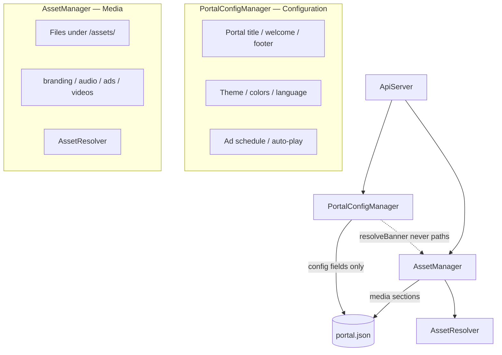

# Portal Configuration Architecture (Frozen — Pre–Phase 3B)

This document defines the **split between PortalConfigManager and AssetManager**, the **target `portal.json` schema**, and **AssetResolver** (internal fallback chain).

**Related:**
- [STORAGE_ARCHITECTURE.md](./STORAGE_ARCHITECTURE.md) — SD paths, ownership
- [ASSET_LIFECYCLE.md](./ASSET_LIFECYCLE.md) — upload flows, `AssetInfo`, validation
- `PortalConfigSchema.h` — section/key constants
- `AssetResolver.h` — serve-time fallback (internal to AssetManager)

---

## Manager split (permanent)

PortalConfigManager **does not disappear**. It becomes **configuration-only** and stops touching media files in Phase 3B.



| Concern | Owner |
|---------|-------|
| Portal title, welcome, footer, theme, language | **PortalConfigManager** |
| Captive behaviour, ad schedule, auto-play flags | **PortalConfigManager** |
| Banner, logo, background, music, ads, videos | **AssetManager** |
| Serve-time fallback (SD → legacy → SPIFFS → bundled) | **AssetResolver** (inside AssetManager) |

---

## Frozen rule: PortalConfigManager never knows storage paths

PortalConfigManager **must not**:

- `#include "StoragePaths.h"`
- Reference `/assets/banner/current.webp`, `/www/portal-banner.webp`, or any SD path
- Call `SD.open`, `writeBinary`, or serve files directly

PortalConfigManager **must**:

- Ask **AssetManager** for media state and resolved paths
- Use `AssetManager::resolveBanner()`, `getAssetInfo()`, etc.
- Own only configuration fields in `portal.json`

```text
PortalConfigManager  →  AssetManager::resolveBanner()  →  AssetResolver  →  ResolvedAsset
                         (never StoragePaths in PCM)
```

---

## AssetResolver (internal service)

Not a separate manager. Lives inside **AssetManager** (`AssetResolver.h` / `.cpp`).

**Purpose:** one fallback implementation for portal serve, admin preview, and future API — no duplicated tier logic.

```text
resolveBanner()
  → metadata path exists?     → return (tier from path prefix)
  → contract SD /assets/…?    → return ContractSd
  → legacy SD /www/…?         → return LegacySd      (banner/music only)
  → SPIFFS /portal/custom/…?  → return SpiffsCustom  (banner/music only)
  → bundled SPIFFS default?   → return Bundled       (banner/music only)
  → not found
```

Public entry points on **AssetManager**:

| Method | Asset |
|--------|-------|
| `resolveBanner()` | Banner |
| `resolveMusic()` | Portal music |
| `resolveLogo()` | Logo |
| `resolveBackground()` | Background |
| `resolveAd(slot)` | Ad slot |
| `resolveVideo(slot)` | Video slot |
| `resolve(type, slot)` | Generic |

Returns `ResolvedAsset` (`found`, `path`, `mimeType`, `tier`, `storageLocation`).

ApiServer `serveBanner` / `serveMusic` (Phase 3B) call `AssetManager::resolve*()` — not PortalConfigManager path constants.

---

## Target `portal.json` schema

Single file at `/config/portal.json`.

**AssetManager** owns: `branding`, `audio`, `ads`, **`videos`**  
**PortalConfigManager** owns: `portal`, `theme`, `behaviour`

Section names are **categories** (consistent naming):

| Section | Contents |
|---------|----------|
| `branding` | banner, logo, background |
| `audio` | music, coin (future SFX) |
| `ads` | ad1 … ad5 |
| `videos` | video1 … video5 |

> **Note:** Earlier drafts used `media` for videos. Renamed to `videos`. AssetManager reads legacy `media` on load only; writes `videos`.

### Example

```json
{
  "revision": 1234567890,

  "portal": {
    "title": "Renz-Fi WiFi",
    "welcomeText": "Insert coin to connect",
    "footerText": "Powered by Renz-Fi",
    "language": "en"
  },

  "theme": {
    "primaryColor": "#2563eb",
    "backgroundColor": "#0f172a"
  },

  "behaviour": {
    "autoPlayMusic": true,
    "adRotationSeconds": 8,
    "adSchedule": []
  },

  "branding": {
    "banner": { "type": "banner", "path": "/assets/banner/current.webp", "..." : "..." },
    "logo": {},
    "background": {}
  },

  "audio": {
    "music": { "type": "music", "path": "/assets/music/current.mp3", "..." : "..." },
    "coin": {}
  },

  "ads": {
    "ad1": {},
    "ad2": {}
  },

  "videos": {
    "video1": {}
  }
}
```

Each leaf is a full **`AssetInfo`** object (`AssetTypes.h`).

### Section map

| Asset type | Section | Key |
|------------|---------|-----|
| Banner | `branding` | `banner` |
| Logo | `branding` | `logo` |
| Background | `branding` | `background` |
| Portal music | `audio` | `music` |
| Coin-insert SFX | `audio` | `coin` (future) |
| Advertisement | `ads` | `ad1` … `ad5` |
| Video | `videos` | `video1` … `video5` |

---

## Deprecated fields (transition)

| Legacy | Replaced by |
|--------|-------------|
| `hasBanner` | `branding.banner` present |
| `hasMusic` | `audio.music` present |
| `bannerPath` | use `resolveBanner()` — not raw paths in PCM |
| `musicPath` | use `resolveMusic()` |
| `assets` (flat map) | sectioned schema |
| `media` (video section) | `videos` |

---

## Write coordination

- **PortalConfigManager** — `portal`, `theme`, `behaviour`; never deletes media sections; never writes paths.
- **AssetManager** — `branding`, `audio`, `ads`, `videos`, legacy mirrors; never deletes config sections.

Both merge-read before write via StorageManager.

---

## Phase 3B checklist

- [ ] ApiServer uploads → AssetManager only
- [ ] ApiServer serve → `AssetManager::resolve*()`
- [ ] PortalConfigManager: remove StoragePaths / file I/O; use AssetManager queries
- [ ] Admin UI: config panel vs media `AssetCard` panels
- [ ] Migrate `/www/` → `/assets/` + populate sectioned metadata
- [ ] Remove legacy mirrors when clients updated
