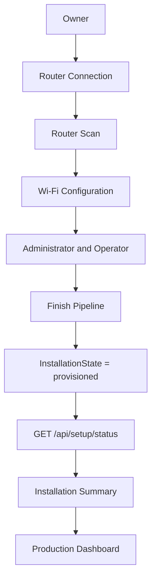
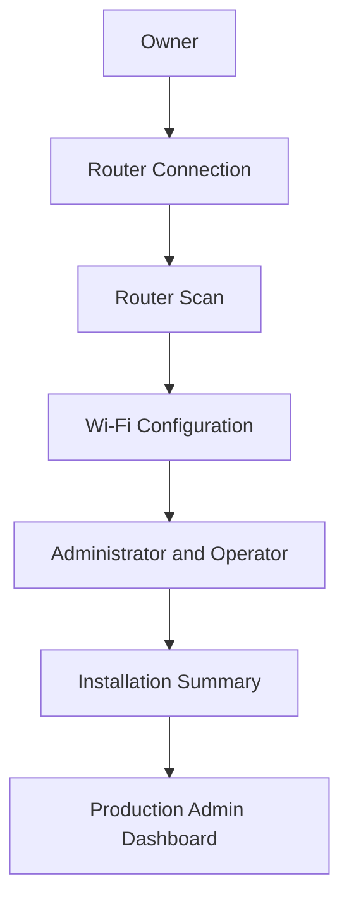
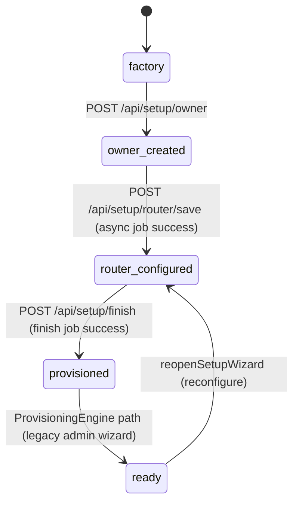
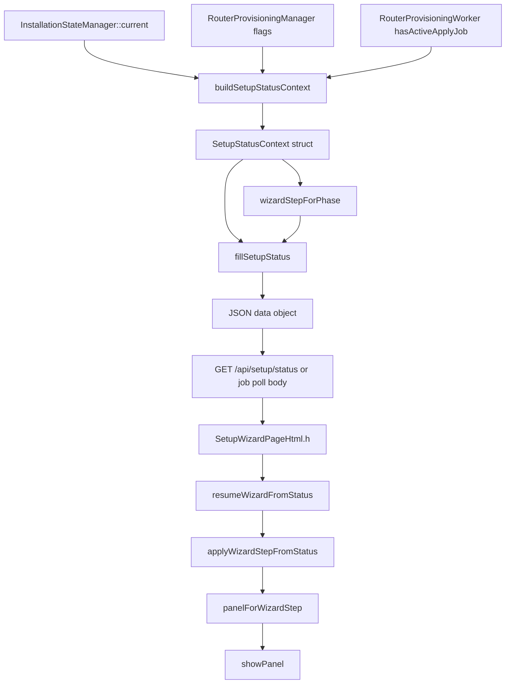
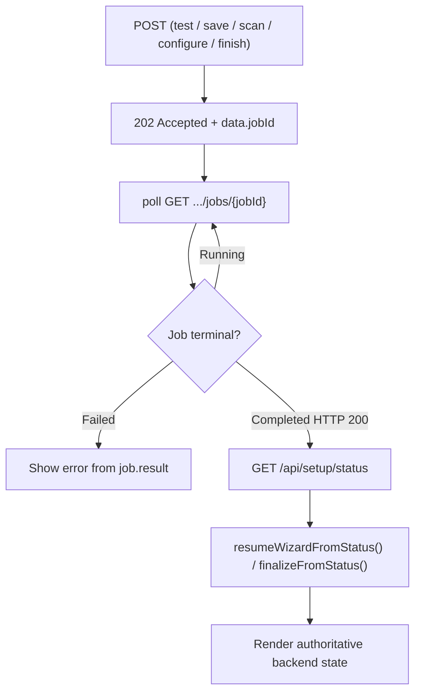
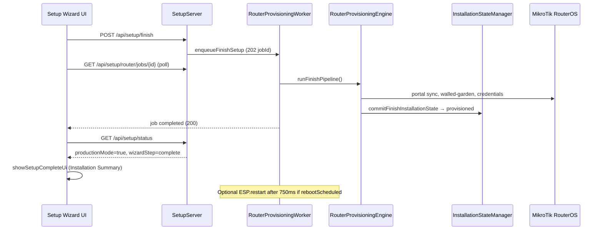

# Renz-Fi Setup Architecture (Frozen)

| Field | Value |
|-------|-------|
| **Status** | **Frozen** — authoritative reference for setup wizard, lifecycle state, and MikroTik provisioning |
| **Architecture Revision** | **RC1** (`2026-07-22`) |
| **Created** | 2026-07-22 |
| **Updated** | 2026-07-22 |
| **Firmware** | `0.5.0-w5500` (`RenzFiConfig::FIRMWARE_VERSION`) |
| **Hardware** | `ESP32-S3-W5500-N8R8` (Freenove ESP32-S3 WROOM N8R8 — 8 MB flash / 8 MB PSRAM) |
| **Board env** | `freenove_esp32_s3_wroom` (`platformio.ini`) |

**Purpose:** This document freezes the architecture for first-run installation — hardware pins, network topology, MikroTik communication, persisted state, wizard lifecycle derivation, HTTP API, and frontend navigation rules. Future development must treat this as the contract. Do not reintroduce duplicate lifecycle derivations, client-side wizard heuristics, or default-parameter status serialization.

## Architecture Invariants

The following rules are **contractual**. Any change that violates them requires an explicit architecture revision (bump **Architecture Revision** in the header table above).

1. **`InstallationStateManager` is the only owner of installation lifecycle.**  
   Persisted state lives in `/config/installation.json`. Transitions use `setState()` / `advanceTo()` only.

2. **`wizardStepForPhase()` is the only function allowed to derive `wizardStep`.**  
   No handler, worker, or frontend code may assign wizard step strings by independent logic.

3. **`fillSetupStatus()` is the only serializer of setup lifecycle fields.**  
   `installationState`, `wizardStep`, `productionMode`, and `setupWizardEnabled` are written here (plus extended fields via `fillSetupStatusData()`).

4. **`SetupStatusContext` is mandatory for all setup status serialization.**  
   Callers use `buildSetupStatusContext()` or helpers (`fillSetupStatusData()`, `fillWorkerSetupStatus()`). There is no default-context overload.

5. **`RouterProvisioningWorker` is the only component permitted to communicate with RouterOS.**  
   No HTTP handler, timer, or background task may open a parallel MikroTik TCP/API session.

6. **The frontend renders backend lifecycle and never infers progression.**  
   Navigation uses `wizardStep` and `productionMode` from `/api/setup/status`. No client-side heuristics drive `showPanel()`.

7. **`InstallationState` must be committed before finish returns success.**  
   `runFinishPipeline()` calls `commitFinishInstallationState()` → `provisioned` on every successful finish path (including idempotent re-finish).

---

## End-to-end setup flow (overview)

Read this first for the full installer journey before diving into implementation sections below.



| Stage | Primary API / mechanism |
|-------|-------------------------|
| Owner | `POST /api/setup/owner` → `owner_created` |
| Router Connection | `POST /api/setup/router/test` + `save` (async jobs) |
| Router Scan | `POST /api/setup/router/existing-network/scan` (async job) |
| Wi-Fi Configuration | `GET /api/setup/router/wifi/networks`, `POST .../wifi/selection` |
| Administrator & Operator | `POST /api/setup/operator` (optional), `POST /api/setup/finish` |
| Finish Pipeline | Async finish job → `RouterProvisioningEngine::runFinishPipeline()` |
| Status refresh | **`GET /api/setup/status`** — authoritative before showing summary |
| Installation Summary | Frontend when `productionMode == true` |
| Production Dashboard | `GET /api/health` handoff → `http://{eth_ip}/admin` |

**Companion documents:**

| Document | Scope |
|----------|-------|
| [NETWORK_PLANE_ARCHITECTURE.md](./NETWORK_PLANE_ARCHITECTURE.md) | Setup vs production HTTP planes |
| [HTTP_ROUTE_CONTRACT.md](./HTTP_ROUTE_CONTRACT.md) | Full HTTP route ownership |
| [STORAGE_ARCHITECTURE.md](./STORAGE_ARCHITECTURE.md) | SD / SPIFFS layout |
| [ROUTER_PROVISIONING_WORKER_REPORT.md](./ROUTER_PROVISIONING_WORKER_REPORT.md) | Router worker deep dive |
| [NETWORK_ADOPTION_STATE_MACHINE.md](./NETWORK_ADOPTION_STATE_MACHINE.md) | Existing-network adoption |
| [ROLE_PERMISSION_MATRIX.md](./ROLE_PERMISSION_MATRIX.md) | Owner vs operator access |

---

## Table of contents

**Quick reference**

- [Architecture Invariants](#architecture-invariants)
- [End-to-end setup flow (overview)](#end-to-end-setup-flow-overview)

**Detailed sections**

1. [System overview](#1-system-overview)
2. [Hardware platform and pin map](#2-hardware-platform-and-pin-map)
3. [Network topology](#3-network-topology)
4. [How the ESP32 talks to MikroTik](#4-how-the-esp32-talks-to-mikrotik)
5. [HTTP planes during setup](#5-http-planes-during-setup)
6. [Installer wizard flow (UI)](#6-installer-wizard-flow-ui)
7. [Installation lifecycle (persisted)](#7-installation-lifecycle-persisted)
8. [wizardStep derivation (backend)](#8-wizardstep-derivation-backend)
9. [Status serialization pipeline](#9-status-serialization-pipeline)
10. [Frontend navigation rules](#10-frontend-navigation-rules)
11. [Frozen development rules](#11-frozen-development-rules)
12. [Setup HTTP API reference](#12-setup-http-api-reference)
13. [Async job lifecycle pattern](#13-async-job-lifecycle-pattern)
14. [Finish job sequence](#14-finish-job-sequence)
15. [Production handoff](#15-production-handoff)
16. [Persistence files](#16-persistence-files)
17. [Source file map](#17-source-file-map)

**Appendices**

- [Appendix A — wizardStep vs installationState](#appendix-a--wizardstep-vs-installationstate-quick-reference)
- [Appendix B — Evolution path](#appendix-b--evolution-path-not-required-for-current-release)
- [Appendix C — Common failure modes (troubleshooting)](#appendix-c--common-failure-modes-troubleshooting)

---

## 1. System overview

Renz-Fi is a **Piso WiFi appliance**: an ESP32-S3 controller wired to a MikroTik RouterOS router over **W5500 Ethernet**. During first-run setup, the installer connects a phone or laptop to the ESP32 **Management AP**, completes a linear setup wizard, and the firmware provisions the MikroTik guest/hotspot network. After finish, the Management AP stops, production HTTP runs on Ethernet, and the admin dashboard serves from SPIFFS.

```
┌─────────────────────────────────────────────────────────────────────────┐
│                         Renz-Fi Appliance (ESP32-S3)                    │
│  ┌──────────────┐  ┌──────────────┐  ┌──────────────────────────────┐ │
│  │ Management   │  │ W5500 ETH    │  │ Peripherals                  │ │
│  │ Wi-Fi AP     │  │ VLAN40       │  │ GPIO4 coin, GPIO38-40 RGB,   │ │
│  │ 192.168.4.1  │  │ 10.40.0.2    │  │ GPIO2 recovery, SD card      │ │
│  └──────┬───────┘  └──────┬───────┘  └──────────────────────────────┘ │
│         │ Setup plane      │ Production plane + RouterOS API            │
└─────────┼──────────────────┼──────────────────────────────────────────┘
          │                  │
   Installer phone/laptop     │  TCP :8728 (RouterOS binary API)
   http://192.168.4.1         │  HTTP :80 (portal API, admin dashboard)
          │                  ▼
          │         ┌─────────────────────┐
          │         │ MikroTik RouterOS   │
          │         │ (hAP / guest LAN)   │
          └────────►│ Hotspot + bridge    │
                    └─────────────────────┘
                              │
                              ▼
                    Guest Wi-Fi clients (captive portal on MikroTik)
```

**Architectural split:**

| Layer | Responsibility |
|-------|----------------|
| **Setup plane** (`SetupServer`) | Inline HTML wizard, `/api/setup/*`, no React SPA |
| **Production plane** (`ApiServer`, `AdminServer`, …) | Full admin dashboard, portal APIs, SSE |
| **RouterProvisioningWorker** | **Single** owner of MikroTik RouterOS TCP/API I/O |
| **InstallationStateManager** | Authoritative persisted installation progress |
| **SetupProvisioningManager** | Owner metadata + **sole** `wizardStep` derivation |
| **RouterProvisioningEngine** | Finish pipeline (portal sync, state commit, optional reboot) |

---

## 2. Hardware platform and pin map

### 2.1 MCU and storage

| Component | Detail |
|-----------|--------|
| MCU | ESP32-S3 (240 MHz, 320 KB SRAM, 8 MB flash, 8 MB OPI PSRAM on N8R8) |
| W5500 | WIZnet W5500 Ethernet controller — dedicated HSPI bus |
| SD card | Separate FSPI bus — runtime customer data (`/config`, `/sales`, `/sessions`, …) |
| SPIFFS | Firmware-shipped system files — admin React build, portal fallback assets |

### 2.2 W5500 Ethernet (HSPI) — `W5500Config.h`

| Signal | GPIO | Notes |
|--------|------|-------|
| MOSI | **11** | Dedicated W5500 SPI |
| MISO | **13** | |
| SCK | **12** | |
| CS | **10** | W5500 chip-select |
| RST | **14** | Hardware reset |
| INT | **-1** | Unused (polled link state) |

**SPI clock:** 8 MHz (`W5500Config::SPI_FREQ_MHZ`)

**Static network (VLAN40 backend):**

| Field | Value |
|-------|-------|
| ESP32 IP | `10.40.0.2` |
| Gateway | `10.40.0.1` (typically MikroTik) |
| Subnet | `255.255.255.0` |
| DNS | `10.40.0.1` |
| MAC | `02:AA:BB:10:40:02` (locally administered; change last octets per unit) |

> **Deployment note:** Field reports and phase docs also reference DHCP leases such as `10.10.10.2` on other VLANs. The **configured defaults** in firmware are `10.40.0.0/24`. Production admin URL is always `http://{eth_ip}/admin` from the live lease.

### 2.3 SD card (FSPI) — `Config.h`

| Signal | GPIO |
|--------|------|
| CS | **18** |
| SCK | **7** |
| MISO | **5** |
| MOSI | **6** |

**SPI frequency:** 1 MHz (`SD_SPI_FREQ_HZ`)

### 2.4 Coin acceptor and status RGB — `Config.h`

| Function | GPIO | Notes |
|----------|------|-------|
| Coin pulse input | **4** (`PIN_COIN`) | Active on pulse; debounce 100 ms (temp calibration) |
| RGB red | **38** | Safe user GPIO on N8R8 |
| RGB green | **39** | |
| RGB blue | **40** | |
| Recovery button | **2** (`PIN_RECOVERY`) | Active LOW, internal pull-up |

**Coin manager:** enabled (`ENABLE_COIN_MANAGER = true`). GPIO **35–37** are OPI PSRAM lines — **do not use**.

**Recovery hold timings:**

| Level | Hold duration | Action |
|-------|---------------|--------|
| Boot window | 5 s after boot | Recovery detection active |
| Level 1 | 10 s | Factory reset path |
| Level 2 | 20 s | Deep recovery |

### 2.5 Management AP — `ManagementApConfig.h`

| Field | Value |
|-------|-------|
| SSID | `Renz-Fi Setup` (fixed, no MAC suffix) |
| AP IP | `192.168.4.1` |
| Channel | 6 |
| Max clients | 4 |
| Setup URL | `http://192.168.4.1/admin/setup` |
| Maintenance auto-stop | 600 s after last admin session |

The Management AP carries **installer traffic only**. It does not bridge customer Internet. Captive DNS on AP answers all queries with `192.168.4.1`.

---

## 3. Network topology

### 3.1 Dual-interface coexistence (Phase 9)

Ethernet (W5500) and Management AP run **concurrently**. The firmware **does not** call `Network.setDefaultInterface(ETH)` — doing so caused `async_tcp` watchdog resets when AP clients hit `/admin` while ETH was up.

AsyncWebServer binds `INADDR_ANY:80` **once at boot** and is never restarted after DHCP.

### 3.2 Planes and local IPs

| Plane | Detected by | Local IP | Routes |
|-------|---------------|----------|--------|
| **Setup** | `HttpPlaneGate` — client connected to AP | `192.168.4.1` | `SetupServer`, captive probes, `/healthz` |
| **Production** | Client on Ethernet interface IP | e.g. `10.40.0.2` | Full stack: `ApiServer`, `AdminServer`, portal, assets |

### 3.3 DNS and NTP during setup

While `installation.needsSetup()` is true:

- Ethernet lwIP DNS servers are **cleared** — no outbound DNS during setup lifecycle
- AP captive DNS serves wildcard → `192.168.4.1`
- NTP (`Asia/Manila`) is **deferred** until `provisioned` or `ready`

When setup completes:

```
[mgmt-ap] setup complete (provisioned/ready) — stopping Management AP and captive DNS
[setup-dns] Ethernet lwIP DNS restored from active interface config
[sales] NTP time sync started (Asia/Manila)
```

### 3.4 MikroTik role in production

| Traffic | Path |
|---------|------|
| Guest captive portal HTML/JS | **MikroTik Hotspot storage** (not ESP32 in production) |
| Guest portal API (`/api/portal/*`) | ESP32 Ethernet IP — e.g. `http://10.40.0.2/api/portal/*` |
| Admin dashboard | ESP32 Ethernet IP — `http://{eth_ip}/admin` |
| RouterOS management | ESP32 → MikroTik `:8728` binary API over Ethernet |

---

## 4. How the ESP32 talks to MikroTik

### 4.1 Protocol

| Parameter | Value |
|-----------|-------|
| Protocol | **MikroTik RouterOS binary API** |
| Transport | TCP over W5500 Ethernet |
| Default port | **8728** (`RenzFiConfig::ROUTEROS_API_PORT`) |
| Client | `RouterOsClient` — login, sentence encode/decode, reply parsing |
| Driver | `MikroTikDriver` (`router/drivers/MikroTikDriver.cpp`) |

**Timeouts (proven on real hAP hardware):**

| Constant | Connect | I/O |
|----------|---------|-----|
| Setup wizard (`SETUP_ROUTER_*`) | 5000 ms | 8000 ms |
| Background driver (`ROUTEROS_*`) | 5000 ms | 8000 ms |
| Per-job deadline (`ROUTER_WORKER_JOB_TIMEOUT_MS`) | 20000 ms total | |

### 4.2 Single Router Worker rule

**All** RouterOS TCP/API work runs on `RouterProvisioningWorker` — a dedicated FreeRTOS task (48 KB stack). No HTTP handler, timer, or diagnostics task may open a parallel RouterOS session.

| Pattern | Used by |
|---------|---------|
| **Async job** (HTTP 202 + `jobId`, poll `/api/setup/router/jobs/{id}`) | Setup wizard: test, save, scan, finish, Wi-Fi list |
| **Blocking dispatch** | Legacy admin router ops, diagnostics |
| **Fire-and-forget** (jobId=0) | Hotspot user activate/deauthorize from portal sessions |

**Queue depth:** 1 — only one async job at a time.

### 4.3 CPU protection — `RouterApiTransportGate`

Between every RouterOS command, the firmware enforces adaptive pacing based on last observed `/system/resource/print` CPU load:

| CPU load | Inter-command delay |
|----------|---------------------|
| < 30% | 100 ms |
| 30–50% | 200 ms |
| 50–70% | 350 ms |
| 70–85% | 500 ms |
| ≥ 85% | 500 ms; **Low-priority jobs pause** entirely |

Wi-Fi discovery uses a 30 s cache (`WIFI_DISCOVERY_CACHE_TTL_MS`) so reopening the wizard does not hammer MikroTik.

### 4.4 Setup-time RouterOS operations (representative)

| Wizard phase | RouterOS work |
|--------------|---------------|
| Router test/save | TCP connect, login, identity print, credential validation |
| Existing network scan | Read-only prints: interfaces, bridges, DHCP, hotspot, wireless/wifi |
| Wi-Fi network list | `/interface/wireless/print` or `/interface/wifi/print` (WiFiWave2) |
| Configure existing network | Bridge, DHCP, hotspot reuse/create, wireless profile |
| Finish provisioning | Portal file sync to MikroTik, walled-garden, credential sync, state commit |

**Hotspot reuse logging** (frozen behavior):

```
[router-wireless] Existing hotspot detected.
[router-wireless] Interface : bridge-lan
[router-wireless] Name : hotspot1
[router-wireless] Action : Reusing existing hotspot
```

### 4.5 Credential storage

| File | Content |
|------|---------|
| `/config/router-connection.json` | Host, username, encrypted password, API port, verification metadata |
| NVS `renz-auth` | Auth hashes, session material |
| NVS `renz-network` | Network settings overrides |

Passwords are **never** returned in setup API JSON. `hasSavedPassword: true` allows blank password on re-test/re-save.

---

## 5. HTTP planes during setup

### 5.1 Entry URLs

| URL | Behavior on setup plane |
|-----|-------------------------|
| `/` | 302 → `/admin/setup` |
| `/login`, `/dashboard`, `/admin` | 302 → `/admin/setup` |
| `/admin/setup` | Inline setup wizard HTML (`SetupWizardPageHtml.h` in PROGMEM) |
| `/healthz` | Compact JSON — works on **both** planes |

Production-only routes (`/api/health`, `/api/auth/*`, `/assets/*`, …) return **403** `SETUP_PLANE_RESTRICTED` when accessed via `192.168.4.1`.

### 5.2 Heartbeat (every 10 s)

```
[net] heartbeat lifecycle=... eth_link=... eth_ip=... mgmt_ap=... setup=... production=... install=...
```

`install=` uses `installationStateLabel()` from `InstallationStateManager`.

---

## 6. Installer wizard flow (UI)

The **visual** installer order (UX reorder, frozen):



| UI step bar | HTML panel ID | User-facing title |
|-------------|---------------|-------------------|
| 1 | `panelOwner` | Owner account |
| 2 | `panelMikrotik` | Router connection |
| 3 | `panelReview` | Router scan (existing network compatibility) |
| 4 | `panelWifi` | Wi-Fi configuration |
| 5 | `panelProvisioned` | Administrator & operator → Installation summary |

**Important:** Backend `wizardStep` string values (`owner`, `router`, `wifi`, …) did **not** change when panels were reordered. The frontend maps backend steps to panels via `panelForWizardStep()` only.

---

## 7. Installation lifecycle (persisted)

### 7.1 Authoritative store

**File:** `/config/installation.json`  
**Owner:** `InstallationStateManager`  
**Schema version:** 2

Only `InstallationStateManager::setState()` / `advanceTo()` may transition persisted state.

### 7.2 Setup-path states (first-run wizard)



| State | Label | Meaning |
|-------|-------|---------|
| `Factory` | `factory` | No owner, fresh unit |
| `OwnerCreated` | `owner_created` | Owner account persisted |
| `RouterConfigured` | `router_configured` | MikroTik API credentials saved and validated |
| `Provisioned` | `provisioned` | Setup finish completed — production handoff eligible |
| `Ready` | `ready` | Legacy full provisioning engine complete |

Intermediate states (`router_selected`, `portal_configured`, `coin_configured`, `validation_passed`, …) exist for the **legacy** `/api/provisioning/*` admin wizard path and are not used by the inline Management AP setup flow.

### 7.3 productionMode

```cpp
productionMode = installation->isReady();
// true when state is Provisioned OR Ready
```

When `productionMode == true`:

- `setupWizardEnabled == false`
- Frontend shows Installation Summary or redirects to admin dashboard
- Management AP is stopped (after lifecycle transition)

---

## 8. wizardStep derivation (backend)

### 8.1 Single canonical function

**File:** `SetupProvisioningManager.cpp`  
**Function:** `SetupProvisioningManager::wizardStepForPhase()`

```cpp
const char *SetupProvisioningManager::wizardStepForPhase(
    bool applyJobActive,
    bool existingNetworkConfigured,
    bool wifiSelectionConfigured) const
```

**Decision tree (in order):**

| Condition | `wizardStep` returned |
|-----------|----------------------|
| `installation->isReady()` | `"complete"` |
| `!ownerCreated` | `"owner"` |
| `installation < RouterConfigured` | `"router"` |
| `applyJobActive` | `"applying"` |
| `existingNetworkConfigured` | `"complete"` |
| `!wifiSelectionConfigured` | `"wifi"` |
| else | `"review"` |

### 8.2 Backend step → frontend panel

| `wizardStep` | Frontend panel | UI name |
|--------------|----------------|---------|
| `owner` | `panelOwner` | Owner |
| `router` | `panelMikrotik` | Router connection |
| `wifi`, `applying` | `panelReview` | Router scan |
| `review` | `panelWifi` | Wi-Fi configuration |
| `complete` | `panelProvisioned` | Administrator / summary |
| `productionMode: true` | Installation Summary or dashboard | Production |

This mapping lives **only** in `panelForWizardStep()` (`SetupWizardPageHtml.h`).

---

## 9. Status serialization pipeline

Every setup status JSON field (`installationState`, `wizardStep`, `productionMode`, …) must flow through this pipeline:



### 9.1 SetupStatusContext

**Files:** `SetupStatusContext.h`, `SetupStatusContext.cpp`

```cpp
struct SetupStatusContext {
  bool applyJobActive             = false;
  bool existingNetworkConfigured  = false;
  bool wifiSelectionConfigured    = false;
};

SetupStatusContext buildSetupStatusContext(
    RouterProvisioningManager *routerProvisioning,
    RouterProvisioningWorker *routerWorker = nullptr);
```

| Flag | Source |
|------|--------|
| `applyJobActive` | `routerWorker && routerWorker->hasActiveApplyJob()` — **live status only** |
| `existingNetworkConfigured` | `routerProvisioning->isExistingNetworkAdopted()` |
| `wifiSelectionConfigured` | `routerProvisioning->wifiSetupComplete()` |

When `routerWorker == nullptr` (completed job responses), `applyJobActive` is always **false**.

### 9.2 Centralized callers

| Caller | Helper | Context |
|--------|--------|---------|
| `SetupServer::fillSetupStatusData()` | wraps full status payload | `buildSetupStatusContext(rp, worker)` |
| `RouterProvisioningWorker` job bodies | `fillWorkerSetupStatus()` | `buildSetupStatusContext(rp, nullptr)` |
| `RouterProvisioningEngine` finish logs | direct | `buildSetupStatusContext(rp, nullptr)` |
| `/api/system/reconfigure` | direct | `wizardStepForPhase(false, false, true)` — reconfigure lands on Wi-Fi review |

### 9.3 fillSetupStatus output (core fields)

**File:** `SetupProvisioningManager::fillSetupStatus()`

| JSON field | Source |
|------------|--------|
| `installationState` | `installationStateLabel(current())` |
| `ownerCreated` | provisioning manager flag |
| `wizardStep` | `wizardStepForPhase(ctx.*)` |
| `productionMode` | `installation->isReady()` |
| `setupWizardEnabled` | `!productionMode` |
| `ethernet.link`, `ethernet.hasIp`, `ethernet.ip` | `EthernetManager` |
| `storage.*` | `StorageManager::fillStorageStatus()` |

`fillSetupStatusData()` adds: `deviceId`, `firmwareVersion`, `bootInstanceId`, wizard config, network settings, `networkProvisioning`, coin GPIO.

---

## 10. Frontend navigation rules

**File:** `SetupWizardPageHtml.h`

### 10.1 Allowed navigation path

```
loadSetupStatus()
    → resumeWizardFromStatus(json)
        → applyWizardStepFromStatus(data)
            → panelForWizardStep(data.wizardStep)
                → showPanel(panelId)
```

### 10.2 After async jobs complete

Finish, save, scan, and configure jobs **must** refresh authoritative state:

```
job poll success (HTTP 200)
    → loadSetupStatus(finalizeFromStatus, failFinalize)
        → GET /api/setup/status
            → finalizeFromStatus / applyWizardStepFromStatus
```

Never finalize from the job poll JSON alone — it can be a pre-reboot snapshot.

### 10.3 Lifecycle error recovery

API errors with codes such as `SETUP_OWNER_REQUIRED`, `ROUTER_CONFIGURE_REQUIRED` trigger:

```
loadSetupStatus() → resumeWizardFromStatus()
```

### 10.4 Display-only helpers (not navigation)

These may exist for UI copy/diagnostics but **must not** drive `showPanel()`:

- `isExistingNetworkConfigured()` — checklist display
- `isWifiSetupComplete()` — checklist display

---

## 11. Frozen development rules

### 11.1 Backend — MUST

1. **Never serialize setup status without `SetupStatusContext`.**  
   There is no `fillSetupStatus(data, eth)` overload. Every call passes an explicit context from `buildSetupStatusContext()` or a helper that does.

2. **Never derive `wizardStep` outside `wizardStepForPhase()`.**  
   The only assignment to `data["wizardStep"]` in setup flows is inside `fillSetupStatus()`. The reconfigure endpoint calls `wizardStepForPhase(false, false, true)` directly with a documented reason.

3. **Never transition `installationState` except through `InstallationStateManager`.**  
   Use `advanceTo()` / `setState()`. Finish commit uses `commitFinishInstallationState()` in `RouterProvisioningEngine`.

4. **Never open parallel RouterOS sessions.**  
   All MikroTik I/O goes through `RouterProvisioningWorker`.

5. **Always log status with lifecycle fields after `/api/setup/status`:**  
   `[setup] status installationState=... wizardStep=... productionMode=...`

### 11.2 Frontend — MUST

1. **Never navigate based on heuristics.**  
   Do not promote/demote panels using `isExistingNetworkConfigured()`, local wifi flags, or client-side `setupStatus.wizardStep = ...` overrides.

2. **The frontend renders lifecycle state; it does not compute it.**  
   Backend `wizardStep` + `productionMode` are the only navigation inputs.

3. **Always refresh `/api/setup/status` after finish job success** (and on `DEVICE_RESTARTED` from job poll).

4. **Map steps to panels only in `panelForWizardStep()`.**

### 11.3 Regression guards

`tools/setup-wizard-navigation-check.py` enforces:

- `wizardStepForPhase` exists with all step literals
- `panelForWizardStep()` used for navigation
- No heuristic bypass in `resumeWizardFromStatus`
- `SetupStatusContext` required; no bare `fillSetupStatus(data, eth)` in worker
- `fillWorkerSetupStatus()` present in worker
- `buildSetupStatusContext` used in `SetupServer`

---

## 12. Setup HTTP API reference

All routes on **setup plane only** unless noted. Envelope: `{ "success", "data", "message" }`.

### 12.1 Lifecycle and status

| Method | Path | Notes |
|--------|------|-------|
| GET | `/api/setup/status` | **Authoritative** wizard state — always prefer over job poll bodies |
| POST | `/api/setup/owner` | Create owner → `owner_created` |
| POST | `/api/setup/finish` | Enqueues finish job → 202 + `jobId`; idempotent if already complete |
| POST | `/api/setup/operator` | Optional operator account on step 5 |

### 12.2 Router connection

| Method | Path | Notes |
|--------|------|-------|
| GET | `/api/setup/router-status` | Ethernet link/DHCP only — **no RouterOS probe** |
| GET | `/api/setup/router-config` | Saved host/username/port — no password |
| POST | `/api/setup/router/test` | Async job — validate credentials |
| POST | `/api/setup/router/save` | Async job — persist + `router_configured` |
| GET | `/api/setup/router/jobs/{id}` | Poll async router jobs |

### 12.3 Network adoption and Wi-Fi

| Method | Path | Notes |
|--------|------|-------|
| POST | `/api/setup/router/existing-network/scan` | Async compatibility scan |
| GET | `/api/setup/router/existing-network/jobs/{id}` | Poll scan/configure jobs |
| POST | `/api/setup/router/existing-network/configure` | Async adopt/configure |
| GET | `/api/setup/router/wifi/networks` | Cache-first Wi-Fi list; async refresh |
| POST | `/api/setup/router/wifi/selection` | Sync save Wi-Fi SSID/mode |
| GET | `/api/setup/router/network-mode` | Read network mode preference |

### 12.4 Legacy / restricted

| Method | Path | Notes |
|--------|------|-------|
| GET | `/api/setup/router-plan` | Plan preview (requires `router_configured`) |
| POST | `/api/setup/router-plan` | **405** — preview is GET-only |
| POST | `/api/setup/router-apply` | Legacy sync apply — prefer finish flow |
| GET | `/api/setup/provisioning/portal/*` | Portal asset preview during setup |

### 12.5 Preconditions (common error codes)

| Gate | Code | Minimum state |
|------|------|---------------|
| Owner required | `SETUP_OWNER_REQUIRED` | `owner_created` |
| Router required | `ROUTER_CONFIGURE_REQUIRED` | `router_configured` |
| Wizard disabled | `SETUP_WIZARD_DISABLED` | `productionMode` false |
| Worker busy | `ROUTER_WORKER_BUSY` | single-slot queue full |

---

## 13. Async job lifecycle pattern

Most RouterOS-touching setup operations use the **same async job contract**. The frontend must always end with a **`GET /api/setup/status`** refresh — job poll bodies are not authoritative.

### 13.1 Generic flow



### 13.2 ASCII summary

```
POST
    ↓
202 Accepted
    ↓
jobId
    ↓
poll /jobs/{id}
    ↓
HTTP 200 (job completed)
    ↓
GET /api/setup/status
    ↓
render authoritative state
```

### 13.3 Operations using this pattern

| Operation | POST endpoint | Poll endpoint |
|-----------|---------------|---------------|
| Router test | `POST /api/setup/router/test` | `GET /api/setup/router/jobs/{id}` |
| Router save | `POST /api/setup/router/save` | `GET /api/setup/router/jobs/{id}` |
| Existing network scan | `POST /api/setup/router/existing-network/scan` | `GET /api/setup/router/existing-network/jobs/{id}` |
| Configure existing network | `POST /api/setup/router/existing-network/configure` | `GET /api/setup/router/existing-network/jobs/{id}` |
| Finish setup | `POST /api/setup/finish` | `GET /api/setup/router/jobs/{id}` |
| Wi-Fi network list (background) | `GET /api/setup/router/wifi/networks` | cache-first; optional async refresh |

### 13.4 Poll response shape

```json
{
  "success": true,
  "data": {
    "jobId": 42,
    "state": "completed",
    "result": { "...original endpoint body..." }
  }
}
```

The UI unwraps `data.result` in `pollRouterJob()` / `pollExistingNetworkJob()`. **Do not** treat `result.data.wizardStep` as final — it may reflect worker-time context or a pre-reboot snapshot.

### 13.5 Special cases

| Case | Behavior |
|------|----------|
| `ROUTER_WORKER_BUSY` (503) | Another job is running — retry after poll interval |
| `DEVICE_RESTARTED` (job 404 + bootInstanceId changed) | After finish reboot — call `GET /api/setup/status` and resume |
| `alreadyCompleted` on finish POST | Synchronous 200 — still refresh via `GET /api/setup/status` |
| Sync endpoints | `POST /api/setup/owner`, `POST .../wifi/selection` return fresh status in body; page load still uses `GET /api/setup/status` on mount |

### 13.6 Worker serialization rule

Job completion handlers call `fillWorkerSetupStatus()` → `buildSetupStatusContext(routerProvisioning, nullptr)`. This ensures job bodies never use omitted lifecycle flags. Live status polling uses `buildSetupStatusContext(routerProvisioning, routerWorker)` so `applyJobActive` reflects in-flight apply jobs.

---

## 14. Finish job sequence



**Serial markers:**

```
[finish] starting finish lifecycle
[finish] installation state -> provisioned
[finish] status persisted
[finish] wizardStep=complete installationState=provisioned productionMode=true
[router-worker] finished type=finish-setup-provisioning ok=yes http=200
[setup] status installationState=provisioned wizardStep=complete productionMode=true
```

---

## 15. Production handoff

After Installation Summary, the UI polls `GET /api/health` (production plane — requires Ethernet access from installer laptop on MikroTik LAN) via `waitForDashboardHandoff()`.

**ProductionHandoff gates (`ProductionHandoff::evaluate`):**

| Check | Meaning |
|-------|---------|
| `owner` | Owner account exists |
| `router` | Router credentials saved |
| `adoption` | Existing network adopted |
| `verification` | State ≥ `provisioned` |
| `production` | `isReady()` |
| `adminApi` | Production routes registered |
| `dashboard` | SPIFFS `/index.html` + Ethernet IP |

**Admin URL:** `http://{eth_ip}/admin` from `ProductionHandoff::buildAdminUrl()`

**Reconfigure (production):** `POST /api/system/reconfigure` (owner auth) → `reopenSetupWizard()` sets state to `router_configured`, starts Maintenance AP, returns `wizardStep` via `wizardStepForPhase(false, false, true)` → `"review"`.

---

## 16. Persistence files

| File | Owner | Setup relevance |
|------|-------|-----------------|
| `/config/installation.json` | `InstallationStateManager` | **Authoritative lifecycle state** |
| `/config/provisioning.json` | `SetupProvisioningManager` | Owner metadata (`ownerCreated`, username, display name) |
| `/config/router-connection.json` | `SetupRouterConnectionManager` | MikroTik host, user, encrypted password |
| `/config/router-provisioning.json` | `RouterProvisioningManager` | Adoption, Wi-Fi selection, network mode |
| `/config/existing-network-scan.json` | Scan cache | Compatibility scan results (TTL) |
| `/config/network-adoption-workflow.json` | Adoption workflow | Cleared on reconfigure |
| `/config/setup-wizard.json` | `SetupWizardConfigManager` | Operator optional config |
| NVS `renz-auth` | `AuthManager` | Password hashes, sessions |
| NVS `renz-network` | `NetworkSettingsManager` | Static IP overrides |

**Rule:** `installationState` lives **only** in `installation.json` (Phase 2B). `provisioning.json` must not carry a parallel lifecycle field.

---

## 17. Source file map

| Concern | Primary files |
|---------|---------------|
| Setup HTTP routes | `src/web/SetupServer.cpp`, `src/web/SetupServer.h` |
| Wizard UI (inline HTML/JS) | `src/web/SetupWizardPageHtml.h` |
| Lifecycle state | `src/InstallationStateManager.cpp`, `src/InstallationState.cpp` |
| wizardStep derivation | `src/SetupProvisioningManager.cpp` |
| Status context | `src/SetupStatusContext.cpp`, `src/SetupStatusContext.h` |
| Router worker | `src/RouterProvisioningWorker.cpp` |
| Finish pipeline | `src/RouterProvisioningEngine.cpp` |
| MikroTik driver | `src/router/drivers/MikroTikDriver.cpp` |
| RouterOS TCP client | `src/RouterOsClient.cpp` |
| Ethernet | `src/EthernetManager.cpp`, `src/W5500Config.h` |
| Management AP | `src/ManagementApManager.cpp`, `src/ManagementApConfig.h` |
| HTTP plane gate | `src/web/HttpPlaneGate.cpp` |
| Production handoff | `src/ProductionHandoff.cpp` |
| Pin / timeout constants | `src/Config.h` |
| Storage paths | `src/StoragePaths.h` |
| Navigation regression | `tools/setup-wizard-navigation-check.py` |

---

## Appendix A — wizardStep vs installationState (quick reference)

| Typical moment | `installationState` | `wizardStep` | `productionMode` |
|----------------|---------------------|--------------|------------------|
| Fresh boot | `factory` | `owner` | false |
| Owner created | `owner_created` | `router` | false |
| Router saved | `router_configured` | `wifi` or `complete`* | false |
| Scan in progress | `router_configured` | `wifi` | false |
| Network adopted, no Wi-Fi pick | `router_configured` | `wifi` | false |
| Wi-Fi selected | `router_configured` | `review` | false |
| Apply job running | `router_configured` | `applying` | false |
| Finish complete | `provisioned` | `complete` | **true** |
| Production | `provisioned` or `ready` | `complete` | **true** |

\* `wizardStep=complete` with `productionMode=false` means existing network is adopted — UI shows Administrator step (`panelProvisioned`), not Installation Summary. Summary requires `productionMode=true`.

---

## Appendix B — Evolution path (not required for current release)

Future refactor may replace three bool parameters with a richer context builder API, but the frozen invariant remains:

> **Callers cannot omit lifecycle context when serializing setup status.**

Any API change must preserve the rules in [§11](#11-frozen-development-rules) and the [Architecture Invariants](#architecture-invariants).

---

## Appendix C — Common failure modes (troubleshooting)

Use this table during field support and development debugging. Symptoms are user-visible; causes point to the authoritative check.

| Symptom | Likely cause | What to verify |
|---------|--------------|----------------|
| **Confirm / Next disabled** | `confirmAllowed == false` in scan UI | Scan still running, adoption checklist incomplete, or validation error on panel |
| **Step returns to Router Scan** | Backend still reports `wizardStep = wifi` | `GET /api/setup/status` — `existingNetworkConfigured` false or Wi-Fi not configured; check `RouterProvisioningManager` flags |
| **Stuck on Router Scan after success** | Frontend used job poll JSON without status refresh | Confirm `GET /api/setup/status` after job 200; see [§13](#13-async-job-lifecycle-pattern) |
| **Installation Summary not shown** | `productionMode == false` | `installationState` not `provisioned`/`ready` — finish may not have committed; check `[finish]` serial logs |
| **Summary shown but wrong step data** | Stale `setupStatus` in browser | Hard refresh; ensure `loadSetupStatus()` ran after finish |
| **"Owner account required before router setup"** | `installationState < owner_created` or lifecycle desync | `SETUP_OWNER_REQUIRED` from `ensureOwnerCreated()` — refresh status, complete owner step |
| **Finish succeeds but heartbeat shows `install=router_configured`** | `commitFinishInstallationState()` skipped or failed | `[finish] installation state -> provisioned` must appear before job 200 |
| **RouterOS TRAP / command failed** | MikroTik rejected command | Inspect `RouterOsClient` TRAP logs; check CPU pacing (`RouterApiTransportGate`); verify credentials |
| **`ROUTER_WORKER_BUSY`** | Single-slot worker queue full | Wait and retry; poll existing job instead of re-posting |
| **`DEVICE_RESTARTED` during poll** | ESP reboot after finish (expected) | Poll `GET /api/setup/status` until `productionMode=true` |
| **Status / UI mismatch** | Incorrect `SetupStatusContext` inputs | Trace caller: must use `buildSetupStatusContext()` — never bare `fillSetupStatus(data, eth)` |
| **`wizardStep` wrong in job body but status correct** | Expected — job body is non-authoritative | UI must follow status API; see invariant §4 and §6 |
| **Dashboard handoff timeout** | Production plane not reachable from installer device | Installer must be on MikroTik LAN (Ethernet path); AP cannot reach `/api/health` production gates |
| **Management AP still up after finish** | `isReady()` false or lifecycle handler not run | `[mgmt-ap] setup complete` serial marker; confirm `provisioned` persisted |

**Debug command sequence (serial + browser):**

1. `GET /api/setup/status` — record `installationState`, `wizardStep`, `productionMode`
2. `[net] heartbeat` line — `install=` field
3. If async job involved — last `[router-worker] finished type=... ok=... http=...`
4. If finish — `[finish] wizardStep=... installationState=... productionMode=...`

---

*End of frozen setup architecture reference (Architecture Revision RC1, 2026-07-22).*
