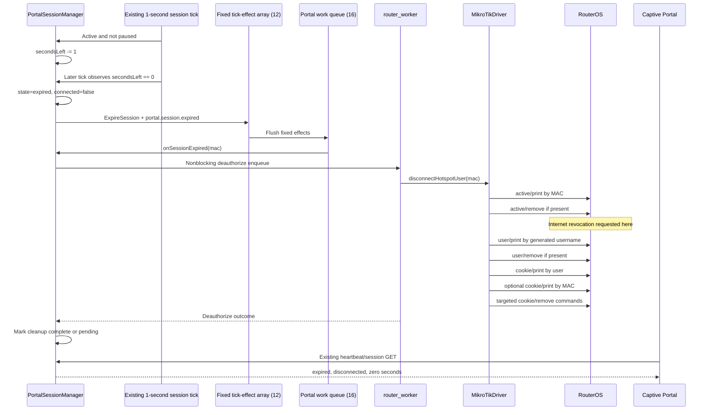

# Investigation B — Done Paying → RouterWorker → MikroTik Activation

**Date:** 2026-08-09  
**Mode:** Forensic investigation only  
**Implementation:** None  
**Architecture changes:** None

## 1. Root-Cause Verdict

There are two distinct failure signatures.

### Signature 1 — `salesSaved=false`, `wall clock not ready`

**Root cause proven.**

Execution stops in:

```text
ESP32_S3_Firmware/src/PortalSessionManager.cpp
PortalSessionManager::donePaying()
lines 317-324
```

`salesRecordedAtNow()` returns an empty string, so `donePaying()` logs
`salesSaved=false` and returns `false`.

The following stages are not reached:

- Sale reservation.
- `sessionState = activating`.
- Sale queue.
- Activation queue.
- RouterWorker.
- RouterPlatform.
- MikroTikDriver.
- RouterOS API.

The browser displays `Activating…` before the API call succeeds. Therefore this
signature can show an Activating label even though backend activation never
started.

### Signature 2 — backend session remains `activating`

**Exact runtime cause not yet proven without the matching device trace.**

Static source proves multiple independent paths capable of leaving a session in
`activating`:

1. `enqueueActivateSession()` fails and its return value is ignored.
2. RouterWorker's shared operation slot is overwritten after a wake token is
   queued but before `_running` becomes true.
3. The one-item Hotspot outcome mailbox drops or overwrites a completion.
4. A persisted `activating` session is restored after reboot without
   re-enqueueing activation.
5. A busy-worker retry cannot be reinserted into the portal queue and the
   failure is ignored.
6. An accepted worker operation hangs or terminates before publishing an
   outcome.
7. Synchronous sale persistence blocks the FIFO portal work queue before its
   following activation item.

The most direct deterministic source path is the ignored activation-queue
admission result after the session has already been committed to `activating`.
It must not be declared the observed hardware cause until queue state and serial
logs from a matching occurrence confirm it.

## 2. Diagnostic Split Required

| Observed evidence | First failed stage | RouterWorker reached? |
|---|---|---|
| HTTP 400 plus `wall clock not ready` | Sales timestamp gate | No |
| HTTP 200, backend remains `activating`, no portal activation dispatch log | Portal deferred enqueue/processing | No |
| Portal activation dispatch logged, no worker dispatch log | Worker admission/shared-slot path | Not reliably |
| Worker dispatch logged, no outcome | Worker/transport/driver/outcome publication | Yes |
| Failed outcome logged and state becomes `activation_error` | RouterOS operation | Yes; not a permanent Activating state |
| Reboot occurs after activation reservation | Boot recovery | Previous attempt uncertain |
| UI says Activating but API reports idle/waiting/error | Frontend optimistic/stale rendering | No active backend activation |

## 3. Complete Activation Sequence

```mermaid
sequenceDiagram
    participant Browser as Captive Portal JS
    participant HTTP as ApiServer / AsyncTCP
    participant PSM as PortalSessionManager
    participant PQ as Portal work queue (16)
    participant Loop as Arduino loopTask
    participant RWQ as RouterWorker queue (1)
    participant RWT as router_worker task
    participant RP as RouterPlatform
    participant MT as MikroTikDriver
    participant ROS as RouterOS API

    Browser->>Browser: Set status "Activating…"
    Browser->>HTTP: POST /api/portal/done-paying
    HTTP->>PSM: donePaying(mac)
    PSM->>PSM: Validate session, credits, purchasedMinutes
    PSM->>PSM: Obtain sales timestamp (up to 500 ms)
    PSM->>PSM: Recheck idempotency under state mutex
    PSM->>PSM: Reserve sale and set state=activating
    PSM->>PQ: Enqueue RecordSale
    PSM->>PQ: Enqueue SaveSessions
    PSM->>PQ: Enqueue ActivateSession
    HTTP-->>Browser: HTTP 200 + local activating session
    Loop->>PQ: Process one FIFO item per loop
    Loop->>Loop: Persist sale/session before activation item
    Loop->>PSM: onSessionActivated(mac)
    PSM->>RWQ: Nonblocking activation enqueue
    RWT->>RWQ: Receive wake byte
    RWT->>RP: provisionHotspotUser(user)
    RP->>MT: authorizeUser(user)
    MT->>ROS: hotspot/user/print
    MT->>ROS: hotspot/user/set or add
    MT->>ROS: hotspot/active/print
    alt No active row
        MT->>ROS: hotspot/active/login
        Note over ROS: Internet authorization requested here
    else Existing active row (Add Time)
        MT->>ROS: hotspot/active/set limit-uptime
    end
    ROS-->>MT: !done or !trap/!fatal
    MT-->>RWT: true/false
    RWT-->>PSM: Publish one Hotspot outcome
    Loop->>PSM: Drain outcome
    alt Success
        PSM->>PSM: connected=true, state=active
    else Failure
        PSM->>PSM: connected=false, state=activation_error
    end
    Browser->>HTTP: Existing session polls
    HTTP->>PSM: getSession()
    PSM-->>Browser: active/error state
```

## 4. Activation Stages — Ownership and Failure Contract

| Stage | Class/function | Thread | Queue | Blocking condition | Timeout | Rollback/retry | Failure state |
|---|---|---|---|---|---|---|---|
| Button | `handleDonePaying()` | Browser main thread | Promise chain | Fetch can stall | No fetch abort; UI poll target 35 s | Catch starts session sync | UI may retain Activating |
| HTTP | `ApiServer` Done Paying route | AsyncTCP callback | None | `donePaying()` is synchronous | Includes 500 ms clock wait | Returns HTTP error | No backend activation |
| Validation | `PortalSessionManager::donePaying()` | AsyncTCP callback | None | State mutex | Unbounded mutex wait | Idempotent active/pending checks | Request false |
| Timestamp | `salesRecordedAtNow()` | AsyncTCP callback | None | `getLocalTime()` | 500 ms | None | Immediate false |
| Reservation | `donePaying()` | AsyncTCP callback | None | State mutex | Unbounded mutex wait | Concurrent recheck | Activating committed |
| Sale enqueue | `enqueueRecordSale()` | AsyncTCP callback | Portal queue 16 | Queue full | Nonblocking | Full rollback | Returns false |
| Save enqueue | `enqueueSaveSessions()` | AsyncTCP callback | Portal queue 16 | Queue full | Nonblocking | Return ignored here | Activating continues |
| Activation enqueue | `enqueueActivateSession()` | AsyncTCP callback | Portal queue 16 | Queue full | Nonblocking | Return ignored | Permanent Activating possible |
| Sale write | `processDeferredWork()` | `loopTask` | Portal FIFO | SD/SPIFFS I/O | No enforced operation timeout | Log only | Activation item waits |
| Portal dispatch | `onSessionActivated()` | `loopTask` | Router queue 1 | Worker busy | 25 s admission budget | Immediate requeue | Error after budget, unless retry lost |
| Worker admission | `tryEnqueueActivateHotspotUser()` | `loopTask` | Wake queue 1 + shared slot | Mutex, `_running`, queue full | All zero-wait | Caller retries | Activating while pending |
| Worker operation | `router_worker` | FreeRTOS worker | None | Transport/API | 20 s cooperative job deadline | No automatic RouterOS retry | Outcome false |
| Outcome publication | `publishHotspotOutcome()` | `router_worker` | One mailbox | Outcome mutex | 50 ms | None | Completion can be lost |
| Outcome drain | `drainHotspotOutcomes()` | `loopTask` | One mailbox | Outcome mutex | 20 ms | Next loop | Active or activation_error |
| Browser completion | `waitForActivation()` | Browser | Sequential requests | Fetch response | Nominal 35 s only after fetch resolves | Heartbeat continues | UI timeout only |

## 5. Part A — Done Paying Source Flow

### Browser

Canonical source:

```text
portal/renzfi-app.js
```

Functions:

- `waitForActivation()` — lines 627-645
- `handleDonePaying()` — lines 648-692
- `renderStatus()` — lines 829-848

Order:

1. Reject duplicate browser click while `donePayingInFlight` is true.
2. Stop coin UI.
3. Close the coin modal.
4. Set visible text to `Activating…`.
5. Send `POST /api/portal/done-paying`.
6. If backend returns an activating session, poll `GET /api/portal/session`
   sequentially every 500 ms.
7. Stop on `active + connected`, `activation_error`, or nominal 35-second
   timeout.

The HTTP helpers do not define a request abort timeout. A stalled fetch can
prevent the nominal activation deadline from being evaluated.

### Portal API

File:

```text
ESP32_S3_Firmware/src/ApiServer.cpp
```

Route:

```text
POST /api/portal/done-paying
lines 2832-2869
```

Order:

1. Apply production portal network-plane gate.
2. Parse request body.
3. Require MAC.
4. Require PortalSessionManager.
5. Call `donePaying(mac)` synchronously.
6. On local success, read the current session.
7. Return HTTP 200 with `Session activating`.
8. On any false return, return HTTP 400 `NO_CREDITS`.

HTTP 200 means local reservation was accepted. It does not mean RouterOS granted
Internet.

### PortalSessionManager

File:

```text
ESP32_S3_Firmware/src/PortalSessionManager.cpp
```

Function:

```text
PortalSessionManager::donePaying()
lines 242-460
```

Ownership:

- `credits`: read, then reset to zero after reservation.
- `purchasedMinutes`: read as authoritative sale time, then reset to zero.
- `saleMinutes`: copied from accumulated `purchasedMinutes`.
- `secondsLeft`: set to purchased seconds or existing seconds plus purchased
  seconds for Add Time.
- `hotspotProfile`: selected using existing profile policy; existing active
  profile is preserved during Add Time.
- Session state: changed to `activating`.
- Router authorization intent: `routerAuthPending=true`.

Ordering:

1. Lock state.
2. Find MAC session.
3. Read state, seconds, credits, purchased minutes.
4. Return idempotent success for an already active/in-flight request.
5. Reject no credits.
6. Reject no purchased minutes.
7. Unlock state.
8. Require StorageManager.
9. Obtain a wall-clock sale timestamp.
10. Lock state again.
11. Repeat concurrent/idempotency checks.
12. Select Hotspot profile.
13. Read accumulated purchased minutes again.
14. Compute:

```text
purchasedSeconds = saleMinutes * 60
newRemaining =
    purchasedSeconds                     for first activation
    existingRemaining + purchasedSeconds for Add Time
```

15. Clear pending credits, inserted amount, and pending purchased minutes.
16. Set `secondsLeft = newRemaining`.
17. Set state to `activating`.
18. Set `connected=false`.
19. Set `routerAuthPending=true`.
20. Unlock.
21. Enqueue RecordSale.
22. On RecordSale admission failure, restore money, purchased minutes, prior
    seconds, and prior state.
23. Enqueue session save.
24. Enqueue activation.
25. Enqueue session event.
26. Return true.

The return values from steps 23-25 are not checked.

### State progression

```text
waiting_coin or active/paused Add Time
  -> local reservation accepted
  -> activating
  -> RouterOS active/login or active/set succeeds
  -> worker outcome delivered
  -> active + connected
```

Internet is externally requested before the local final `active` transition.
The ESP32 only marks Granted after it receives a successful worker outcome.

## 6. Part B — RouterWorker Forensics

### Portal deferred queue

Definition:

```text
ESP32_S3_Firmware/src/PortalSessionManager.h:75-104
```

- Fixed circular queue.
- Capacity 16.
- Protected by PortalSessionManager `_stateMutex`.
- Work types:
  - SaveSessions
  - ActivateSession
  - ExpireSession
  - PauseSession
  - EmitSessionEvent
  - EmitBusEvent
  - RecordSale

Processing:

```text
PortalSessionManager::loop()
PortalSessionManager::processDeferredWork()
```

`FirmwareApp::loop()` calls it from Arduino `loopTask`.
One portal work item is removed per loop iteration.

Duplicate prevention:

- Save and bus events are coalesced.
- RecordSale is deduplicated by MAC/session ID.
- ActivateSession is deduplicated while it remains in the portal queue.

Limit:

Once activation is popped from the portal queue, pending-activation detection
does not track the accepted RouterWorker job.

### RouterWorker creation

File:

```text
ESP32_S3_Firmware/src/RouterProvisioningWorker.cpp
```

Creation region:

```text
lines 173-220
```

Resources:

- Dispatch mutex.
- Hotspot outcome mutex.
- Completion semaphore.
- Queue depth one.
- `router_worker` FreeRTOS task.
- 48 KB worker stack.

### Activation enqueue

Function:

```text
RouterProvisioningWorker::tryEnqueueActivateHotspotUser()
lines 252-277
```

It is nonblocking:

1. Require queue, mutex, and semaphore.
2. Attempt mutex with zero wait.
3. Reject when `_running`.
4. Write operation and `HotspotUser` to shared `_slot`.
5. Clear stale completion semaphore.
6. Send one wake byte with zero wait.
7. Release mutex.

The queue carries only a wake byte. It does not own a copy of the operation
payload.

### Dequeue and execution

Worker loop:

```text
RouterProvisioningWorker.cpp:1256-1306
```

1. Block on `xQueueReceive()`.
2. Set `_running=true`.
3. Read/dispatch `_slot`.
4. Run the operation on `router_worker`.
5. Publish result.
6. Clear running state.
7. Signal completion where applicable.

### Busy and retry

`PortalSessionManager::onSessionActivated()`:

```text
PortalSessionManager.cpp:1448-1515
```

- Builds `HotspotUser`.
- Attempts RouterWorker enqueue.
- If busy, reinserts ActivateSession into the portal queue.
- Total admission budget: 25 seconds.
- After budget expiry, changes session to `activation_error`.

The retry has no intentional delay. It is driven by repeated portal-loop queue
processing. A failed retry enqueue is ignored and loses the operation.

### Worker timeout

- Overall cooperative worker deadline: 20 seconds.
- RouterOS connect timeout: 5 seconds.
- RouterOS sentence I/O timeout: 8 seconds.
- Connect failures participate in global 10-to-60-second exponential backoff.
- No PortalSessionManager timeout exists after the worker has accepted the job.

### Completion

Functions:

```text
RouterProvisioningWorker::publishHotspotOutcome()
RouterProvisioningWorker::takeHotspotOutcome()
```

The mailbox holds one outcome.

Publication can fail after a 50 ms mutex wait.
Consumption can fail after a 20 ms mutex wait.
Publishing a second outcome overwrites a still-pending first outcome.

### Conditions that can permanently retain `activating`

#### Activation queue admission ignored

After RecordSale succeeds, SaveSessions and ActivateSession admission results
are ignored.

If queue pressure fills the remaining slots, the HTTP request still returns
success while no activation work exists.

#### Shared-slot wake race

There is a scheduling window between:

```text
xQueueSend(wake)
```

and the worker setting:

```text
_running = true
```

Another producer can acquire the mutex, observe `_running=false`, overwrite
`_slot`, then fail or succeed in sending another wake. The first wake can execute
the wrong payload and never produce the expected activation outcome.

#### Lost outcome

The one-item mailbox can:

- Drop a result if the mutex cannot be acquired in 50 ms.
- Overwrite an undrained result.

No accepted-job watchdog reconstructs the missing completion.

#### Lost busy retry

If worker admission is busy and reinsertion into the portal queue fails, the
retry disappears. Its elapsed-budget state disappears with it.

#### Reboot recovery gap

`recoverSessionsAfterReboot()` repairs stale coin windows only.
It does not repair persisted:

```text
sessionState=activating
routerAuthPending=true
secondsLeft>0
```

No activation is re-enqueued.

#### Blocking sale persistence

RecordSale is ahead of ActivateSession in FIFO order.
The sale append reads and rewrites sales JSON using synchronous storage I/O.
There is no enforced storage-operation timeout. A stalled write prevents the
following activation item from being processed.

#### Accepted worker never publishes

The 20-second deadline is cooperative, not a task-kill watchdog. A worker task
failure or lower-level unbounded call can leave the accepted session without an
outcome.

### Conditions normally producing `activation_error`

- Ethernet link unavailable.
- Router credentials unavailable.
- RouterOS connect/login failure.
- API trap or fatal response.
- User print/add/set failure.
- Active login failure.
- DMA headroom rejection.
- Worker continuously busy beyond the pre-admission budget.

These only become permanent Activating cases when the failure outcome or retry
is lost.

## 7. Part C — Exact MikroTik Activation Commands

Call chain:

```text
RouterProvisioningWorker::runOp()
  -> RouterPlatform::provisionHotspotUser()
  -> active driver authorizeUser()
  -> MikroTikDriver::createHotspotUser()
  -> RouterOsClient
```

Files:

```text
ESP32_S3_Firmware/src/router/RouterPlatform.cpp:601-608
ESP32_S3_Firmware/src/router/drivers/MikroTikDriver.cpp:2426-2617
ESP32_S3_Firmware/src/RouterOsClient.cpp:1337-1467
```

### Credential and API session

The driver loads RouterOS credentials and opens one RouterOS API session.
Connection and API login are protocol work outside the four functional commands.

### Command 1 — Find Hotspot user

```routeros
/ip/hotspot/user/print
?name=<COLONLESS_UPPERCASE_MAC>
```

Expected:

- Zero or one `!re` rows.
- Terminal `!done`.

Failure:

- `!trap`, `!fatal`, write/read error, deadline, or disconnect returns false.

### Command 2 — Set or add user

Existing:

```routeros
/ip/hotspot/user/set
=.id=<user-id>
=profile=<selected-profile>
=limit-uptime=<HH:MM:SS>
=disabled=no
=comment=<ORIGINAL_MAC>
```

New:

```routeros
/ip/hotspot/user/add
=name=<COLONLESS_UPPERCASE_MAC>
=password=<COLONLESS_UPPERCASE_MAC>
=profile=<selected-profile>
=limit-uptime=<HH:MM:SS>
=comment=<ORIGINAL_MAC>
```

Expected:

```text
!done
```

Failure returns false and prevents authorization.

### Command 3 — Find active Hotspot row

```routeros
/ip/hotspot/active/print
?mac-address=<MAC>
```

Expected:

- Zero or one matching `!re`.
- Terminal `!done`.

### Command 4A — Initial Internet grant

When no active row exists:

```routeros
/ip/hotspot/active/login
=user=<COLONLESS_UPPERCASE_MAC>
=password=<COLONLESS_UPPERCASE_MAC>
=mac-address=<MAC>
=ip=<CLIENT_IP>
```

The IP argument is omitted if unavailable.

**This is the source location where Internet authorization is requested.**

Creating the Hotspot user alone does not grant Internet.

Expected:

```text
!done
```

A trap, fatal response, transport error, or timeout returns activation failure.

### Command 4B — Add Time

When an active row already exists:

```routeros
/ip/hotspot/active/set
=.id=<active-id>
=limit-uptime=<TOTAL_HH:MM:SS>
```

The supplied value is total ESP32 `secondsLeft`, including newly accumulated
purchased minutes.

Current source treats this command as best effort. Its failure is ignored and
the driver can still report activation success.

### RouterOS replies

`RouterOsClient` treats:

- `!re` as result rows.
- `!done` as command completion.
- `!trap` and `!fatal` as failures.

The command path also rejects:

- Missing authenticated connection.
- Worker deadline expiry.
- CPU pacing deadline violation.
- Insufficient DMA headroom.
- Socket write/read failure.

### Functional command count

Normal first activation:

```text
1 user print
1 user set/add
1 active print
1 active login
= 4 functional commands
```

Normal Add Time:

```text
1 user print
1 user set
1 active print
1 active set
= 4 attempted functional commands
```

No idle command is added by this flow.

## 8. Part D — Hotspot Session Lifecycle

### User creation

The Hotspot user is created in `MikroTikDriver::createHotspotUser()` only after:

- Local sale reservation.
- RecordSale portal-queue admission.
- Activation deferred work processing.
- RouterWorker acceptance.
- RouterOS API login.
- User lookup confirms no existing user.

### Timeout assignment

Source:

```text
session["purchasedMinutes"]
  -> donePaying saleMinutes
  -> purchasedSeconds
  -> session["secondsLeft"]
  -> HotspotUser.timeoutSeconds
  -> formatLimitUptime()
  -> /ip/hotspot/user add/set limit-uptime
```

For Add Time, the active row also receives total `secondsLeft` through
`/ip/hotspot/active/set`.

### Profile assignment

- Initial activation applies the selected promo/managed profile.
- Add Time preserves an already stored active-session profile.
- The profile is sent through Hotspot user add/set.

### Internet grant

Initial grant:

```text
/ip/hotspot/active/login
```

Local confirmation:

```text
successful worker outcome
  -> connected=true
  -> sessionState=active
```

### Existing active session extension

Add Time:

1. PortalSessionManager adds purchased seconds to existing `secondsLeft`.
2. Existing user receives total `limit-uptime`.
3. Existing active row receives best-effort total `limit-uptime`.
4. Worker reports success.

Because active/set failure is ignored, hardware validation must prove that the
target RouterOS versions extend the live active session correctly.

### User removal

The user is removed during terminate/expiration deauthorization after the active
row is removed.

## 9. Part E — Complete Expiration and Disconnect Sequence



### Expiration detector

File/function:

```text
ESP32_S3_Firmware/src/PortalSessionManager.cpp
PortalSessionManager::tickSessions()
lines 1157-1237
```

Owner:

```text
ESP32
```

The ESP32 timer is authoritative for local state.
RouterOS can independently enforce its own limit, but the firmware does not poll
RouterOS to detect expiration.

`tickSessions()`:

1. Runs from the existing PortalSessionManager loop once per second.
2. Decrements active, unpaused `secondsLeft`.
3. On a later tick observing zero:
   - sets state `expired`;
   - sets `connected=false`;
   - sets cleanup queued/pending flags;
   - schedules ExpireSession and events.

There can be approximately one additional tick between decrementing 1→0 and
queueing cleanup.

### Reverse RouterWorker path

```text
PortalSessionManager::onSessionExpired()
  -> RouterProvisioningWorker::tryEnqueueDeauthorizeHotspotUser()
  -> RouterPlatform::disconnectHotspotUser()
  -> MikroTikDriver::deauthorizeUser()
```

Busy-worker retry uses the same 25-second admission budget.

### Exact deauthorization command order

1. Find active row:

```routeros
/ip/hotspot/active/print
?mac-address=<MAC>
```

2. Remove active row if present:

```routeros
/ip/hotspot/active/remove
=.id=<active-id>
```

**Internet revocation is requested here.**

3. Find generated user:

```routeros
/ip/hotspot/user/print
?name=<COLONLESS_UPPERCASE_MAC>
```

4. Remove user if present:

```routeros
/ip/hotspot/user/remove
=.id=<user-id>
```

5. Find cookies by user:

```routeros
/ip/hotspot/cookie/print
?user=<COLONLESS_UPPERCASE_MAC>
```

6. If no IDs were found, find by MAC:

```routeros
/ip/hotspot/cookie/print
?mac-address=<MAC>
```

7. Remove each collected cookie, up to eight:

```routeros
/ip/hotspot/cookie/remove
=.id=<cookie-id>
```

### Disconnect command count

- Minimum no-entry cleanup: 3 commands.
- Typical active + user + one cookie: approximately 6 commands.
- Implemented maximum with fallback and eight cookies: 14 attempted commands.

### Cleanup outcome

Success:

- `routerCleanupComplete=true`.
- `routerCleanupPending=false`.
- `connected=false`.

Failure:

- `routerCleanupComplete=false`.
- `routerCleanupPending=true`.
- `connected=false`.

No automatic retry path was found after a failed deauthorization outcome.
Expired records with incomplete cleanup are retained rather than deleted.

Cookie-query failure can be masked as cleanup success when no cookie IDs are
collected. This is a separate cleanup integrity risk, not the activation root
cause.

## 10. Part F — 30/15-Second Notification Feasibility

### In-page notification

**Feasible without backend or RouterOS changes.**

The portal already has:

- Authoritative `secondsLeft` from session JSON.
- A one-second local display timer.
- Ten-second heartbeat/session correction.
- Pause state.
- Active/expired session state.

No additional polling, timer, ESP32 loop, RouterWorker job, or RouterOS command
is required.

### Safest localized behavior

Use the existing one-second browser timer and existing status element.

Recommended behavior:

1. When active and not paused, detect crossing from above 30 to 30 or below.
2. Display `30 seconds remaining`.
3. Detect crossing from above 15 to 15 or below.
4. Display `15 seconds remaining`.
5. At zero/expired, display `Session expired`.
6. Use one-shot flags scoped to the current session.
7. Re-arm thresholds only when an authoritative session update increases time
   above them after Add Time.
8. On tab visibility restoration, calculate the currently applicable warning
   from the existing local state; do not make a new request.

The smallest presentation uses the existing `#connectionStatus` element and
requires only JavaScript. A new styled toast would require HTML and CSS as well,
but is not necessary for the contract.

### Limitation

In-page warnings work only while the captive page remains alive.
Mobile browsers and captive assistants throttle or suspend background JavaScript.
Warnings can be shown when execution resumes, but exact 30/15-second delivery
cannot be guaranteed when the page is hidden, closed, or killed.

### Phone OS notification

**Not reliably feasible in the current architecture.**

Reasons:

- Production portal uses plain HTTP.
- Notifications and service workers require a secure origin in normal browser
  policy.
- Notification permission requires explicit user interaction.
- Captive-assistant WebViews may not expose the Notifications API.
- The customer portal has no service worker or push subscription.
- The existing PWA/service worker belongs to the Admin dashboard and excludes
  portal routes.
- A service worker cannot reliably schedule exact future notifications after
  the page closes without push/native infrastructure.

Adding HTTPS, push, a service worker, or a native application would be an
architecture/product change and is outside the localized requirement.

### Exact future portal files

For the recommended existing-status-element implementation:

Canonical source:

```text
portal/renzfi-app.js
```

Generated MikroTik artifact:

```text
deployment/mikrotik-hotspot/renzfi-app.js
```

Physical MikroTik upload:

```text
Files/hotspot/renzfi-app.js
```

No firmware, HTML, CSS, RouterOS script, or other portal asset is required.

No files were changed during this investigation.

## 11. Part G — Regression Analysis

| Subsystem | Risk from activation correction | Risk from in-page warning | Required preservation |
|---|---|---|---|
| CoinManager | None if untouched | None | ISR handoff and denomination flow |
| Coin ISR | None | None | Debounce, guard, pulse timing |
| PortalSessionManager | High accounting/state risk | None | Idempotency, purchased time, rollback |
| PromoManager | None | None | Per-coin entitlement and profile policy |
| VoucherManager | None | None | Keep separate voucher path |
| RouterWorker | Very high if modified | None | Single RouterOS session, pacing, deadline |
| RouterPlatform | None if untouched | None | Driver delegation |
| MikroTikDriver | High if modified | None | Four-command activation budget |
| Portal APIs | Medium | None | Backward-compatible response schema |
| Admin APIs | None | None | Auth and RBAC |
| Captive Portal | Medium UI-state risk | Low/medium | Existing polling cadence |
| Admin Dashboard | None | None | No shared UI changes |
| Synchronize Router | None | None | No new sync trigger |
| Router Cache | None | None | No cache invalidation |
| Installation State | Medium if wall-clock policy changes | None | Do not force Ready |
| Router synchronization | None | None | No extra API work |
| Hotspot | High only if driver changed | None | Existing user/active lifecycle |
| WAN | None | None | No added probe/NTP loop |
| Portal queue | High | None | Bounded FIFO and failure handling |
| Heartbeat | None | Low | Keep 10-second interval |
| Portal polling | None | Low | Keep 500 ms activation and 2 s coin cadence |
| Timer | None | Low | Reuse existing one-second timer |
| Storage | High around sale ordering | None | No retry writes or extra cadence |
| SPIFFS | None if unchanged | None | No added writes |
| SD | High around sale persistence | None | Preserve atomic write path |
| Authentication | None | None | Preserve guest and management gates |
| RBAC | None | None | No management access changes |
| Customer sessions | High | Low | Exactly-once credit consumption |
| Add Time | High | Low | Preserve total seconds and active profile |
| Promo Rates | None | None | Preview equals activated entitlement |

### Changes that must not be bundled

- Promo arithmetic changes.
- Coin ISR/timing changes.
- RouterOS command additions.
- WAN/NTP polling.
- Synchronize Router changes.
- Router cache refreshes.
- Admin Dashboard refactors.
- Voucher integration.
- MikroTik topology changes.
- Storage architecture changes.

## 12. Part H — Captive Portal File Impact

### Activation reliability only

If the future correction is backend-only:

```text
No MikroTik upload required.
```

No change is required in:

```text
portal/
deployment/mikrotik-hotspot/
```

### Frontend optimistic/stale Activating correction

Minimum canonical file:

```text
portal/renzfi-app.js
```

Generated/upload file:

```text
deployment/mikrotik-hotspot/renzfi-app.js
```

### 30/15/expired existing-status notification

Minimum canonical file:

```text
portal/renzfi-app.js
```

Generated/upload file:

```text
deployment/mikrotik-hotspot/renzfi-app.js
```

Do not upload every portal file for a JavaScript-only change.

## 13. Part I — Performance and Resource Impact

### Current activation

RouterOS functional command count:

```text
First activation: 4
Add Time: 4 attempted
Idle: 0 commands/minute
```

### Current expiration

```text
Minimum: 3 commands
Typical: approximately 6
Maximum implemented: 14 attempted
```

Expiration occurs once per session, not continuously.

### Safest activation correction envelope

Any future localized correction must:

- Add zero RouterOS commands.
- Keep one RouterOS API session per activation.
- Add zero polling.
- Add zero timers.
- Add zero background loops.
- Add zero busy waiting.
- Preserve command pacing and transport backoff.
- Preserve the 20-second worker deadline.
- Avoid new persistence operations.

### In-page warning impact

| Resource | Expected impact |
|---|---|
| ESP32 CPU | None |
| RouterOS CPU | None |
| RouterOS commands | Zero |
| ESP32 heap | None |
| DMA | None |
| PSRAM | None |
| Firmware flash | None for production MikroTik portal |
| SD/SPIFFS writes | None |
| RouterWorker | None |
| Portal queue | None |
| Heartbeat | Frequency unchanged |
| Browser CPU | A few integer comparisons in existing 1-second callback |
| Idle RouterOS behavior | **0 commands/minute remains** |

### Activation backend fix impact

Impact depends on the selected failure signature.

- Wall-clock error handling can remain zero RouterOS commands on rejection.
- Queue admission/error-state correction can remain zero additional RouterOS
  commands.
- Worker queue/outcome redesign has broader RAM/concurrency risk and must be a
  separate, explicitly approved task.

## 14. Required File Changes for a Future Fix

No file was changed by this investigation.

### Proven wall-clock signature

Potential localized backend files:

```text
ESP32_S3_Firmware/src/PortalSessionManager.cpp
ESP32_S3_Firmware/src/SalesTime.cpp
ESP32_S3_Firmware/src/ApiServer.cpp
```

The accounting policy for activation without valid wall time must be approved
before implementation.

### Ignored portal activation enqueue

Potential localized file:

```text
ESP32_S3_Firmware/src/PortalSessionManager.cpp
```

The safest direction is to check admission and transition to a recoverable
failure/rollback state without adding retries or RouterOS work.

### Shared worker-slot or outcome loss

Potential files:

```text
ESP32_S3_Firmware/src/RouterProvisioningWorker.cpp
ESP32_S3_Firmware/src/RouterProvisioningWorker.h
```

This is higher risk and must not be combined with the localized Done Paying
error fix.

### UI correction or low-time warning

Canonical:

```text
portal/renzfi-app.js
```

Generated/upload:

```text
deployment/mikrotik-hotspot/renzfi-app.js
```

## 15. Hardware Validation Checklist

### Failure classification

- Capture Done Paying HTTP status/body.
- Capture immediate authoritative session JSON.
- Capture serial log from `done-paying begin` through completion/failure.
- Distinguish wall-clock rejection from backend `activating`.
- Record portal queue count before sale and activation enqueue.
- Record whether portal activation dispatch appears.
- Record whether RouterWorker dispatch appears.
- Record whether MikroTikDriver begins.
- Record whether a Hotspot outcome is published and drained.

### Activation

- New user activation.
- Existing user activation.
- Add Time while active.
- Add Time while paused.
- Add Time after activation error.
- Confirm accumulated preview minutes equal sale minutes.
- Confirm `secondsLeft` equals preview minutes × 60.
- Confirm RouterOS user `limit-uptime`.
- Confirm active row and Internet access.
- Confirm target RouterOS v6/v7 behavior for `active/login`.
- Confirm target RouterOS v6/v7 behavior for `active/set`.

### Failure injection

- Wall clock unavailable.
- NTP delayed beyond 500 ms.
- Storage unavailable.
- SD write delay/failure.
- Portal work queue near capacity.
- RouterWorker busy with Admin Sync.
- RouterWorker queue full.
- RouterOS connect failure.
- RouterOS login failure.
- User add/set trap.
- Active login trap.
- Outcome publication delay.
- Reboot after state becomes activating.

### Duplicate and recovery

- Double-click Done Paying.
- Repeat HTTP request after timeout.
- Reload portal during activation.
- Resume after `activation_error`.
- Verify no duplicate sale.
- Verify no duplicate RouterOS time grant.
- Verify purchased time remains recoverable.

### Expiration

- Natural countdown to zero.
- Pause near zero.
- Resume near zero.
- Active row removal.
- User removal.
- Cookie removal.
- Cleanup failure and retained session.
- RouterOS independently expiring before ESP32 cleanup.

### 30/15/expired warning

- Trigger each threshold once.
- Skip warnings while paused.
- Add Time above thresholds and verify re-arm.
- Keep page visible.
- Background and restore the page.
- Close/reopen captive assistant.
- Verify no new network request at a threshold.

### Stability

- MikroTik CPU before/during/after activation.
- RouterOS functional command count remains four.
- Idle RouterOS commands remain zero per minute.
- ESP32 heap, minimum heap, DMA free/largest/minimum.
- RouterWorker stack watermark.
- No watchdog reset.
- No Guru Meditation.
- No additional SD/SPIFFS writes.
- Portal heartbeat and polling cadence unchanged.

## 16. Safest Localized Implementation Plan

No implementation is authorized by this report.

### Step 1 — Classify the real occurrence

Use existing HTTP/session/log evidence to determine:

```text
pre-activation wall-clock rejection
or
true backend activating stall
```

Do not modify RouterWorker for a request that never reached it.

### Step 2 — Fix only the proven boundary

For wall-clock rejection:

- Return an accurate retryable error.
- Do not optimistically retain Activating in the browser.
- Do not increase the 500 ms clock wait.
- Do not add NTP polling.
- Do not allow activation without first defining durable sale semantics.

For ignored activation enqueue:

- Check the existing enqueue return.
- Restore a recoverable state or explicit `activation_error`.
- Preserve purchased seconds.
- Add no retry loop and no RouterOS command.

For shared-slot/outcome loss:

- Treat as a separate worker-hardening task.
- Preserve one RouterOS session, queue bounds, pacing, and deadlines.
- Require concurrent hardware stress validation.

### Step 3 — Optional in-page warning

- Reuse the existing one-second browser timer.
- Reuse the existing status element.
- Add only one-shot threshold crossing state.
- Make no API call at 30, 15, or zero.
- Upload only generated `renzfi-app.js`.

### Step 4 — Validate

Run the complete hardware matrix above before release.

## 17. Final Conclusion

- The known `wall clock not ready` occurrence has a proven pre-RouterWorker root
  cause.
- A genuine backend `activating` stall cannot be assigned one exact runtime
  cause without its matching trace.
- Source proves multiple permanent-Activating paths, with ignored activation
  queue admission being the narrowest localized candidate.
- Accumulated `purchasedMinutes` reaches RouterOS user `limit-uptime` and the
  existing active-row Add Time path.
- Internet authorization is requested by `/ip/hotspot/active/login`.
- Expiration is detected by ESP32 and Internet revocation is requested by
  `/ip/hotspot/active/remove`.
- In-page 30/15/expired warnings are feasible with one JavaScript file and zero
  RouterOS impact.
- Reliable phone OS notifications are not compatible with the current HTTP
  captive-portal architecture.
- No code, portal asset, RouterOS configuration, or architecture was changed.
