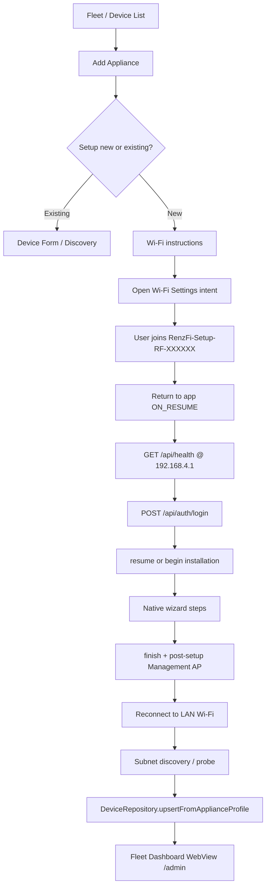

# Phase 7C.3 — Android Owner App Onboarding

**Status:** Implemented  
**Scope:** Native Material 3 Compose onboarding in the Owner App  
**Frozen:** ProvisioningEngine, ProvisioningServer, browser Setup Wizard, HTTP contracts, ManagementApManager, DeviceRegistry semantics

---

## Objective

Brand-new appliances are onboarded from the Android Owner App using the **same provisioning REST APIs** as the browser Setup Wizard. The app does **not** embed the React wizard in a WebView and does **not** duplicate provisioning business logic on the client.

---

## Architecture

```
Owner App (Compose)
    │
    ├─ Device List → Add Appliance
    │
    ├─ OnboardingViewModel (phase + workflowStep UI state)
    │
    ├─ ProvisioningRepository (thin HTTP client)
    │       └─ ApplianceSessionClient (per-host Retrofit + SessionCookieJar)
    │
    ├─ DeviceRepository (existing registry — DataStore)
    │
    └─ Frozen firmware APIs
            GET  /api/health
            POST /api/auth/login
            GET  /api/system/network
            GET  /api/provisioning/installation/resume
            POST /api/provisioning/installation/begin
            GET  /api/provisioning/routers/detect
            POST /api/provisioning/routers/select
            POST /api/provisioning/routers/connect
            POST /api/provisioning/portal/configure
            POST /api/provisioning/coin/configure
            POST /api/provisioning/validate
            POST /api/provisioning/finish
            POST /api/system/management-ap/post-setup
```

### Key components

| Layer | Files |
|-------|--------|
| Models | `ProvisioningModels.kt`, `NetworkStatusModels.kt`, `ApplianceDefaults.kt` |
| Network | `ApplianceApiService.kt`, `ApplianceSessionClient.kt`, `SessionCookieJar.kt` |
| Repository | `ProvisioningRepository.kt` |
| ViewModel | `OnboardingViewModel.kt` |
| UI | `AddApplianceScreen.kt`, `OnboardingConnectScreen.kt`, `OnboardingWizardScreen.kt`, `OnboardingRejoinScreen.kt`, `OnboardingHostScreen.kt` |
| Navigation | `NavGraph.kt` — `add_appliance`, `onboarding_setup` |

---

## End-to-end flow



---

## State flow

### OnboardingPhase (navigation shell)

| Phase | Screen | Trigger |
|-------|--------|---------|
| `WifiInstructions` | Connect | Enter onboarding |
| `Detecting` | Connect (spinner) | Manual detect or return from Wi-Fi settings |
| `Detected` | Connect (device facts) | Health probe success |
| `Wizard` | Native wizard | User taps Continue |
| `RejoinWifi` | Rejoin | Finish + post-setup succeeded |
| `Discovering` | Rejoin (spinner) | LAN rejoin / retry |
| `Complete` | Rejoin (success) | Device registered |

### WizardStep (driven by `workflowStep` from firmware)

| `workflowStep` | UI step |
|----------------|---------|
| `welcome` | Start / resume |
| `router_detection`, `driver_selection` | Network type (Standard / MikroTik) |
| `router_connection` | Router connection form |
| `portal_configuration` | Portal defaults |
| `coin_configuration` | Coin defaults or skip |
| `validation` | Run checks (firmware-owned) |
| `summary` | Progress review |
| `ready` | Management AP policy + finish |

`OnboardingViewModel.mapWorkflowToWizardStep()` mirrors the browser `stepRouter` without reimplementing validation rules.

---

## Provisioning API usage

### Session

1. Bind `ApplianceSession` to `192.168.4.1` during Management AP onboarding.
2. `POST /api/auth/login` with factory password (`admin` — same as firmware `DEFAULT_ADMIN_PASSWORD`).
3. OkHttp `SessionCookieJar` stores the admin session cookie for subsequent provisioning calls.

### Resume on interrupt

After login, the app calls `GET /api/provisioning/installation/resume`. If that fails, it calls `POST /api/provisioning/installation/begin`. Interrupted setups continue at the firmware-reported `workflowStep` — no local step machine duplicates engine state.

### Wizard actions (no duplicated logic)

| Step | API | Body |
|------|-----|------|
| Network type | `POST …/routers/select` | `{ driverId: "generic_ap" \| "mikrotik" }` |
| Router | `POST …/routers/connect` | host + credentials (MikroTik only) |
| Portal | `POST …/portal/configure` | `ApplianceDefaults.portalBody()` |
| Coin | `POST …/coin/configure` | defaults or `{ skip: true }` |
| Validation | `POST …/validate` | _(empty — firmware runs checks)_ |
| Finish | `POST …/finish` | _(empty)_ |
| Management AP | `POST …/management-ap/post-setup` | `{ keepEnabled: boolean }` |

Portal/coin defaults mirror `src/lib/applianceConfiguration.ts` — the firmware still validates and persists.

### Network status during onboarding

`GET /api/system/network` is polled during wizard steps. The UI shows Management AP (SSID, IP, clients) and Ethernet (IP, gateway, link) from the frozen contract.

---

## Wi-Fi switching

The app **never** attempts programmatic Wi-Fi association.

| Moment | Mechanism |
|--------|-----------|
| Join Management AP | `Settings.ACTION_WIFI_SETTINGS` intent |
| Return detection | `Lifecycle.Event.ON_RESUME` after `onOpenManagementWifiSettings()` flag |
| Rejoin LAN | Same intent + `onOpenLanWifiSettings()` flag |
| Manual retry | “I've connected — detect appliance” / “find appliance” buttons |

---

## Device Registry integration

- **Single registry:** existing `DeviceRepository` + DataStore (`DevicePreferences`).
- **Stable Device ID:** captured from `GET /api/health` at detection; used to match post-LAN discovery.
- **Registration:** `upsertFromApplianceProfile()` after LAN discovery (same path as fleet scan).
- **No second registry** or parallel onboarding store.

Post-finish discovery order:

1. Probe saved Ethernet IP from `/api/system/network` (if available).
2. Subnet scan (`discoverDevicesOnSubnet`) matching `applianceDeviceId`.
3. Fallback: first discovered appliance on subnet.

---

## Failure recovery

| Failure | User actions |
|---------|----------------|
| Cannot reach `192.168.4.1` | Retry detect, Open Wi-Fi settings, Cancel |
| Auth / provisioning error | Inline message; retry current step |
| Validation failed | Re-run checks; firmware `checks[]` displayed as-is |
| Finish failed | Retry complete setup |
| LAN discovery failed | Open Wi-Fi settings, Retry discovery, Cancel |
| Setup interrupted | Reconnect to Management AP → resume API restores session |

---

## UI notes

- Material 3 Compose throughout — **no WebView** in onboarding.
- Fleet Dashboard (`DashboardScreen`) still uses WebView for `/admin` **after** registration — unchanged.
- “Add existing appliance” routes to the existing `DeviceFormScreen` / discovery flow.

---

## Success criteria checklist

- [x] Factory appliance → Add Appliance → Wi-Fi settings → Management AP → detect @ `192.168.4.1`
- [x] Native wizard calls frozen `/api/provisioning/*` endpoints
- [x] Finish → reconnect LAN → auto discovery → registry → dashboard
- [x] Browser Setup Wizard unchanged
- [x] No duplicated provisioning validation or summary calculation on Android
- [x] `assembleDebug` succeeds

---

## Appliance-first startup (Phase 7E)

On launch, before the normal fleet connection flow, the app silently evaluates:

1. Whether a Renz-Fi setup network is reachable (`192.168.4.1` / `RenzFi-Setup-*`)
2. Whether the appliance Device ID is already in the local registry
3. `GET /api/health` — including `managementAp.mode` (`factory` | `maintenance` | `disabled`)

| Outcome | Screen |
|---------|--------|
| New appliance (not in registry) | **New Renz-Fi Appliance Detected** → Begin setup / Later |
| Already registered on setup Wi-Fi | **This appliance is already registered** → Open dashboard / Maintenance mode |
| No setup appliance | Normal fleet splash → device list or dashboard |

After setup completes, the rejoin flow names the operational Wi-Fi SSID, scans the LAN, and confirms registration with the discovered IP.

**Appliance readiness:** When a factory appliance is detected, the app shows identity + build metadata and a split readiness summary (hardware status vs gateway status) from `GET /api/health` before **Begin setup** is enabled.

| Layer | Files |
|-------|--------|
| Readiness model | `ApplianceReadiness.kt`, `HealthResponse.kt` (`router.product`, `router.capabilities`, build metadata) |
| Startup probe | `MainViewModel.startHealthCheck()`, `DeviceRepository.evaluateNearbySetupAppliance()` |
| Models | `NearbyApplianceInfo.kt`, `HealthResponse.kt` (`managementAp.mode`) |
| Screens | `NewApplianceDetectedScreen.kt`, `AlreadyRegisteredSetupScreen.kt`, `OnboardingRejoinScreen.kt` |
| Navigation | `NavGraph.kt` — `new_appliance_detected`, `setup_already_registered/{deviceId}` |

---

## Related documents

- [PROVISIONING_API.md](ESP32_S3_Firmware/docs/PROVISIONING_API.md)
- [MANAGEMENT_AP_ARCHITECTURE.md](MANAGEMENT_AP_ARCHITECTURE.md)
- [PHASE_7C2_MANAGEMENT_AP_LIFECYCLE.md](PHASE_7C2_MANAGEMENT_AP_LIFECYCLE.md)
- [PHASE_6C_INSTALLER_UX_REFINEMENT.md](PHASE_6C_INSTALLER_UX_REFINEMENT.md) — network type UX parity
