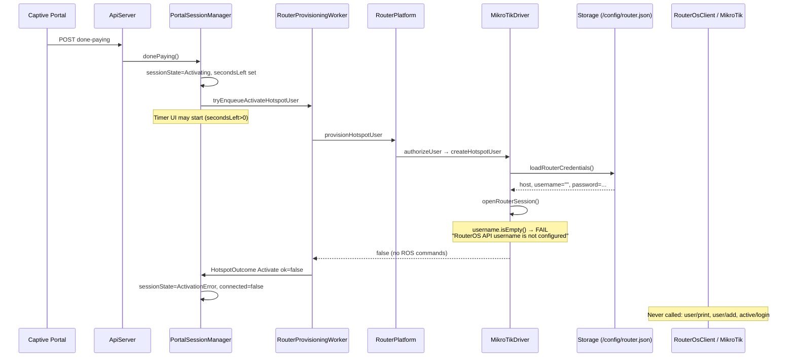
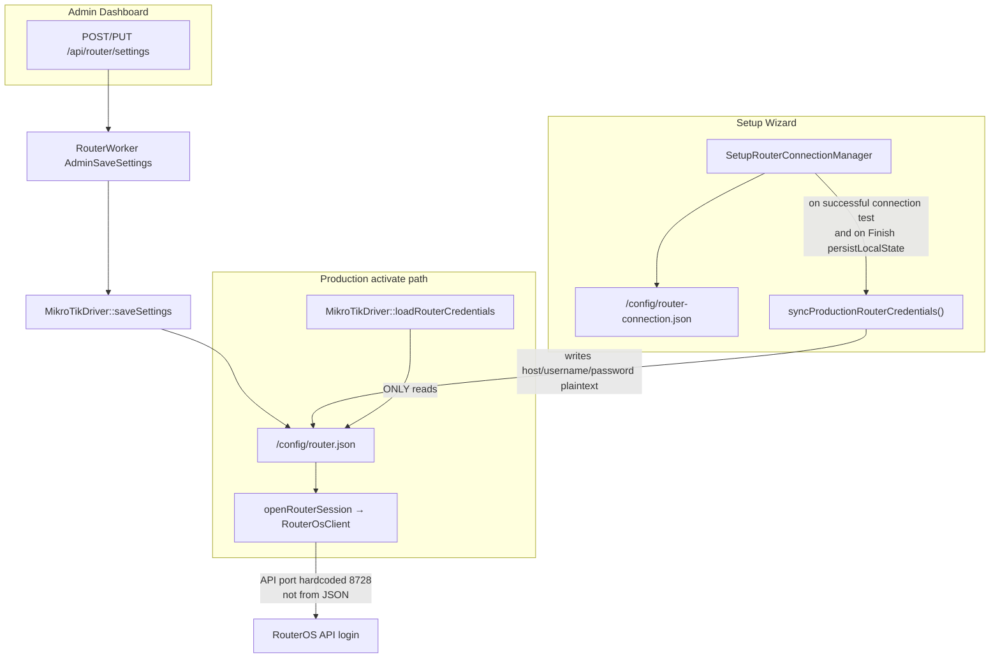

# FORENSIC REPORT: RouterWorker Activation Failure (Internet Never Granted)

**Mode:** Investigation only — no source changes  
**Date:** 2026-08-10  
**Scope:** Done Paying → ACTIVATING → RouterWorker → credential load → RouterOS authorize  
**Stability constraint:** No recommended fix in this document beyond pinpointing the smallest future change surface

---

## 1. Verdict (single primary root cause)

**Internet is never granted because hotspot activation aborts before any RouterOS authorize command when production RouterOS API `username` loaded from `/config/router.json` is empty.**

| Item | Evidence |
|------|----------|
| **Exact error** | `"RouterOS API username is not configured"` |
| **Exact file** | `ESP32_S3_Firmware/src/router/drivers/MikroTikDriver.cpp` |
| **Exact function** | `MikroTikDriver::openRouterSession` |
| **Exact lines** | **357–359** (`username.isEmpty()` → set `errorOut` → `return false`) |
| **Exact variable** | `username` (local `String` filled by `loadRouterCredentials`) |
| **Exact object / store** | JSON field `username` in `RenzFiConfig::ROUTER_FILE` = `/config/router.json` |
| **Exact upstream fill** | `MikroTikDriver::loadRouterCredentials` lines **163–175** (`username = stored["username"] \| ""`) |
| **Exact caller chain stop** | `createHotspotUser` → `openRouterSession` fails → `return false` at **2515–2519** — **before** `user/print`, `user/add|set`, `active/login` |
| **Duplicate guard** | `RouterOsClient::login` lines **1227–1229** (same message) — not reached if openRouterSession rejects first |

**Confidence: 95%** that this is the proven stop for “no Internet after Done Paying,” given the user log string matches this exact branch and the authorize path never runs after that failure.

**Why Factory appears in logs (correlated, not a separate activation gate):**  
`InstallationStateManager::inferFromStorage()` returns `Factory` when `router.json` host/username/password are empty (`InstallationStateManager.cpp` **170–174**). Factory mode does **not** skip `loadRouterCredentials` or intentionally ignore credentials during activate. Factory is typically the *symptom* of empty production credentials, not an alternate activation policy.

---

## 2. What is proven NOT to be the root cause

| Claim | Status |
|-------|--------|
| Done Paying / sale / wall clock | Disproven earlier; Done Paying reaches ACTIVATING + enqueue |
| RouterWorker queue / dispatch | Worker starts; failure is inside activate job |
| Portal session persistence / coin / credits | Upstream of activate; working per symptoms |
| RouterOS hotspot commands / profiles / queues | Never reached on this failure path |
| Pause/Resume primary defect | Secondary (see §9) |
| Timer jump primary defect | Secondary (see §8) |

---

## 3. Complete activation sequence (proven)



---

## 4. Investigation A — Credential lifecycle diagram



### Where fields live

| Field | Production store (`router.json`) | Setup store (`router-connection.json`) | Activate uses? |
|-------|----------------------------------|----------------------------------------|----------------|
| host | `host` | `host` | Yes — from `router.json` |
| username | `username` | `username` (default `"admin"` in setup RAM) | Yes — from `router.json` only |
| password | `password` (plaintext) | `passwordProtected` | Yes — from `router.json` only |
| API port | **Not stored** | `apiPort` | Activate uses `RenzFiConfig::ROUTEROS_API_PORT` (8728) |
| profile | `profile` | n/a (sync writes `"default"`) | Yes — fallback profile name |

### How many copies / caches

| Copy | Location | Used by activate? |
|------|----------|-------------------|
| 1 | `/config/router.json` (+ optional SPIFFS `/fallback/router.json`) | **Yes — sole source** |
| 2 | `/config/router-connection.json` | **No** |
| 3 | `SetupRouterConnectionManager` RAM | No |
| 4 | `MikroTikDriver::_cachedHost/_cachedUsername` | Only after successful open; not a load source |
| 5 | `RouterOsClient` session fields | Ephemeral after `setCredentials` |
| 6 | Seed default | Created only if file missing: `username:""`, `password:""` (`StorageManager.cpp` **31–33**) |

**Stale / split-brain is possible:** setup credentials can be valid in `router-connection.json` while `router.json` still has empty `username` (seed). Activation never reads the setup file.

**Silent sync gap (high relevance):** after setup connection success, `RouterProvisioningWorker` calls `syncProductionRouterCredentials` but **continues HTTP 200 even if sync fails** (`RouterProvisioningWorker.cpp` **733–738**). UI can show MikroTik connected while production file stays empty.

---

## 5. Investigation B — `loadRouterCredentials()`

| Question | Answer |
|----------|--------|
| Who calls it? | Many MikroTikDriver ops; activate path: `createHotspotUser` **2497** |
| When? | Once per activate job at step 1 |
| Ownership | `MikroTikDriver` method; reads via `StorageManager*` |
| Source | **Storage file only** — not RAM singleton, not setup manager, not RouterOS |
| Success semantics | Returns `true` if JSON **reads**; empty username still returns `true` |
| Failure vs empty | File missing → `false` (“settings unavailable”). File present with `""` username → open fails with configured error |

```163:175:ESP32_S3_Firmware/src/router/drivers/MikroTikDriver.cpp
bool MikroTikDriver::loadRouterCredentials(String &host, String &username,
                                           String &password,
                                           String &profile) const {
  HeapJsonDocument heap(RenzFiConfig::JSON_DOC_SMALL);
  if (!_storage || !_storage->readJson(RenzFiConfig::ROUTER_FILE, heap.doc())) {
    return false;
  }
  JsonDocument &stored = heap;
  host     = stored["host"] | "";
  username = stored["username"] | "";
  password = stored["password"] | "";
  profile  = stored["profile"] | "default";
  return true;
}
```

```351:360:ESP32_S3_Firmware/src/router/drivers/MikroTikDriver.cpp
bool MikroTikDriver::openRouterSession(...) {
  ...
  if (username.isEmpty()) {
    errorOut = "RouterOS API username is not configured";
    return false;
  }
```

---

## 6. Investigation C — Configuration persistence

```
Admin Save → RouterWorker AdminSaveSettings → MikroTikDriver::saveSettings → writeJson(ROUTER_FILE)
Setup connect OK → syncProductionRouterCredentials → writeJson(ROUTER_FILE)  [may fail silently to UI]
Finish persistLocalState → syncProductionRouterCredentials (hard fail of finish if sync fails)
Boot seed → ensureJsonFile only if missing → kDefaultRouter with empty username/password
Factory reset (setState Factory) → does NOT clear router.json by itself
```

| Mechanism | Overwrites production credentials? |
|-----------|-------------------------------------|
| `ensureJsonFile` | No — skips if file exists |
| Boot seed | Only creates missing file with empty username |
| Setup connection sync fail | Leaves prior/empty `router.json` |
| SPIFFS fallback | Eligible for `ROUTER_FILE`; can serve empty seed if SD path wrong / fallback active |
| Installation Factory flag | Does not rewrite credentials |

---

## 7. Investigation D — Factory lifecycle

| Question | Proven answer |
|----------|---------------|
| Does Factory ignore credentials in activate? | **No** — same `loadRouterCredentials` path |
| Does Factory skip loading config? | **No** |
| Does Factory reset router.json? | `resetToFactory()` only sets installation state (**329–333**); does not clear credentials |
| Could Factory explain failure? | **Indirectly:** Factory often means `inferFromStorage` saw empty username/password in `router.json` — same emptiness that stops activate |

---

## 8. Investigation E — RouterWorker / activate stop point

```
WAITING (portal) → ACTIVATING → [RouterWorker ActivateHotspotUser]
  → createHotspotUser
  → loadRouterCredentials  OK (file readable)
  → openRouterSession      FAIL line 357–359
  → return false           line 2515–2519
  → publishHotspotOutcome(Activate, ok=false)
  → PortalSessionManager → ActivationError (secondsLeft preserved)
```

**Never reaches:** hotspot user print/add/set, active login, cookie/MAC binding, simple queue, profile assignment on RouterOS for this session.

**RouterOS API call count on this failure:** **0** (fails before `connect()`).

---

## 9. Investigation F & G — Timer jump + portal polling (secondary)

### Ownership

| Field | Owner |
|-------|--------|
| `secondsLeft` | ESP `PortalSessionManager` session JSON (authoritative for sync) |
| `purchasedMinutes` | Session / promo enrich on getSession |
| Frontend `state.secondsLeft` | Local countdown + overwritten by `syncSession` |

### Why timer starts then jumps backward

1. Done Paying sets `secondsLeft` and `Activating`.
2. Frontend `timers.main` decrements `state.secondsLeft` every 1s when `secondsLeft > 0 && !paused` (`renzfi-app.js` **755–757**) — **does not require `Active`**.
3. ESP `tick` only decrements when `sessionState == Active` (`PortalSessionManager.cpp` **1686–1708**). During Activating / ActivationError, server `secondsLeft` is **frozen**.
4. Heartbeat every **10s** (`HEARTBEAT_NORMAL_MS`) → `syncSession()` → `GET .../session` → `applySession` **overwrites** UI with frozen server value → **visible jump backward**.
5. Coin-modal poll every **2s** (`COIN_POLL_MS`) also calls `syncSession` while modal open.

**Classification:** Secondary symptom of failed / stuck activation (UI counts locally; server does not until Active). Not an independent root cause of no Internet.

### Portal poll fields

`getSession` copies session object + `enrichSessionPurchasedMinutes`. Polling does not recreate the session from disk each GET (in-RAM map); it can mark `_dirty` via `lastSeen`. No RouterOS calls.

---

## 10. Investigation H — Pause / Resume (secondary)

| Path | Behavior with failed activation |
|------|----------------------------------|
| Pause while Activating | Allowed (**672–674**): freezes locally, queues RouterOS pause |
| Pause RouterOS | Same credential path → also fails empty username |
| Pause outcome fail | Forces `sessionState=Active`, `paused=false` (**2247–2249**) even if Internet was never granted |
| After ActivationError | Pause not accepted (only Active/Activating). Resume from ActivationError **retries activate** (**735–742**) → same credential failure |

**Classification:** Pause/Resume misbehavior is **secondary** to activation never reaching RouterOS (and pause-fail incorrectly claiming Active). Not a separate primary Internet-grant defect.

---

## 11. Investigation I — RouterOS authorization reachability

| Step | Reached on this failure? |
|------|--------------------------|
| Create/update hotspot user | No |
| Active session / login | No |
| Cookie / MAC binding | No |
| Simple queue | No |
| Profile assignment on wire | No |

Abort is pre-connect. No retry storm inherent in this branch; one activate job → one failed outcome. No added RouterOS polling from this error path.

---

## 12. Investigation J — Stability audit (this failure mode)

| Risk | Observation |
|------|-------------|
| Extra RouterOS CPU | None — 0 API commands |
| Duplicate activate jobs | Worker design non-blocking enqueue; not proven as cause of empty username |
| Memory leak from this abort | Early return before session open — no stuck ROS session from this branch |
| Timer/poll load | Existing 1s UI tick + 10s heartbeat; not introduced by credential miss |
| Watchdog | No blocking ROS I/O on this path |

---

## 13. Root cause tree

```
Internet never granted
└─ HotspotOutcome Activate ok=false
   └─ MikroTikDriver::createHotspotUser returns false
      └─ openRouterSession returns false
         └─ username.isEmpty()   ← PRIMARY STOP
            └─ loadRouterCredentials read username="" from /config/router.json
               ├─ File still at seed default (empty username)  [likely]
               ├─ Setup credentials only in router-connection.json (dual store)  [likely]
               ├─ syncProductionRouterCredentials never ran or failed silently  [likely]
               ├─ Admin never saved /api/router/settings with username  [possible]
               └─ Fallback/SPIFFS empty copy preferred  [possible; needs runtime file dump]
```

**Single primary software stop:** empty production `username` in `/config/router.json` consumed by activate.  
**Likely configuration cause (dual-store / sync gap):** production activate does not use setup credential store; sync into `router.json` is incomplete or never completed — **strongly consistent with Installation=Factory + MikroTik detection still “working” via setup path.**

---

## 14. Smallest future fix surface (guidance only — DO NOT IMPLEMENT HERE)

Any subsequent fix should stay minimal and avoid RouterOS polling increases, e.g.:

1. Ensure `/config/router.json` `username`/`password`/`host` are populated before production portal sales (finish sync hard-required; or admin save; or one-time sync from `router-connection.json` at Ready), **or**
2. Make activate resolve credentials from the same store setup already verified — **one read path**, no duplicate idle RouterOS traffic.

Hardware confirmation before coding: dump `/config/router.json` vs `/config/router-connection.json` on the failing unit (username empty in production file is the expected smoking gun).

---

## 15. Success criterion check

| Criterion | Result |
|-----------|--------|
| Single evidence-backed stop | Yes — empty `username` at `openRouterSession` |
| Exact file/function/line/variable | Yes — §1 |
| Internet never granted reason | Abort before any RouterOS authorize command |
| Timer / Pause secondary | Yes — §9–§10 |
| No code modified | Confirmed |

**END OF FORENSIC REPORT**
