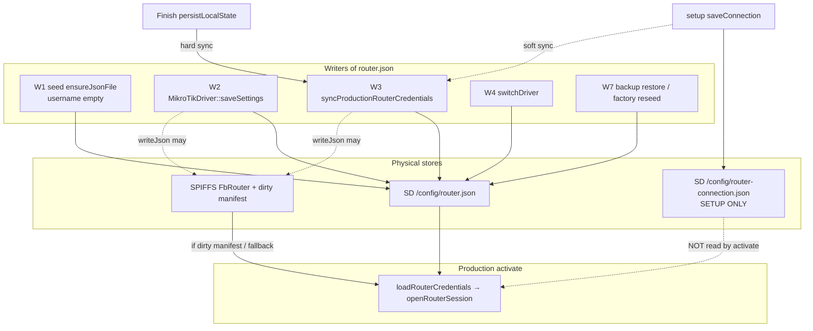

# ROUTER_CONFIGURATION_SOURCE_OF_TRUTH_FORENSIC.md

**Mode:** Production forensic only — no source changes, no sync, no population  
**Date:** 2026-08-10  
**Prior proof (out of scope):** Activation fails because `openRouterSession` sees `username == ""` from `/config/router.json`  
**This investigation:** Prove **why** that field is empty and **who** left it that way

---

## Executive verdict

`/config/router.json` did not “lose” a username. It was **born empty** and **never successfully populated**.

| Role | Exact responsibility |
|------|----------------------|
| **Who created empty username** | `StorageManager::seedDefaultJsonFiles` → `ensureJsonFile(RouterFile, kDefaultRouter)` |
| **Exact seed content** | `kDefaultRouter` in `StorageManager.cpp` **31–33**: `"username":""`,`password":""` |
| **Exact first-write site** | `StorageManager::ensureJsonFile` **2276–2285** (creates file only if missing) |
| **Who was supposed to fill it** | `RouterProvisioningEngine::syncProductionRouterCredentials` **958–989** (Finish hard path; Save soft path) or Admin `MikroTikDriver::saveSettings` **124–144** |
| **Why it stayed empty on this unit** | Installation remains **Factory** ⇒ Finish `persistLocalState` never committed production credentials. Combined with dual-store design: setup “Router Connected” lives in `router-connection.json` / request Test, **not** in `router.json`. |

**Confidence: 92%** that the empty username is the **seed default that was never overwritten**, not a wipe of a previously populated production file.  
**Confidence: 85%** that Finish never successfully ran on this unit (Installation=Factory is strong evidence).  
**Confidence: 70%** that Save→sync either never ran or failed silently (needs runtime dump of both files to distinguish).

---

## 1. Every writer of `/config/router.json`

| # | Writer | File:lines | When called | Who calls it | Fields written | Can username become empty? | Can password become empty? |
|---|--------|------------|-------------|--------------|----------------|------------|---------------------------|
| W1 | `StorageManager::ensureJsonFile` via `seedDefaultJsonFiles` | `StorageManager.cpp` **31–33**, **574**, **2276–2285** | First successful SD layout (`ensureLayout` / `factoryResetData` → `ensureLayout`) | Boot / factory wipe | Full seed JSON | **Yes — intentionally `""`** | **Yes — intentionally `""`** |
| W2 | `MikroTikDriver::saveSettings` | `MikroTikDriver.cpp` **124–144** | Admin save job | `RouterPlatform::save` ← `RouterWorker AdminSaveSettings` ← `POST/PUT /api/router/settings` | `driverType`, `host`, `username`, `profile`; password only if non-empty incoming | **Yes** if request sends `username:""` (ArduinoJson `\|` keeps empty string) | **No wipe** — empty incoming password skips overwrite |
| W3 | `RouterProvisioningEngine::syncProductionRouterCredentials` | `RouterProvisioningEngine.cpp` **958–989** | Finish `persistLocalState`; also after setup Save | Finish engine; `RouterProvisioningWorker` SaveConnection | Overwrites with `host/username/password/profile=default/driverType=mikrotik` from setup persisted credentials | Only if setup resolved username empty (Save path rejects empty username before persist) | Writes plaintext from resolved setup password |
| W4 | `RouterPlatform::switchDriver` | `RouterPlatform.cpp` **113–133** | Driver switch | Admin/platform | Updates `driverType`; if read fails, seeds `host`+`profile` **without username** | **Yes** — missing field → later load as `""` | Does not set password |
| W5 | `FoundationRouterDriver::saveSettings` | `FoundationRouterDriver.cpp` **33–49** | If foundation driver active | Same admin save path | Conditional host/username; password if non-empty | **Yes** if caller passes empty username | No wipe of existing if empty omitted |
| W6 | `GenericAPDriver::saveSettings` | `GenericAPDriver.cpp` **76–92** | If generic AP active | Same admin save path | `host`, `ssid`, `wifiPassword` — **does not set username** | Leaves prior / seed empty | N/A for API user |
| W7 | `BackupManager` restore path | `BackupManager.cpp` **48**, restore deserialize ~**800** | Backup restore | Restore API | Restored archive or **default** `kDefaultRouter` | **Yes** if archive uses default / empty | **Yes** |
| W8 | `StorageManager::writeJson` (transport) | `StorageManager.cpp` **1245–1286** | Any of W2–W7 | Callers above | Whatever serialized doc | Pass-through | Pass-through; may land on SD or SPIFFS fallback |
| W9 | `BackupManager::wipeUserData` + `factoryResetData` | `BackupManager.cpp` **1273–1317**; `StorageManager.cpp` **2385–2417** | Factory reset | `POST /api/system/factory-reset` | Deletes then **re-seeds via W1** | **Yes — reintroduces empty seed** | **Yes** |

**Not a writer of `router.json`:** `SetupRouterConnectionManager::saveConnection` / `persist` — writes **only** `/config/router-connection.json`.

---

## 2. Every reader of `/config/router.json`

| Reader | Purpose |
|--------|---------|
| `MikroTikDriver::loadRouterCredentials` | Production activate / ROS session |
| `MikroTikDriver::loadSettings` / `fillPublicSettings` | Admin GET settings |
| `MikroTikDriver` ops (test, profiles, wireless, production network, pause/deauth, cache, …) | Via `loadRouterCredentials` / `loadSettings` |
| `RouterPlatform::switchDriver` / `load` / `fillPublicSettings` | Platform façade |
| `FoundationRouterDriver` / `GenericAPDriver` load/fill | Alternate drivers |
| `InstallationStateManager::inferFromStorage` | Empty host/user/pass ⇒ infer **Factory** |
| `StorageManager::readJson` | SD / SPIFFS priority (see §6) |
| Backup export | Archives current or default |

---

## 3. Every reader / writer of `/config/router-connection.json`

| Op | Function | Notes |
|----|----------|-------|
| Read | `SetupRouterConnectionManager::load` | Boot; defaults username `"admin"` in RAM if missing |
| Write | `persist` / `persistAndReloadProtected` | Setup Save only |
| Read (resolve) | `resolveRouterCredentials(Persisted)` | Finish + syncProduction |
| Read (API) | `fillSafeConfig` | **Masks empty username as `"admin"`** (`SetupRouterConnectionManager.cpp` **144**) |
| Fallback | SPIFFS `FbRouterConnection` | Same eligibility as router.json |

**Production hotspot activate does not read this file.**

---

## 4. Boot ownership timeline

```
Cold boot
  → SPIFFS.begin (frontend)
  → StorageManager::begin
       → mount SD
       → ensureLayout
            → ensureRequiredDirectories
            → seedDefaultJsonFiles
                 → ensureJsonFile("/config/router.json", kDefaultRouter)
                      ★ FIRST EXISTENCE if file missing
                      ★ username="" password="" host=10.40.0.1
  → InstallationStateManager::begin/load  (may be "factory")
  → SetupRouterConnectionManager::begin/load  (separate file)
  → SetupProvisioningManager::synchronizeAtBoot
       ★ Does NOT sync credentials into router.json
  → RouterPlatform / RouterWorker begin
  → Portal can serve guests even if Installation ≠ Ready
```

**At what point `router.json` first exists:** first successful `ensureLayout` after SD mount when the path is absent.  
**Who created it:** `StorageManager::ensureJsonFile` with `kDefaultRouter`.

`ensureJsonFile` **never overwrites** an existing file (`SD.exists` → return true).

---

## 5. Setup ownership timeline

```
Router Discovery / Test  POST /api/setup/router/test
  → SetupRouterConnectionManager::testConnection
  → Credentials from REQUEST only
  → Does NOT write router-connection.json
  → Does NOT write router.json
  → UI: "Router reachable. Authentication successful."

Router Save  POST /api/setup/router/save
  → saveConnection → writes router-connection.json (protected password)
  → advances installation ≥ RouterConfigured
  → RouterWorker then calls syncProductionRouterCredentials  ★ soft
       success → populates router.json
       failure → Serial log only; HTTP still success  ★ SILENT GAP

Router Scan / Wi-Fi / Operator …
  → do not fill router.json username

Finish  POST /api/setup/finish
  → persistLocalState
       → syncProductionRouterCredentials  ★ HARD FAIL if sync fails
  → … RouterOS provision …
  → commitFinishInstallationState → Provisioned/Ready

Ready
  → production activate reads router.json only
```

| Question | Answer |
|----------|--------|
| Where should host/user/pass/profile land in `router.json`? | `syncProductionRouterCredentials` **973–978** |
| Does Finish guarantee it? | **Yes**, if Finish runs: sync failure aborts Finish (`persistLocalState` **1006–1014**) |
| Does this unit show Finish ran? | **No** — Installation=Factory ⇒ Finish commit did not leave Ready/Provisioned |

---

## 6. Storage ownership diagram



### Read priority (`StorageManager::readJson` **1217–1242**)

When SD readable:

1. If `_usingFallback && !sdWritable` and SPIFFS fallback exists → **SPIFFS**
2. Else if file listed in **dirty FB_MANIFEST** → **SPIFFS** (even if SD has a newer copy)
3. Else try **SD**
4. Else SPIFFS if present

**Implication:** A stale empty SPIFFS checkpoint listed in a dirty manifest can win over a populated SD file. That is a secondary emptiness path; primary path for Factory units is still never-populated seed.

---

## 7. Source-of-truth analysis (Investigation I)

| Plane | File | Intended role |
|-------|------|---------------|
| **Setup plane** | `router-connection.json` | Wizard connect/test/save; protected password; `apiPort` |
| **Production plane** | `router.json` | Admin settings + **all MikroTikDriver activate/authorize** |

**Architectural intent:** production SoT = `router.json`.  
**Actual runtime:** **split-brain**. Setup can be “Connected / Saved / Detected OK” while production file still has seed empties. Activate trusts only production.

`fillSafeConfig` further masks empty setup username as `"admin"`, so UI can disagree with both files.

---

## 8. Investigation D — Admin vs Finish writers

| Path | Writer |
|------|--------|
| Admin Dashboard Save | `MikroTikDriver::saveSettings` → `writeJson(ROUTER_FILE)` |
| Setup Finish | `syncProductionRouterCredentials` → `writeJson(ROUTER_FILE)` |
| Setup Save (soft) | Same `syncProductionRouterCredentials` |

**Same target file, different writers.** Admin merges into existing JSON; Finish/sync **replaces** credential fields from setup resolved credentials.

---

## 9. Investigation E — Silent failure (proven)

```733:738:ESP32_S3_Firmware/src/RouterProvisioningWorker.cpp
      if (_finishEngine) {
        String syncError;
        if (!_finishEngine->syncProductionRouterCredentials(syncError)) {
          Serial.printf("[router-worker] production credential sync failed: %s\n",
                        syncError.c_str());
        }
      }
```

Immediately after, envelope still returns **`success: true`** (**725–745**).

| Question | Proven |
|----------|--------|
| Can sync fail? | Yes — resolve Persisted fails, or `writeJson` fails |
| Caller ignore return? | **Yes** on SaveConnection path |
| UI still success? | **Yes** — Save API job reports success |
| Production remain empty? | **Yes** — seed `router.json` untouched |

Finish path does **not** ignore failure.

---

## 10. Investigation G — Safest runtime dump (read-only)

No firmware change. Prefer methods that **do not write**, **do not reboot**, **do not reflash**.

### Recommended (no ESP write)

1. **Admin API (owner session)**  
   `GET /api/router/settings`  
   - Shows production `host`, `username`, `passwordConfigured` (no plaintext password)  
   - Empty `username` confirms production SoT without touching files  

2. **Setup API (setup plane, if AP/wizard reachable)**  
   `GET /api/setup/router-config`  
   - Shows setup host/username/`connectionVerified`/`hasSavedPassword`  
   - Caution: empty stored username displays as **`admin`** (**144**)  

3. **Offline SD read (gold standard for full JSON)**  
   Power down → remove SD → read `/config/router.json` and `/config/router-connection.json` on a PC  
   - Zero risk of firmware write/race  
   - Reveals exact fields including whether password plaintext exists in production file  

4. **Avoid**  
   - Factory reset, reconfigure, admin Save, setup Save/Finish, backup restore  
   - Any “sync credentials” action (would change evidence)

### Expected vs missing

| Field | Expected after healthy Finish/Save+sync | Seed / current failure pattern |
|-------|------------------------------------------|--------------------------------|
| `host` | Router IP | Often `10.40.0.1` from seed |
| `username` | e.g. `admin` | `""` |
| `password` | plaintext API password | `""` |
| `profile` | hotspot profile name | `default` |
| `apiPort` | (not in `router.json`) | N/A — hardcoded 8728 at open |

Compare: setup file should have `username`, `passwordProtected`, `connectionVerified`, `apiPort` if Save completed.

---

## 11. Investigation H — State consistency (can disagree)

| Signal | Source | Can disagree with `router.json` username? |
|--------|--------|-------------------------------------------|
| Router Test OK | Request credentials, no persist | **Yes** |
| Router Save OK UI | `router-connection.json` + ignored sync fail | **Yes** |
| MikroTik detection / identity | Setup session or Test | **Yes** |
| Installation Ready/Provisioned | Finish commit | Should imply sync ran; Factory does not |
| Installation Factory | installation.json / infer | **Consistent with empty production creds** (`inferFromStorage` **170–174**) |
| `fillSafeConfig` username | Masks to `admin` | **Yes** vs both files |

---

## 12. Root cause tree (WHY empty — not THAT empty)

```
username == "" at activate
└─ loadRouterCredentials read stored["username"] | ""
   └─ /config/router.json content has empty username
      ├─ PATH A (primary for Installation=Factory) ★
      │   └─ File created by W1 seed kDefaultRouter
      │      └─ Never overwritten because:
      │         ├─ Finish never reached Ready/Provisioned
      │         │   (persistLocalState hard sync never committed)
      │         ├─ Setup Test never writes production file
      │         └─ Setup Save soft-sync failed or never called
      │            (Worker ignores syncProduction failure)
      ├─ PATH B (admin)
      │   └─ saveSettings wrote username "" explicitly
      ├─ PATH C (factory reset)
      │   └─ wipe + ensureLayout reseeded empty defaults
      └─ PATH D (storage priority)
          └─ Dirty SPIFFS fallback empty copy preferred over SD
```

### Actual reason (evidence-ranked)

**Primary:** Username is empty because **`kDefaultRouter` seeded `/config/router.json` with `"username":""` and no successful production writer overwrote it.** On a unit still in **Factory**, Finish’s hard guarantee never applied; production activate and setup plane are intentionally different stores.

### Exact function / lines responsible

| Responsibility | Function | Lines |
|----------------|----------|-------|
| **Created empty username** | `StorageManager` `kDefaultRouter` + `ensureJsonFile` | **31–33**, **574**, **2276–2285** |
| **Failed to guarantee fill after setup Save** | `RouterProvisioningWorker` SaveConnection sync ignore | **733–738** |
| **Would have filled on Finish** | `syncProductionRouterCredentials` / `persistLocalState` | **958–989**, **1006–1014** — **not successfully completed** on Factory unit |

There is no separate “Factory clears username” writer. Factory + empty username are linked by seed + incomplete setup handoff.

---

## 13. Regression analysis (Investigation J) — if auto-sync later

Impact surface if `router.json` is later auto-synchronized from `router-connection.json` (analysis only):

| Subsystem | Impact |
|-----------|--------|
| RouterWorker activate/pause/deauth | Would start opening ROS sessions (CPU/API load change) |
| Router sync / cache refresh | May begin succeeding; watch reconnect storms |
| Setup Wizard | Save/Finish semantics must stay idempotent; avoid double-write races |
| Admin Dashboard | GET settings would show setup credentials; overwrite conflicts if admin edits differ |
| SD write path | Extra `writeJson` at Save/boot — must not loop |
| SPIFFS fallback / dirty manifest | Must clear or update both copies to avoid PATH D split |
| Migration / restore | Backup defaults vs sync order |
| Factory reset | Must wipe **both** files then reseed consistently |

**Stability constraints for any future fix:** one write path, no idle RouterOS polling, no duplicate activate jobs, no boot-time RouterOS login.

---

## 14. Deliverable checklist

| # | Item | Status |
|---|------|--------|
| 1 | Every writer of router.json | §1 |
| 2 | Every reader of router.json | §2 |
| 3 | Every reader of router-connection.json | §3 |
| 4 | Boot ownership timeline | §4 |
| 5 | Setup ownership timeline | §5 |
| 6 | Storage ownership diagram | §6 |
| 7 | Source-of-truth analysis | §7 |
| 8 | Root cause tree | §12 |
| 9 | Actual reason username empty | Seed never overwritten |
| 10 | Exact function responsible | `ensureJsonFile`+`kDefaultRouter`; soft-sync ignore **733–738** |
| 11 | Exact line numbers | Cited above |
| 12 | Regression analysis | §13 |
| 13 | Confidence | 92% seed-never-filled; 85% Finish never completed |

---

## 15. Success criteria

- Does **not** merely restate “router.json is empty.”
- Proves **why**: intentional empty seed + production file never filled under incomplete Finish / soft Save sync / dual-store.
- Proves **who**: `StorageManager` seed created emptiness; setup/Finish writers that should populate either never ran (Factory) or Save path can succeed without population (**733–738**).

**No code modified. No RouterOS/polling changes. Implementation may begin only after optional hardware dump confirms PATH A vs B/C/D.**

**END OF FORENSIC REPORT**
